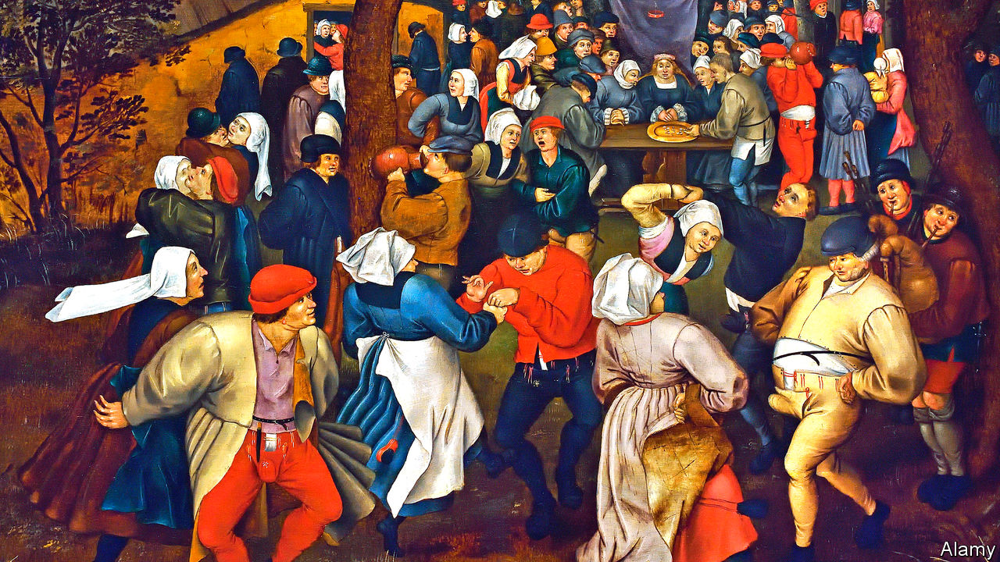

###### Value judgments

# Joseph Henrich’s study of WEIRD societies 

##### That is, Western, educated, industrialised, rich and democratic 

 

> Nov 7th 2020 

The Weirdest People in the World: How the West Became Psychologically Peculiar and Particularly Prosperous. By Joseph Henrich. Farrar, Straus and Giroux; 704 pages; $35. Allen Lane; £30

IT TAKES MORE than a decent constitution to build a democracy, as anyone who has tried to steer a country out of anarchy or tyranny can attest. And it takes more than well-turned commercial laws to make a healthy market economy. For either to happen, certain values must be widely accepted—yet defining them can be tricky.


Joseph Henrich, a professor of human evolutionary biology at Harvard, has devised a teasing term to describe societies where rules and values have come together with benign results: Western, educated, industrialised, rich and democratic. The acronym, WEIRD, neatly makes his point that these attributes, and the mindset that goes with them, are the exception not the rule in human history.

The values that underpin WEIRDness, he writes, include a tough-minded belief in the rule of the law, even at the risk of personal disadvantage; an openness to experimentation in matters of scientific knowledge or social arrangements; and a willingness to trust strangers, from politicians offering new policies to potential business partners. These may not seem original insights, but Mr Henrich’s work is distinguished by the weight he places on the extended family as an obstacle to healthy individualism, and on religious norms as the determinant of family obligations. He reinforces this theme with a welter of polling data and sweeping historical arguments, mostly about medieval Europe.

As an example of kin loyalty at odds with modern thinking, Mr Henrich records the experience of democracy-builders in Afghanistan: rural folk could not grasp the idea that they might vote for somebody who was not part of their family. Just as foreign to such outlooks, he says, is the idea that crimes are treated equally regardless of the relationships involved. In medieval China, killing within the family was treated differently from killing a stranger; killing your father was a worse crime than killing a child.

In many accounts of modern history, it was Europe’s Protestant Reformation that catalysed a more individualist, law-based mentality. Mr Henrich’s own emphasis is on the Catholic world from about 1000 onwards. He thinks that, by banning kin-marriage, the Roman church ushered in a more fluid society where people had to look farther afield for spouses.

Here he is not quite convincing, despite the extensive studies he adduces to argue that modern mentalities, even now, are correlated with regions of historic Catholic influence. It seems more likely that the medieval church was negotiating with, rather than moulding, a social reality which was evolving fast as cities emerged. Nor does a ban on marrying cousins imply free marital choice. It can be part of an elaborate system of communally arranged unions.

Mr Henrich’s broad point about the values that underpin liberal democracy is stronger, with one big qualification. Hundreds of millions of people live neither in atomistic WEIRD-land nor in kin-obsessed pre-modern societies, but in an interesting limbo, sometimes dynamically and sometimes tragically. Think, say, of a family from a poor, remote part of south-eastern Europe, whose younger members are working and raising children in assorted European cities, while their elders keep the home fires burning in the village. An extraordinary range of roles and attitudes co-exist in three generations.

Or take the South Asian communities in some northern English towns, where the mores of rural Kashmir can persist even in the fourth generation of diaspora life. Tradition-bound as they are, such communities are not untouched by modern British culture. Younger generations grow up somewhere between Mr Henrich’s WEIRDness and the harsh security of a regulated rural clan. Some have fun negotiating this terrain, some swing sharply towards either individualism or conformity; a handful react to the confusion by embracing extremism. In any case, WEIRDness need not be an either-or category, whether in medieval Europe or the 21st century. ■

