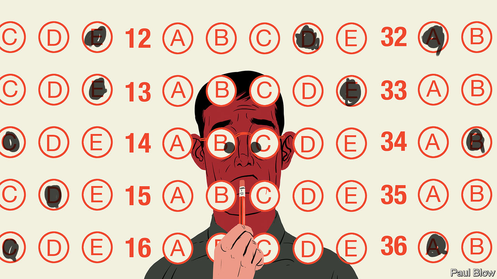

###### Bartleby

# Questionable behaviour 

##### Companies are relying more and more on psychometric tests 

 

> Nov 5th 2020 

HERE IS A test. Assign a score of 1 to 5, where 1 is “strongly agree” and 5 is “strongly disagree”, to the following statement: “I really care about my work.” If you have answered that kind of question before, you have probably applied for a job at a large company. Psychometric tests, as they are called, have become increasingly popular.

Eager job-seekers may think the answers to these questions are glaringly obvious. For any statement, give a response that creates a portrait of a diligent, collaborative worker. Of course, applicants care about their work, love collaborating with other people and pay careful attention to detail. But the people who set the tests know that candidates will respond this way. So questions are rephrased in many different ways to check that applicants are consistent and make it difficult for them to remember what they have already said.


Aptitude tests are not a new idea. Intelligence tests have been around for a century and were popular with government departments. Charles Johnson, who has been involved in psychometric testing for 40 years and was responsible for constructing the tests used to recruit British civil servants, says the second world war had a big impact. The British were impressed with the efficiency of German army officers and learned they had been selected with the help of intelligence tests. This led the British to create the War Office Selection Board. Alongside verbal and non-verbal reasoning, it challenged candidates with word-association exercises and being made to lead group discussions.

For high-skilled jobs, these tests are useful. However, Mr Johnson says there is a risk with using such tests to recruit workers for low-skilled jobs. If you select people who pass sophisticated cognitive tests, they will learn the job quickly but will then get bored and leave.

Psychometric tests became more popular from the 1970s onwards and are now seen as a useful way of sorting through the many candidates who apply for the jobs offered by big companies. “It is a laborious task to sort through thousands of written applications,” says Julia Knight, another occupational psychologist. “As well as being time consuming, it is not very effective and subject to bias.”

Questions in such tests may ask a candidate to describe their behaviour in hypothetical situations: dealing with an angry customer, for example. The suggested answers may all be plausible (apologise profusely, fetch a manager and so on), so there is no obviously “right” answer. Nevertheless the aim is to build a profile of the candidate to see if they have the right character traits for the job.

People are generally judged on the basis of five characteristics with the acronym OCEAN for openness, conscientiousness, extroversion (or introversion), agreeableness and neuroticism. The ideal characteristics can be surprising: it turns out that introverts are the best train-drivers as they seem to pay more attention to details such as safety procedures and can cope with spending long periods of their time on their own.

Extroverts do not make the best call-centre employees because they can spend so much time chatting to customers that they don’t get much done. The most useful trait among such workers, according to Steve Fletcher, an occupational psychologist, is assertiveness; this enables them to deal with more calls.

These tests are used to assess senior managers, as well as new hires. Along with OCEAN characteristics, testers are also looking for what is known as the “dark triad”—psychopathy, narcissism and Machiavellianism. Factors that can make people successful as junior managers may limit their ascent. Candidates who are good with detail turn out to be obsessive micromanagers; people who flourish in sales may have an excessive need to be the centre of attention.

A large majority of big companies use these tests but they are hardly perfect. Paul Flowers, the former head of Co-op Bank, a British lender, passed his psychometric tests with flying colours, according to testimony at a parliamentary inquiry. But he was later ousted in a sex-and-drugs scandal that led him to be dubbed “the crystal Methodist”. Mr Johnson says the tests can be useful, but only in conjunction with aptitude tests and structured interviews.

That probably won’t save job candidates from having to take these tests in future, because they winnow down the list. But at least they beat the old-fashioned method: drop half the applications in the bin and pick from the other half.

