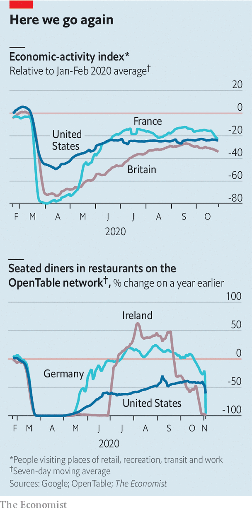

###### Winter is here

# How economically damaging will new lockdowns be? 

##### Less severe than last time—but still very painful 

 

> Nov 7th 2020 

COUNTRIES NOTCHED up absurdly high growth rates in the third quarter. America’s GDP rose by 7.4%, compared with the second (an annualised rate of 33%). Output in the euro area grew by 12.7%. But there is little reason for cheer. The resurgence of covid-19, and lockdowns to contain the virus, seem likely to stop the economic recovery in its tracks. Such fears drove oil prices to a five-month low on November 2nd.

 


Using mobility data from Google, The Economist has constructed an index of real-time economic activity. This suggests that America’s recovery has come to a halt as recorded covid-19 cases have risen again. Europe, with a higher number of infections, is faring worse. Activity in Britain and France seems to have peaked in September and performance is set to slip given that Britain, France and Germany returned to varying degrees of lockdown in the past week or so.

It is too soon to see the full impact of these new lockdowns in our index. They should at least be less damaging than those earlier in the year: more manufacturing and construction firms, for instance, will stay open this time. Still, the experience of places that have already locked down suggests they will be painful. Ireland’s restaurants have more or less been closed since it locked down on October 21st. Wales locked down two days later; our index suggests activity in Cardiff, its capital city, has fallen by 20 percentage points. Based on past relationships, a similar decline in European countries would cause GDP to be 5% lower in the fourth quarter.

Editor’s note: Some of our covid-19 coverage is free for readers of The Economist Today, our daily . For more stories and our pandemic tracker, see our 

