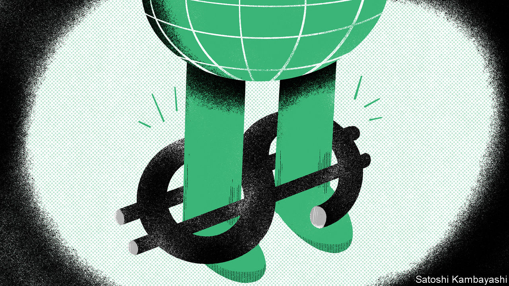

###### Buttonwood

# Why dollar assets are still riding high after America’s election 

##### And why that matters for everywhere else 

 

> Nov 7th 2020 

CAN YOU identify what or whom the following describes: is widely disliked around the world; might have been ditched by some supporters earlier had convincing alternatives existed; has had a difficult six months; and refuses to go quietly? Here’s another clue: this is not a column about politics. The answer is the dollar. It is the most unloved of major currencies, apart from all the others. And, oddly, it has been given a fillip by a messy election result at home.

Or perhaps that is not so odd. The dollar’s resilience has been one of the more monotonous motifs in financial markets in recent years. Dollar strength is twinned with another hardy theme—the growing heft of America’s companies, notably its tech giants, in global equity markets. The dollar matters for America, but it matters for everywhere else, too. A weaker dollar would trigger a period of catch-up by the rest of the world’s economies and asset markets. Such a prospect is seemingly delayed.


A reason for dollar resilience is growing doubts over fiscal stimulus in America. The election was supposed to be the start of a new era of fiscal largesse. Agreeing on any kind of policy now looks hard. If Joe Biden enters the Oval Office in January he is likely to face a divided Congress. But dollar strength is not solely down to politics. It is as much about the economic consequences of a resurgent coronavirus as it is about dashed hopes of a blue-wave election.

Begin with the blue wave that didn’t crest. Before the election, an idea had taken hold, fuelled by pollsters and election forecasters, that a clean sweep of the White House and both houses of Congress by the Democratic Party was highly likely. The upshot would be a weaker dollar.

In 2016 a similar prospect of fiscal easing drove the dollar up, not down. This needs some explaining. The difference is that four years ago, the Federal Reserve was expected to offset the stimulative effect of tax cuts by raising interest rates in order to contain inflation—thus supporting the dollar. But with the economy now weak, the Fed has committed itself to easy money. A fiscal-stimulus package would be an unimpeded spur to aggregate demand, leading to more imports, a wider trade deficit and a weaker dollar. And a weaker dollar would in turn help the rest of the world, partly because of its role as a borrowing currency beyond America’s shores. A lot of emerging-market companies and governments have dollar debts, so a weaker greenback acts as an indirect stimulus to global growth.

Instead, the dollar has perked up a bit. That is because the dollar is special in another way. Dollar assets, notably shares, are more prized when the outlook seems less certain. Holders of dollars cling on to them for longer, rather than swap them for other currencies. This goes for wealthy savers in emerging economies, or Chinese or South Korean exporters, say, who have earned dollars on sales.

It also goes for institutional investors at home who might have thought of cashing in some of their expensive-looking American tech stocks for a wager on cheap-looking cyclical stocks in Europe or Asia. The diminished prospect of fiscal stimulus is one reason why this “reflation trade” is less alluring. The resurgence of coronavirus infections is another. Much of Europe is now in soft lockdown. Its economy is losing steam. The appeal of cyclical stocks is similarly ebbing. Investors have instead piled back into tech firms, which benefit from the stay-at-home economy.

If there is one thing as hardy as the dollar itself, it is forecasts that its resilience cannot last. What might hasten the dollar’s fall now? Even without a friendly Senate to back his plans for increased federal spending, a President Biden would probably have a less bellicose and arbitrary trade policy than a re-elected President Trump. Good news on a vaccine might rekindle American investors’ appetite for buying cheap assets abroad.

Further out, the dollar still seems likely to weaken. Whatever the configuration of American politics, fiscal stimulus will not stay off the agenda for ever. Populism is hardly in retreat. Bond yields are incredibly low. In the circumstances it would be unwise to think that politicians will forgo the temptations of deficit-financed spending or tax cuts for too long. And for the past half-decade the greenback has drawn strength from the fact that short-term interest rates in America were higher than in western Europe and Japan. One of the few things that everyone can agree on is that this advantage is largely gone.

