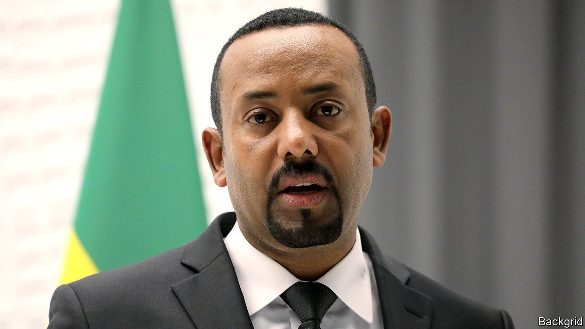
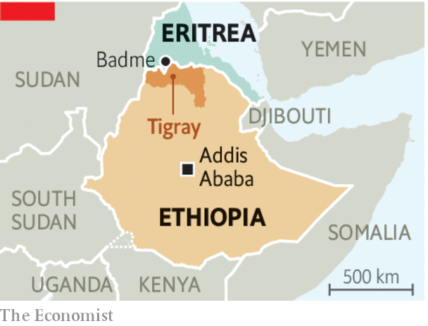

###### Back to blood

# Ethiopia’s prime minister may be starting a civil war 

##### Abiy Ahmed should pursue talks instead 

 

> Nov 7th 2020 

IT STARTED AS a border skirmish in 1998, between Ethiopian policemen and Eritrean soldiers in Badme, a small village on a barren mountain. One observer at the time likened it to “two bald men fighting over a comb”. It grew into a two-decade-long war in which two of the world’s poorest countries bled themselves to exhaustion. Waves of young men charged across the no-man’s-land between their trenches, in battles reminiscent of the first world war in Europe. Perhaps 100,000 soldiers died, and half a million civilians were forced from their homes.

Among those who fought in Badme was a young Ethiopian radio operator who briefly left his foxhole to position his antenna. When he came back to it, he found his unit had been wiped out in an artillery strike. “War is the epitome of hell,” said Abiy Ahmed, the radio operator who is now Ethiopia’s prime minister. “I know because I was there.” He ended that pointless conflict in 2018, by promising to withdraw Ethiopian troops from Badme and restoring relations with Eritrea. In 2019 Abiy won the Nobel peace prize.


Yet now the peacemaker has turned martial. Early on November 4th, while the world’s eyes were boggling at America’s elections, Abiy ordered his troops into action against the Tigrayan People’s Liberation Front (TPLF), which runs Tigray, a northern region of Ethiopia (see ). He accuses the TPLF of attacking an army base to steal weapons. “The last red line has been crossed,” he said. “The federal government is therefore forced into a military confrontation.”

Abiy argues that armed action is needed to bring the TPLF to heel and to hold together Ethiopia’s fractious federation of ethnically based states. Yet in resorting to tanks, rather than talks, he risks rolling Ethiopia into another pointless, hellish war. Such a war could lead to the balkanisation of Africa’s second-most-populous country (with 110m people). It could also spread instability into neighbouring countries.

 


Start with the balance of forces. Because Tigray was on the front line of the war with Eritrea, it has a large militia and paramilitary force manned by veterans. The army’s Northern Command in Tigray contains more than half of the federal army’s fighting men and its best divisions, according to the International Crisis Group, an NGO. Many of the officers and men in the Northern Command are Tigrayan. If ordered into battle against their own region, many might choose to defend it instead.

Fighting in Tigray could draw in neighbouring Amhara, which has long-standing disputes over the border between the two regions. It could also fan ethnic conflagrations elsewhere in Ethiopia. Even though Oromos, another ethnic group, currently dominate the federal government, Oromo activists are demanding more power and autonomy for their region. Their mobs have been killing members of other groups in multi-ethnic towns and cities in Oromia. Amnesty International has reported that on November 1st Oromo gunmen rounded up 54 people, mostly women and children, and killed them in a schoolyard. Smaller ethnic groups, such as the Sidama in the south, are also agitating for greater autonomy and have mounted pogroms against minorities. Conflict could draw in neighbouring countries, such as Eritrea, which has a score to settle with the TPLF dating back to the war it fought with Ethiopia. And it could destabilise Somalia, where Ethiopian troops are battling the jihadists of al-Shabaab.

For almost 150 years since Emperor Menelik II waged the wars of conquest that created the borders of modern Ethiopia, the country’s various governments have used naked power to hold it together against the centrifugal forces of ethnic nationalism. Now, however, violence is more likely to speed up the gyre. To slow it, Abiy and the TPLF need to stand their forces down. That would allow time for Ethiopians to talk about how to mend their country’s many rifts—without shooting. ■

