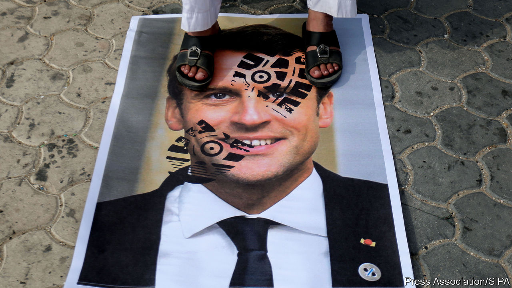

###### Voltaire’s heirs

# France is right to defend free speech 

##### No one has a right not to be offended 

 

> Nov 5th 2020 

SAMUEL PATY told his pupils to look away if they might be offended. He knew that caricatures of the Prophet Muhammad are deemed blasphemous by Muslims. But since the images in question were published by Charlie Hebdo, a French satirical magazine whose staff were massacred by jihadists in 2015, they were also relevant to a class about free speech. The teacher thought his pupils old enough to decide for themselves. For this, he was beheaded.

In the age of social media, outrage can swiftly go global. The parent who denounced Mr Paty was not in the classroom, and lied when he said his daughter had been. The jihadist who killed the teacher did so after watching a Facebook video posted by that parent. And when Emmanuel Macron, France’s president, decried the murder and defended free speech, the leaders of several Muslim countries accused him of Islamophobia. Among them were Turkey’s president, who locks up thousands of Muslims for belonging to the wrong religious group, and Pakistan’s prime minister, who seems more upset by events in a classroom in France than in next-door China’s million-Muslim gulag.


Unscrupulous politicians have always stirred up racial or sectarian outrage to unite their supporters and distract attention from their own flaws. But some critics seem sincerely to believe that France is the cause, rather than victim, of jihadist attacks on its soil. They often point to its tradition of laïcité, or secularism. This was entrenched by law in 1905, after a long struggle with the Catholic church. It protects the right to believe, or not to believe, and separates religion from public life. No French president could be sworn in on a holy book. No French state school could stage a nativity play. Some feel that such rules discriminate against Muslims. A ban on “conspicuous” religious symbols in state schools includes the crucifix, but some Muslims still resent the fact that they (or their daughters) must remove their headscarves at the school gate. When Mr Macron recently announced a crackdown on signs of “Islamist separatism”, such as home schooling, which he sees as a pretext for radicalised teaching, he was accused of “weaponising” secularism against Muslims.

Most controversial of all for some Muslims, French law protects the right to blaspheme and to insult any religion—although not to discriminate against an individual on the basis of religious belief. Some see this, wrongly, as a French campaign to insult Islam. Boycotts of French goods and anti-Macron protests have taken place from Istanbul to Islamabad.

Discrimination against Muslims is a real problem in France, as Mr Macron implicitly concedes. Employers are more likely to bin their job applications. Mr Macron has vowed to fight racism, and improve opportunities for people in deprived neighbourhoods, “of whatever skin colour, origin, religion”. He will have his work cut out, even without his own ministers undermining him by griping absurdly about the existence of separate shelves for halal food in supermarkets.

Yet it is important not to lose sight of two points of context. First, more than 250 people have been killed in Islamist terrorist attacks in France since 2015. Last year more suspects of jihadist terrorism were arrested in France than in any other EU country. French intelligence services warn that radicals are waging a war for the minds of the young, especially online, to win recruits to violence. France is right to be more concerned than most, and to seek to respond firmly (see ).

Second, France is also right to defend free speech. A religion is a set of ideas, and therefore open to debate and even mockery. Considerate speakers will try not to give gratuitous offence. But governments should not compel them to be inoffensive. If they did, everyone would have to censor themselves, for fear of offending the most easily offended person in the audience. And as Mr Paty discovered, an audience can include anyone on Earth with a phone.

The French state should never give the impression that it endorses blasphemy, but it is right to protect blasphemers, just as it is right to protect those who complain about them, so long as they do not advocate violence. As many thoughtful Muslims in France and elsewhere have pointed out, no matter how offended you feel, the answer to speech is not knives: it is more speech. ■

