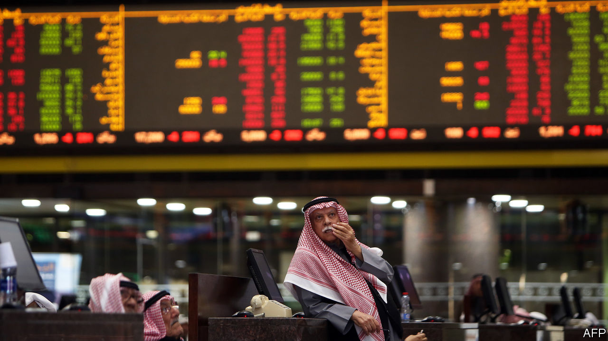
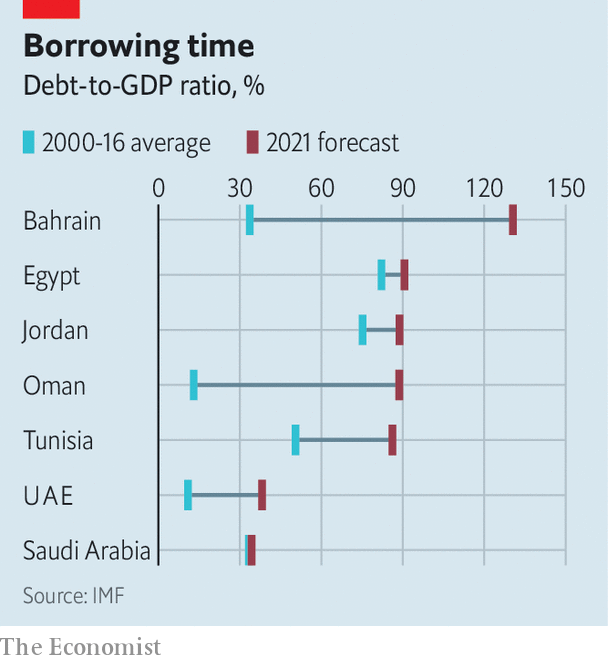

###### Not flattening the curve

# Arab states are loading up on debt 

##### Big borrowing to cope with covid-19 has not translated into big stimulus 

 

> Nov 5th 2020 

TOURISTS MAY not have returned to Egypt’s beaches and historic sites, but the portfolio investors are back. Since May foreigners have snapped up more than $10bn in local-currency debt, reversing a sell-off from the early days of the covid-19 pandemic. There is similar enthusiasm across the region. The six members of the Gulf Co-operation Council issued a record $100bn in public and corporate debt in the first ten months of the year. Treasuries are courting local investors too, though not always successfully: Tunisia’s government was rebuffed when it asked the central bank to buy treasury bonds.

Arab states are on a borrowing binge. Even before covid-19 arrived many were taking on fresh debt to cope with low oil prices and sluggish economies. The pandemic has only increased their needs. By next year public-debt ratios in many of these countries will be at their highest in two decades (see chart). The region’s 11 oil-and-gas-exporting countries owed an average of 25% of GDP from 2000 to 2016. Next year the IMF projects that ratio will hit 47%. Increases are less stark in states without energy resources—but only because they already had high debt levels.

 


This is not always cause for concern. Saudi Arabia’s debt-to-GDP ratio will reach an estimated 34% next year, up from 17% in 2017. Debt levels in Kuwait and the United Arab Emirates will almost double as well, to 37% and 38%. These numbers are still comfortably low. All three have well-provisioned central banks or flush sovereign-wealth funds. And capital is cheap: a 35-year tranche of Saudi Eurobonds issued in January had yields below 4%.


Other oil-producing states look shakier. Bahrain’s debt-to-GDP ratio is projected to hit 131% next year, up from an average of 34% from 2000 to 2016. Oman will owe 89%. Both were largely shut out of bond markets earlier this year. Oil markets offer little hope for their budgets: renewed lockdowns in Europe and rising cases in America pushed prices lower in October.

Elsewhere in the region the pandemic has reversed years of fiscal reforms. Egypt trimmed subsidies and introduced a value-added tax after borrowing $12bn (over three years) from the IMF in 2016. It cut the deficit from 11% of GDP in 2016 to 7% last year and it was on pace to lower its debt-to-GDP ratio to 79% in 2021. The pandemic, however, sent it back to the IMF for a $5.2bn loan. Next year its debts are projected to climb back to 91% of GDP. Jordan will be close behind at 89%, and Tunisia at 86%.

For now, at least, investors are enthusiastic about Egyptian debt. Yields are high—the last batch of six-month treasury bills paid around 13.5%—and Abdel-Fattah al-Sisi’s authoritarian rule has erased concerns about political instability. But sentiment can be fickle. Between March and May $12.7bn flowed out of local markets.

All this borrowing offers limited returns for Arab states. More than 70% of Kuwait’s budget is earmarked for public-sector salaries and subsidies. It is taking on debt not to fund reforms but to sustain a bloated bureaucracy. Arab states have also been stingy with their covid-19 stimulus packages. They have allocated an average of 2% of GDP for pandemic-related help, compared with 3% for all emerging markets, in part because of limited fiscal firepower.

Borrowing has helped them cope, but it also exacerbates this problem (Egypt already spends an estimated 9% of GDP on debt service). Oil prices are projected to stay low next year, and vital industries such as tourism will be slow to recover. Heavier debt loads will limit the extent to which Arab governments can jolt their sluggish economies. ■

