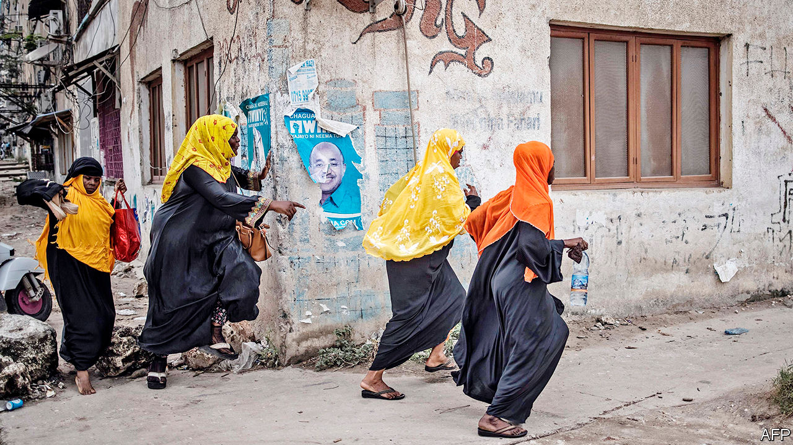
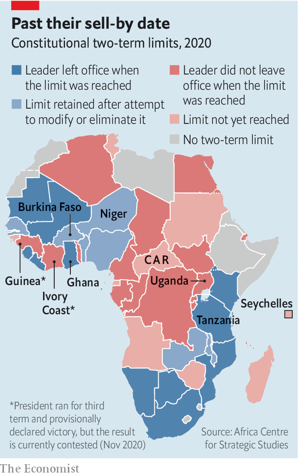

###### Setting a bad example

# Democracy is faltering in Tanzania and Ivory Coast 

##### Their post-election crises could yet get worse 

 

> Nov 5th 2020 

“I HAVE ESCAPED arrest twice today,” said Zitto Kabwe, a Tanzanian opposition leader, on November 2nd. But, he added, “I cannot avoid the police for ever.” The next day they picked him up, like so many of his colleagues who contested Tanzania’s election on October 28th. Some have been beaten. Tundu Lissu, a leading rival to President John Magufuli, was grabbed by police in front of European embassies, where he was seeking refuge having been turned away by the American embassy. Mr Lissu was interrogated, but not charged—perhaps because German diplomats were waiting outside the police station.

Democracy in Tanzania is broken—and is in trouble elsewhere in Africa, too. Guinea’s election on October 18th resulted in a dubious victory (and a third term) for President Alpha Condé. At least 30 people were killed protesting against the result, says the opposition. Ivory Coast is in crisis after President Alassane Ouattara won a third term on October 31st, amid a boycott by the opposition. Both leaders claimed not to be bound by term limits, illustrating a dismal recent trend (see map).

 


Tanzania may be the most troubling case. Not long ago it seemed on its way to becoming a relatively prosperous democracy. For more than a decade from 2000 its economy was among Africa’s best performers. But Mr Magufuli, who took over in 2015, has set things back. He has produced fishy economic numbers that seem to hide real problems, while cracking down on any opposition. In this election he won 84% of the vote, up from 58% in 2015, according to the official tally. His party won enough seats to abolish term limits, if it so chooses. The opposition is claiming fraud. “This was not an election,” says Mr Lissu. “It was just a gang of people who have decided to misuse state machinery to cling to power.”

Mr Lissu has called for protests. Mr Kabwe hopes other countries will impose sanctions on Tanzania. Britain, for one, said it was “deeply troubled” by the result. But countries in the region have been more supine. An observer mission from the East African Community, a regional bloc, said the vote had been “conducted in a credible manner”. The observer mission from the African Union (AU) has yet to express an opinion. President Cyril Ramaphosa of South Africa, who currently chairs the AU, congratulated Mr Magufuli on his win in a “peaceful election”.

Ivory Coast seemed to be moving in the right direction, too. Mr Ouattara took over in 2011, after a disputed election and much bloodshed. The economy grew faster than most in Africa. But democracy has suffered. In 2016 Mr Ouattara wangled changes to the constitution which, he claims, reset the clock on his time in office, so that its two-term limit would not apply to him until after a fourth term. In August he reneged on his decision to retire and said he would run again. The constitutional council waved through his candidacy and blocked 40 of 44 other contenders from running, including several big names. Since then there have been protests and ethnic violence. Dozens of Ivorians have been killed.

When the time came to vote, the opposition called for civil disobedience. Protesters smashed up polling stations and prevented voting in some areas. At least five people were killed in clashes. A significant chunk of the population did not vote. The electoral commission says that 21% of polling stations never opened. The AU and the Economic Community of West African States (ECOWAS), another regional bloc, nonetheless called the poll “satisfactory”. Officially Mr Ouattara took 94% of the vote.

The Ivorian opposition is not backing down. Rather, it is setting up a parallel government, led by an 86-year-old, Henri Konan Bédié, who ran against Mr Ouattara in the election. Its aim is to organise a new election. Mr Ouattara’s men call this sedition. Tensions are rising. On November 3rd riot police surrounded Mr Bédié’s house and used tear gas to disperse journalists before carting away some 20 people, including a former minister of health. The houses of other opposition figures were also surrounded. As The Economist went to press Mr Bédié had not been arrested.

With each side taking such extreme positions, dialogue looks remote, says William Assanvo of the Institute for Security Studies in Abidjan, Ivory Coast’s commercial capital. He thinks the crisis will worsen, as leaders are arrested and clashes break out between rival factions and ethnic groups. Parts of the armed forces do not view Mr Ouattara as legitimate, he adds. Guillaume Soro, a former prime minister and rebel leader exiled in France, has called on the army to act against Mr Ouattara. Over 3,000 people have fled the country.

International mediation is desperately needed, says Arsène Brice Bado of the Jesuit University in Abidjan. But regional bodies tend to favour incumbents. In 2015 the members of ECOWAS discussed a proposal to restrict presidents in the region to two terms, but it was ultimately dropped. The limp response of ECOWAS to the situations in Guinea and Ivory Coast has made opposition parties even angrier.

Guinea, Tanzania and Ivory Coast are setting a bad example just as an election season in Africa heats up. Burkina Faso, the Central African Republic, Ghana, Niger and Uganda all go to the polls in the next few months. Their leaders might do well to look instead to the Seychelles, where last month the opposition won a presidential election for the first time since independence in 1976. The loser graciously attended his opponent’s victory speech. ■

