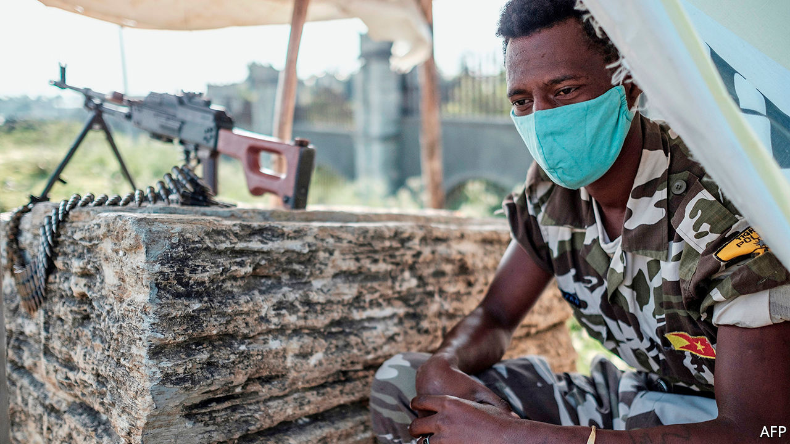
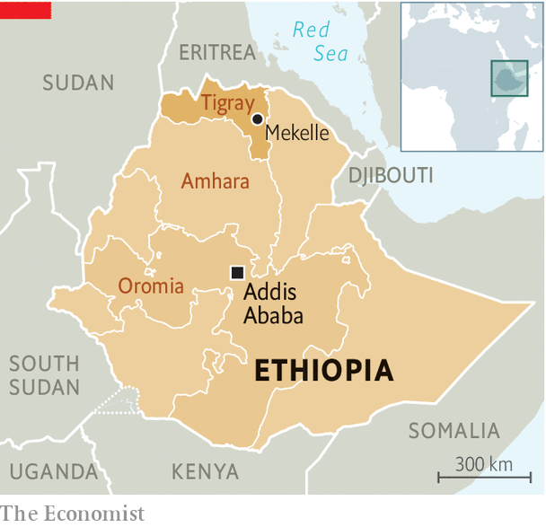

###### Abiy’s call to arms

# Ethiopia lurches towards civil war 

##### The prime minister confronts Tigray, a restive region that will not be easy to subdue 

 

> Nov 4th 2020 

FOR SEVERAL days the warning lights had been flashing red. Early in the morning of October 29th a general in Ethiopia’s federal army had flown to the northern region of Tigray to take up his new position as deputy commander of forces in the region. He was refused entry. In Mekelle, the regional capital, rumours swirled of troop movements across the state border in the Amhara region, as well as in Eritrea, a country to its north. Throughout Tigray young men had been armed and trained. On November 2nd its president said the region was preparing for war.

War may have begun. On November 4th Ethiopia’s prime minister, Abiy Ahmed, ordered his forces to hit back in response to what he claimed was an “attack” by Tigray’s ruling party on a base housing federal troops. “The red line has been crossed,” he said. Early reports suggest there had been a heavy exchange of artillery fire around Mekelle and on the border with Amhara. The internet and phone networks in Tigray were cut off. Abiy has declared a state of emergency in the region. In a television address he said the fighting had resulted in casualties, though he did not say how many. As The Economist went to press it was unclear whether the conflict would be limited to a brief skirmish or might blow up into a full-scale war.


The latest escalation comes after months of bitter feuding between Abiy and leaders of the Tigrayan People’s Liberation Front (TPLF), an armed group that turned into a political party after leading the rebellion that ousted the Derg, a Marxist junta, in 1991. Since then, for almost three decades, the TPLF called the shots in the federal government before massive protests in 2018 among the Oromos, who make up roughly a third of Ethiopia’s population, forced it to make way for Abiy.

His administration views the TPLF as spoilers who are sabotaging Ethiopia’s fragile transition to democracy. The TPLF, by contrast, sees Abiy as a usurper determined to tear up the constitution, which guarantees self-rule for each of Ethiopia’s ten ethnically based states—and even the right to secede. When the central government postponed elections earlier this year, citing covid-19, the TPLF accused Abiy of scheming to extend his time in office.

The feud came to a head in September, when Tigray defied the federal government and went ahead to hold its own regional election. Instead of quietly accepting the result, the central government said it was illegal. The federal parliament voted to isolate Tigray’s leaders. The finance ministry in Addis Ababa stopped giving money to the regional government and set in motion plans to send funds directly to local authorities. It is also said to have blocked welfare payments to poor farmers and to have tried to prevent investors and even some tourists from travelling to Mekelle.

 


The TPLF said that slashing federal funding amounted to a “declaration of war”. It called for Abiy to step down and for a caretaker government to replace him. Although the prime minister had repeatedly ruled out armed intervention, parliament recently authorised it. Both sides had flexed their muscles with military shows of force. “If Abiy wishes to fight this out, we will pay him in his coin,” Getachew Reda, a senior TPLF official, told The Economist in late October.

It is not the only conflict tugging hard at the seams of the Ethiopian state. Abiy is also waging a war against armed separatists in his own region of Oromia, the country’s largest. He is struggling to quell popular protests against his rule there and elsewhere. In the past few weeks there have been several massacres, mostly of Amharas. On November 1st armed men killed dozens of women and children in a schoolyard in western Oromia, according to Amnesty International.

The federal government claims that the TPLF fuels these various conflicts by arming and training opposition groups, though hard evidence has yet to be shown. This, it says, justifies action. On November 2nd Abiy’s allies in Amhara called on him to finish off the TPLF “once and for all”. Parliament suggested it would declare the TPLF a “terrorist” organisation.

Abiy may be hoping to reassert control over Tigray with a quick strike. But three factors make the conflict with the TPLF especially dangerous. First, the TPLF is by far the best equipped and most powerful of Ethiopia’s opposition forces. Though Tigrayans are less than 10% of Ethiopia’s population, the region’s paramilitaries are led by veterans of both the long struggle against the Derg and of a devastating war with Eritrea fought mostly between 1998 and 2000. Tigrayan officers purged by Abiy from the federal army are said to have returned to Tigray to train and organise new recruits. Though the constitution allows each region to have its own security forces, the prime minister’s office has accused the TPLF of unconstitutionally “arming and organising irregular militias”.

Moreover, Tigray is also the home base of the Ethiopian army’s most powerful units, amounting to more than half its soldiers. Organised into its Northern Command, they bore the brunt of the fighting against Eritrea. The TPLF reckons that many of the Northern Command’s officers and soldiers would switch sides or mutiny if Abiy ordered them into battle against Tigray. On November 4th Tigray’s state broadcaster claimed that many officers and other ranks had already defected. The federal government denies it.

The third factor is Eritrea. In 2018 Abiy ended the cold war between the countries by signing a peace deal with Eritrea’s ageing dictator, Isaias Afwerki, for which Abiy was awarded the Nobel prize the year after. But Isaias, whose enmity with the TPLF stretches back decades, has shown little appetite for peace. Instead, he has stepped up his efforts to topple his old foes by cosying up to Abiy. On October 31st Eritrea’s government declared that the TPLF was “on its deathbed”. Eritrean troops are said to have been conducting provocative manoeuvres along the border. “Tigray is preparing for war on two fronts,” says Fetsum Berhane, a Tigrayan activist.

Both sides claim to have done all they can to prevent escalation. “What we want is to avoid bloodshed,” said Seyoum Mesfin, a Tigrayan who was a former foreign minister of Ethiopia, recently in Mekelle. He stressed that the TPLF wanted dialogue, but with all parties on an equal footing. Abiy’s office, for its part, claims the government has “retained a policy of extreme patience” but that war cannot be prevented by the “goodwill” of only one side. It insisted the army was acting to “save the country and the region from spiralling into instability”. As both sides edge closer to war, some hear echoes of 1998. That was when Ethiopia and Eritrea sleepwalked into a catastrophic conflict. There is still just enough time for both sides to wake up. ■

