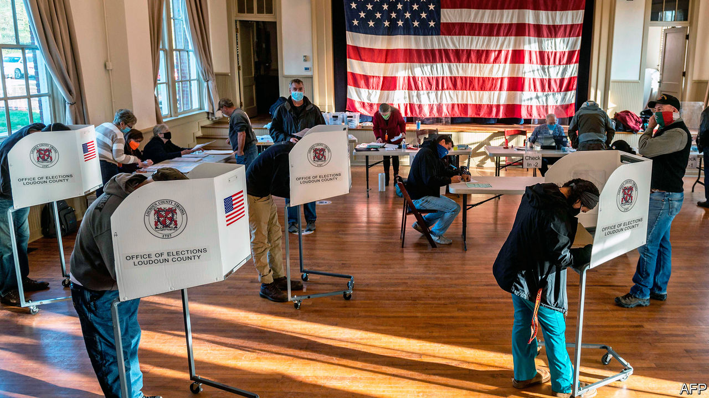

###### 

# Politics this week 

#####  

 

> Nov 7th 2020 

America’s presidential election was closer than the polls had suggested. In the electoral college Joe Biden won Michigan and Wisconsin, two states that helped hand victory to Donald Trump in 2016; Mr Trump took the key state of Florida, and by a bigger margin than in 2016. Mr Biden had the edge in the vote-count, which the Trump campaign challenged in court. When the final results are tallied the Democrat will have won the nationwide popular vote by perhaps five percentage points. See  and . 


Early results suggested that the Republicans would retain the Senate. The Democrats gained two seats, but a Republican took one back in Alabama, defeating a Democrat who had won a special election in 2017 after his rival was embroiled in a sex scandal. Republicans picked up several seats in the House of Representatives, but the Democrats kept a firm grip on the chamber. Montana was the only state to flip parties in the 11 governors’ races, switching to the Republicans. See . 

Among the state ballot initiatives that took place, voters in Oregon approved laws that will decriminalise the possession for personal use of cocaine, heroin and other drugs, and legalise magic mushrooms for mental-health treatment. A new state flag was approved in Mississippi to replace the old one, which featured the Confederate emblem. The new flag portrays a magnolia flower. See . 

Abiy Ahmed, the prime minister of Ethiopia, ordered the army to take action against the northern region of Tigray, whose leaders he accused of attacking an army base. Tensions have been building between the central government and Tigray in recent months and observers worry that a civil war is brewing. See . 

While the world’s eyes were firmly on America’s election, governments in several African countries arrested prominent adversaries. Police in Uganda detained Bobi Wine, a pop-star politician, after he registered as a candidate for the presidency. In Tanzania the police arrested Tundu Lissu, the main opposition leader. And in Zimbabwe Hopewell Chin’ono, a journalist who has exposed corruption linked to the ruling party, was seized. See . 

Officials in Ivory Coast said that Alassane Ouattara had won a third term in a presidential election with 94% of the vote, even though many Ivorians boycotted it. The constitution limits presidents to two terms. His opponents refused to recognise the result. See . 

Algerians approved changes to the constitution that would impose term limits on their president and restrict his choice of prime minister. But the “Hirak” protest movement dismissed the revisions as a “façade” of change. Turnout was low.

A gunman with links to Islamic State went on a rampage in Vienna, killing four people and wounding 23 before he was shot dead by police. The atrocity, which took place in the centre of the Austrian capital, follows a spate of other incidents, including the beheading of a French teacher near Paris and the murder of three people in a church in Nice.

With covid-19 soaring in some areas, England went back into a national lockdown. Non-essential shops, pubs, restaurants, gyms and other public places will close until December 2nd, but schools and building sites remain open. A government scheme that pays 80% of wages for furloughed staff was extended for another month. Covid-19 restrictions were also tightened in Belgium. Family visits are banned, and all non-essential shops closed.

Denmark decided to cull 17m mink, fearing that a mutation of the coronavirus that has been found in the animals could weaken the effectiveness of a vaccine. Denmark is the world’s largest producer of mink skins.

An earthquake in Turkey near the coastal city of Izmir killed at least 110 people. Scores of residents are still missing.

Prosecutors in Rio de Janeiro charged Flávio Bolsonaro, the eldest son of Brazil’s president, Jair Bolsonaro, with corruption and money-laundering. He is accused of taking some of the salaries paid to aides when he was a legislator in the state, a practice known as rachadinha. He is now a federal senator.

Brazil’s space-research institute said that the number of wildfires in the Pantanal, which contains the world’s largest tropical wetland area, reached a record high in October. The area is renowned for its abundance of animal life.

Typhoon Goni slammed into the Philippine islands of Catanduanes and Luzon with winds of 225kph, among the most ferocious landfalls ever recorded; 20 people died and 25,000 homes were destroyed.

Terrorists from the Afghan affiliate of Islamic State attacked Kabul University, killing 22 students before being shot by security forces.

The government of New Zealand announced the results of two referendums. Voters opted to legalise assisted dying but not marijuana. See . 

Police in Hong Kong arrested a local journalist, Choy Yuk-ling, who helped to make a documentary about alleged police misconduct. Ms Choy was accused of using a false pretext to obtain details of car-owners from an official database.

Coronavirus briefs


America recorded 100,000 new cases in a day.

The number ofdaily deaths in Italy hit its highest level since early May. Hospitals in Germany were urged to postpone non-urgent operations to make beds available. See . 

The French health minister said that in Paris one person was becoming infected every 30 seconds, and hospitals were admitting someone with the disease every 15 minutes.

Saudi Arabia allowed foreign pilgrims back into Mecca. They must self-isolate for three days and submit to frequent testing.

Machu Picchu reopened to tourists after eight months of shutdown. The majestic Inca site is restricting visitor numbers; Peru has a high death rate from the disease. An ancient ritual marked the reopening, along with prayers to the gods. With luck they are listening.

