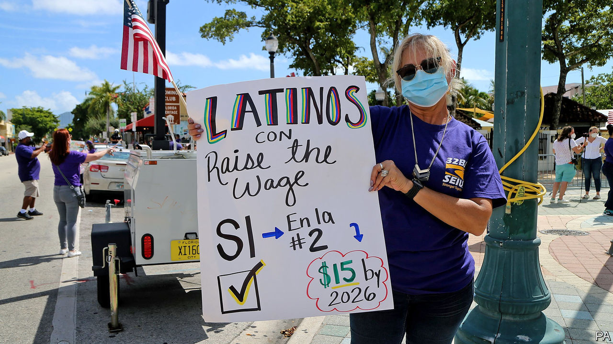

###### State houses and local referendums

# Covid coloured races for governor and ballot initiatives 

##### Health and social policy shaped America’s state and local elections 

 

> Nov 5th 2020 

IF YOU WANT to see where the momentous events of 2020 had their biggest impact, look not at the national contest but at the governors’ races and local referendums. Covid-19 and other traumas turned competitive races into walkovers and showed that states could still push through social changes even while the country is counting every last vote.

Governors have been the dominant figures of the pandemic response, choosing when and how to lock areas down. As a result, gubernatorial races often turned into referendums on states’ responses to covid-19. Take the contests in New England, where Democrats might have fancied their chances of unseating one or both Republican governors up for re-election, Chris Sununu of New Hampshire and Phil Scott of Vermont. Mr Biden won both states easily. But on covid-19, the governors were the un-Trumps. When the president told Americans not to be afraid of covid, Mr Sununu shot back, “I’m afraid of covid. I think everyone should be very concerned.” Mr Scott even endorsed Bill Weld, Mr Trump’s rival in the Republican presidential primary. Both earned sky-high approval ratings for handling of pandemic; both won re-election in blue states by over 30 points.


There was a similar story in North Carolina, where the Democratic governor, Roy Cooper, won by four points in a state where the presidential and Senate races were in essence tied. Mr Cooper, an affable centrist, won plaudits for taking the pandemic seriously from the start. His Republican challenger, in contrast, criticised the health restrictions and mask-wearing.

The only governorship which changed hands (out of 11 races) was in a state where covid-19 policy was barely mentioned. This was Montana, where the Democratic incumbent was term-limited and ran for a Senate seat. Neither candidate for governor made the pandemic an issue, though Montana now has the fourth-highest covid caseload, relative to its population, in America. In the absence of debate, the state reverted to its habitual hue, with Republicans winning every statewide office.

Just as only one governorship changed hands, so only four state houses seemed likely to switch party, the fewest since 1946 (a handful were undecided as The Economist went to press). Democratic hopes of winning the Texas and Michigan legislatures came to naught. The 2020s will see a new round of redistricting, to Democrats’ dismay. Republicans will gerrymander five times as many state maps as they will.

The political impact of covid-19—and of that other upheaval of 2020, the Black Lives Matter (BLM) movement—was clearest in the state and local ballot initiatives put to voters. There were fewer than usual, about 120 state ones, because lockdowns made it harder to collect the signatures required to get proposals on the ballot. Of those that got through, many tackled health and racial inequalities. Surprisingly, voters tended to approve socially liberal proposals, while rejecting conservative ones.

Two Californian referendums showed the contrast in criminal-justice policy. A proposition permitting felons on parole to vote passed. One that would have toughened sentencing failed. Six cities asked voters to approve or expand the powers of independent panels to oversee local police forces. All passed, including in Columbus, Ohio, a state Mr Trump won easily.

Amy Liu, who tracks state and local governments for the Brookings Institution, a think-tank, argues that cities and states are still able to make social policy through ballot initiatives, despite paralysis at the federal level. Coloradans approved state-wide paid family leave and repealed a constitutional provision that kept property taxes low. A majority of Floridians backed Mr Trump—and a hike in the hourly minimum wage from $8.56 to $15 by 2026.

Even so, there are limits to state progressivism. In Illinois, a constitutional amendment to change the state’s flat-rate income tax to a graduated one (which would have raised taxes on the wealthy) went down to defeat. The governor, J.B. Pritzker, spent millions of his family fortune backing the idea. His cousin, Jennifer Pritzker, spent hers defeating it. Partisanship may be less hyperbolic in state politics but families are still deeply divided.■

