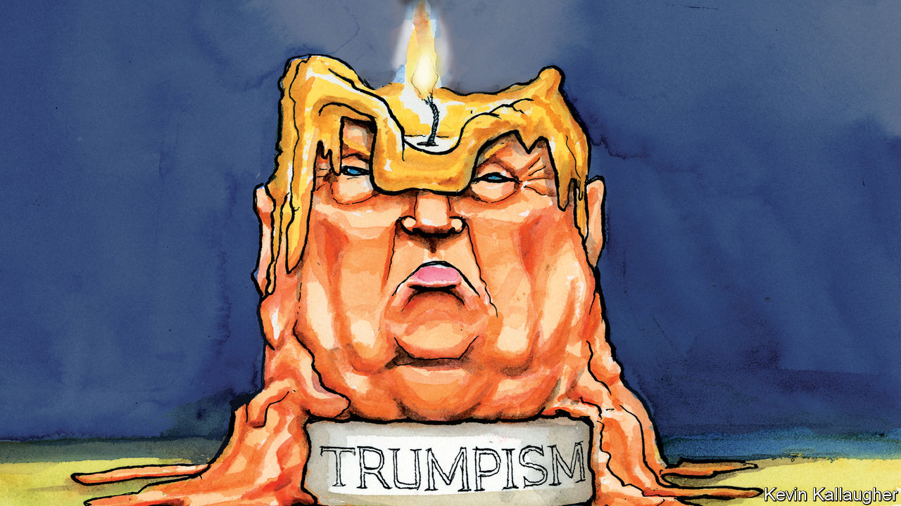

###### Lexington

# Trump and Trumpism 

##### The president has transformed his party. But how enduring his influence will be is unclear 

 

> Nov 5th 2020 

IT HAS BECOME a cliché of liberal editorialising to demand that voters repudiate Donald Trump’s populist platform as well as the president himself. Wherever the final vote tallies land, it will be hard to argue that they have.

At the time of writing, Mr Trump looked on course to lose his re-election bid with the second-highest number of votes ever recorded. He seemed to have achieved that feat mainly by turning out the most characteristic parts of his coalition in force. White working-class men, in particular, cemented the Republicans’ hold on some of the territory he took for them in 2016. Mahoning County in Ohio—which is dominated by hardscrabble Youngstown, whose construction sites your columnist visited on the trail—went Republican for the first time since 1972.


The president’s populist rhetoric—his hounding of elites and foreigners, his race-baiting—also proved to be much less of a turn-off generally than the Democrats had hoped. Bumper support from Cuban-Americans in Florida and Mexican-Americans in southern Texas saw Mr Trump more than double his winning margin in the first state and kill off Democratic dreams of winning the second. Exit polls suggest he increased his share of support from every group except white men. If that is right, Democrats won the election chiefly through their improved turnout effort, not by wooing voters from Mr Trump.

And this, to recap, was after an election campaign that had featured the president at his worst. In the midst of a deadly pandemic, he derided public-health experts and ridiculed his opponent for following their advice. He gave nodding support to a conspiracy theory which holds that Democrats are devil-worshipping paedophiles. He called Kamala Harris—Joe Biden’s black, female, running-mate—a “monster”. It is not hard to see why Mr Trump’s opponents consider the results too close. Yet their hopes of a full-on repudiation, encouraged by a dose of hubris as well as by rotten polls, now appear unrealistic.

Contemporary nationalist populists—such as Andrzej Duda in Poland or Viktor Orban in Hungary—and American presidents alike tend to win re-election. By that measure, merely dislodging Mr Trump would represent an achievement. And Mr Biden’s campaign message, it should be noted, was almost entirely devoted to the vital importance of doing exactly that. If the result was not a crushing rejection of Mr Trump, it seems nevertheless to have been a rejection.

For those who worry about the endurance of Mr Trump’s strain of populism, it should also be noted that it is not altogether clear what it is. After his victory in 2016, Trumpism looked like a rallying-call to the economically distressed. Mr Trump fought this campaign on his claim to have built “the greatest economy in the history of our country”. A mixture of isolationism, cronyism, nativist rhetoric, somewhat performative authoritarianism, corporate tax cuts and personality cult, Trumpism is what the president says it is. No one finds this more frustrating than the small minority of Republicans—including Senators Tom Cotton and Marco Rubio—who have attempted to turn the party into an actual vehicle for the working-class concerns Mr Trump raised. Arguably he has thereby emerged as the main obstacle to the conservative movement he inspired.

His influence may prove to be most enduring if those frustrated adherents take over in his wake. Mr Rubio and the rest appreciate that the pre-Trump party had become detached from its main supporters. And the president has normalised protectionism and other policies that they like. But there is no reason to assume a populist successor to Mr Trump would persist with his race-baiting and thuggery—or, at least, get away with it so easily if he did. Another oddity of the president is how voters who would normally balk at such bad behaviour have given him a pass. Mr Trump, a loud-mouthed celebrity for 40 years, is in that sense a political one-off.

This should be somewhat reassuring to his critics in both parties. Mr Trump has transformed the right—but his influence may be less enduring than these results suggest. In a polarised environment, they probably represent less of an endorsement of him even on the right than it seems. His low approval rating suggests he has again been backed by Republicans who dislike him, but cannot bear to vote for the alternative. The logic of such hyper-partisanship is that, once he is out of office, many Republicans will shift their allegiance to a new leader, and be influenced by him in turn.

Yet there is still plenty in the election verdict to worry Trumpism’s opponents. Above all, the president’s success in broadening his coalition points to their own weaknesses. Democrats will probably take from this that they should have offered Hispanics a better economic message and done more campaigning among them. They say this after most elections. Yet after a campaign almost entirely governed by negative partisanship on both sides, Democrats should think harder about how they may have actively repelled their flagging non-white base.

Populist polarisation

Cuban-Americans are hostile to socialism, a label the Democratic left proudly wears. Mexican-Americans care less about Mr Trump’s anti-immigrant rhetoric than Democrats—in the face of much evidence to the contrary—persist in believing. A doggedly upwardly mobile community, Hispanics do not generally consider themselves to be the downtrodden minority the left refers to them as. The Democrats will not be a reliable alternative to right-wing populism unless they correct such errors and widen their appeal.

In the current polarised environment, anything less than full control of the government is a recipe for deadlock and disaffection. It was the enabling condition for Mr Trump. That America appears to be headed for another bout of divided government is therefore hard to celebrate.■

