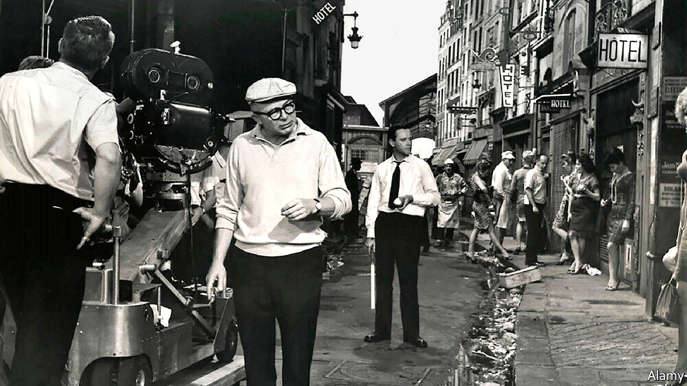

###### Film and fiction

# Billy Wilder is ready for his close-up 

##### Jonathan Coe’s novel reimagines the life and work of a legendary director 

 

> Nov 11th 2020 

Mr Wilder and Me. By Jonathan Coe.Viking; 256 pages; £16.99.

IN THE SUMMER of 1977 an international film crew descended on the sleepy Greek island of Lefkada, temporarily casting it into chaos. Billy Wilder (pictured), the legendary director of “Sunset Boulevard” and “Some Like It Hot”, had chosen it as the location for key scenes in what would be his penultimate movie, “Fedora”. In Jonathan Coe’s mischievous and inventive re-enactment, this film about a reclusive, fading star is, at heart, as much about the end of Hollywood’s Golden Age as the ephemeral nature of youth and fame.


Mr Coe’s novels typically fuse politics, satire and the passage of time. This one draws heavily on factual accounts of Wilder and his associates but places a fictitious outsider at the heart of the story. Calista is an aspiring young composer brought up by her bohemian parents in a shabby flat in Athens. She first encounters Wilder while travelling around America in 1976; later he hires her to act as an interpreter and secretary for “Fedora”.

She and the production move from Greece to the final shoot in West Germany. A lack of American backing had meant Wilder, an Austrian-born Jew, was obliged to turn to German investors. In a dramatic and ingenious scene, Mr Coe grafts the transcript of an actual interview with the director onto a swanky dinner in a Munich hotel. Wilder’s reflections in the interview on the fate of his relatives under Nazism become a biting rebuttal of a Holocaust-denying guest.

Calista narrates the novel, largely in flashback from the present day. Now a married woman with twin daughters, she gives a retrospective view of her own life as well as insights into the enigmatic Wilder, who rails against the “kids with beards” (a new generation of film-makers such as Martin Scorsese and Steven Spielberg). Thus “Mr Wilder and Me” is also a coming-of-age story, in which the first sip of a martini is, for the unworldly Calista, “like a gentle slap in the face to bring you round after a faint”. To appear knowledgeable on set, she memorises and quotes every entry in “Halliwell’s Film Guide”, accidentally finding her vocation as a composer of scores.

Mr Coe has drawn on real-life memories of the production, including those of Wilder’s actual personal assistant, to create the composite figure of Calista. “Fedora” flopped on its release in 1978; the New York Times thought it had “the resonance of an epitaph”. It is now widely recognised as an artistic masterpiece about the illusion of cinema itself. In his finely tuned novel Mr Coe has done it, and its director, justice. ■

