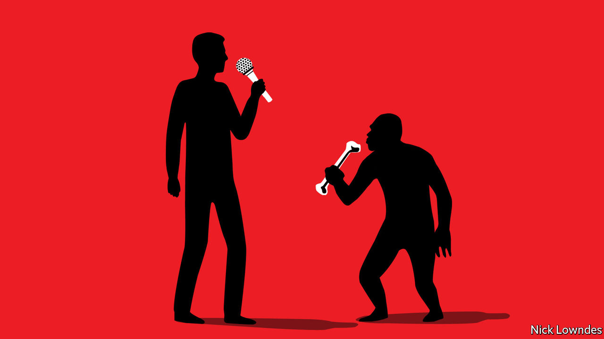

###### Johnson

# Like biological species, languages evolve 

##### There are parallels between the two processes—as Charles Darwin saw 

 

> Nov 14th 2020 

“BECAUSE POLITICS.” “Latinx.” “Doomscrolling.” Language is developing all the time, as new usages like these arise and old ones disappear. One common way to describe this process is to say that “language evolves”. It is an apt formulation, for there is a deep and revealing relationship between linguistic change and biological evolution—along with some big differences.

Linguists today aim to apply methods from other sciences to messy social phenomena. But the influence once ran the other way, with discoveries in linguistic history leaving a mark on evolutionary theory. In the late 18th century William Jones, a British judge in Calcutta, concluded that Sanskrit’s similarity to Latin and Greek was too great to attribute to mere chance. He proposed a parent language, the descendants of which included Sanskrit, Greek, Latin, Persian and other European tongues. Like Columbus, he was not the first to get there, but he made the revelation famous.


As Jones’s findings were elaborated by the philologists who came after him, they also came to the attention of a young Charles Darwin. As early as 1837, looking at the evidence that wildly different languages had once diverged from a single parent, he wrote to his sister that mankind must have been around much longer than the Bible allowed. In 1871 he made the parallel between language divergence and evolution more specific, writing in “The Descent of Man” that “the formation of different languages and of distinct species, and the proofs that both have been developed through a gradual process, are curiously the same.” One language giving birth to both Hindi and English was not so extraordinary if you gave tiny changes time to accrete.

Speciation—the emergence of distinct species—offers one of the closest parallels between linguistic and biological evolution. Darwin found that finches separated on different Galapagos islands had developed into different species, and worked out why. When a homogenous population is split, each subset will be affected by its own genetic changes. Those that contribute, even a little bit, to survival will tend to become more prevalent through the process of natural selection. When such changes accumulate, you no longer have two populations of a single species, but two different species.

Two linguistic populations separated by enough distance, or by a physical barrier such as a mountain range, can undergo a similar experience. Random alterations—to pronunciation, the meaning of words or grammar—are often so small that no one notices them as they are happening. Over the course of many generations, for instance, a t sound might become an s. Or take the terms in the opening lines of this column: using “because” as a preposition, shedding grammatical gender (as “Latinx” purports to do) or forging new words from old pieces (as in “doomscrolling”) may all baffle the uninitiated. As tweaks of these and other kinds mount up in one group, its speakers gradually lose the ability to converse with another—as two speciating populations begin to lose the ability to mate.

Mark Pagel of Reading University has made a list of other compelling parallels between the two processes. Like genes, he notes, words are “discrete, heritable units”. The replication of DNA is akin to language teaching. Physical fossils resemble ancient texts. And so on. But there are contrasts, too, perhaps the biggest being that the chief driver of biological evolution—natural selection—is mostly absent in language.

Nature is red in tooth and claw: a maladaptive mutation can get you killed. Language doesn’t quite work that way. For the most part, changes don’t take hold because they help you avoid a predator, but because they help people communicate. For that, they have to be adopted by others at the same time—which may happen for reasons that have little to do with “fitness”. A celebrity’s coinages will take off quicker than those of a brilliant basement neologist not because they are superior, but because the star has more Twitter followers.

There is, though, a final, important overlap between the two kinds of evolution. In a common visual depiction of the ascent of man, an ape gradually becomes a human through a series of intermediate steps. That gives the impression that evolution is a process of ever increasing sophistication. Not always: rather, organisms, like languages, change to fit their environments. They may not always become more refined. But neither—despite the incessant chorus of grumbles—are they in decline.

