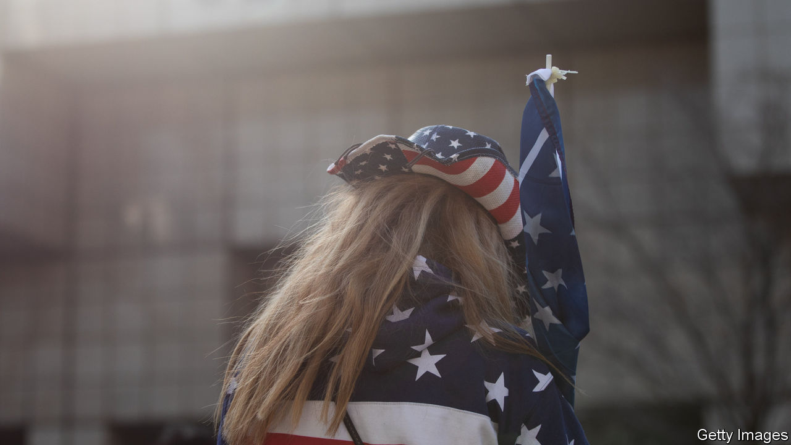

###### All for one

# Robert Putnam and Michael Sandel diagnose America 

##### It has become more egotistical, both scholars conclude. But is there a way back? 

 

> Nov 14th 2020 

The Upswing. By Robert Putnam and Shaylyn Romney Garrett. Simon &amp; Schuster; 480 pages; $32.50. Swift Press; £25.

The Tyranny of Merit. By Michael Sandel.Farrar, Straus and Giroux; 288 pages; $28. Allen Lane; £20.

THE RANCOUR of American politics, say these two distinguished scholars, is a symptom of an even deeper malaise. Robert Putnam charts a rise in economic inequalities, cultural tribalism and frayed social connections since the 1960s—when, he recalls, the spirit of solidarity and reform was by contrast strong. Michael Sandel focuses on the meritocratic rat-race and its justifications, which create, in his words, “hubris among the successful and resentment among the disadvantaged”.

Both blame the ills they identify on widespread acceptance of egotistical go-getting at a cost to common purpose. Their bleak picture of private indifference to public welfare prompts an equally sweeping solution. America needs nothing less, they think, than a recovery of community and rededication to the common good.

Mr Putnam, a political scientist, is well-known for “Bowling Alone” (2000), which reported a drop of clubbability in a nation of joiners. Written with Shaylyn Romney Garrett, “The Upswing” is a reprise that answers critics and laments a yet broader retreat to private concerns. It offers a historical account of trends in public commitment over 120 years.

The narrative arc is simple. A dog-eat-dog Gilded Age at the end of the 19th century prompted ever greater social engagement and reform in three stages—Progressivism, the New Deal and the 1960s. Soon, however, dog-eat-dogism returned and is now again uppermost. To support that analysis, a mass of survey data and statistics is mapped onto what Mr Putnam calls “I-we-I” curves, which show a rise and fall in economic equality, political co-operation, social solidarity and a sense of shared American culture.

“The Upswing” ranges widely, yet its scrupulous survey-mining and curve-fitting is not wholly persuasive, or indeed necessary. Up on the latest research and impeccably open to counterargument, Mr Putnam tends to take away with one study what he has just offered with another. A heartfelt communitarian essay, “What ails America”, without the social-science apparatus, might have been just as convincing.

Mr Sandel’s focus is tighter. His target is meritocratic society and the ideal it aims to realise, equality of opportunity. For true egalitarians, who want fairer outcomes, a uniform starting line has always seemed a fudge. To some rugged conservatives, promising equal opportunity is necessary lip-service to unmeetable popular demands. Mr Sandel, a political philosopher, ends up on the fence. He is not an out-and-out egalitarian, but nor does he dismiss hopes for some degree of genuine civic equality.

He recognises that gauges of performance and success often measure the wrong things—or measure the right things badly. His critique of over-reliance on paper credentials in hiring and university placements is telling. (Similar flaws of ranking mania in medicine, policing, schooling and the armed forces were expertly exposed in Jerry Muller’s “The Tyranny of Metrics”.) Mr Sandel’s larger concern, however, is not whether achievement is properly calibrated but whether its rewards are rightly merited. As he says, that ethical question runs back to theological disputes about the arbitrariness or earnability of God’s grace. These days, free-marketeers and redistributionists tussle over whether and how to offset the lottery of talent and energy that underlies supposedly merited rewards.

Like Mr Putnam’s, the solutions Mr Sandel suggests call for profound changes in prevailing attitudes: acknowledgment of luck in the share-out of rewards, recognition that all work has dignity, new commitment to the public good, and readiness to argue such matters out in a healthier, more deliberative democracy. A sceptic may share the pair’s concerns about American society yet wonder if, in such a vigorously competitive, capitalist place, those profound changes in thinking are probable. And whether, given how long the arguments over unmerited disadvantage have lasted, they are likely to end soon. ■

