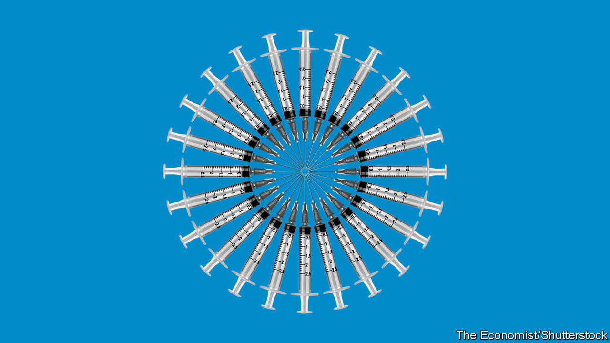
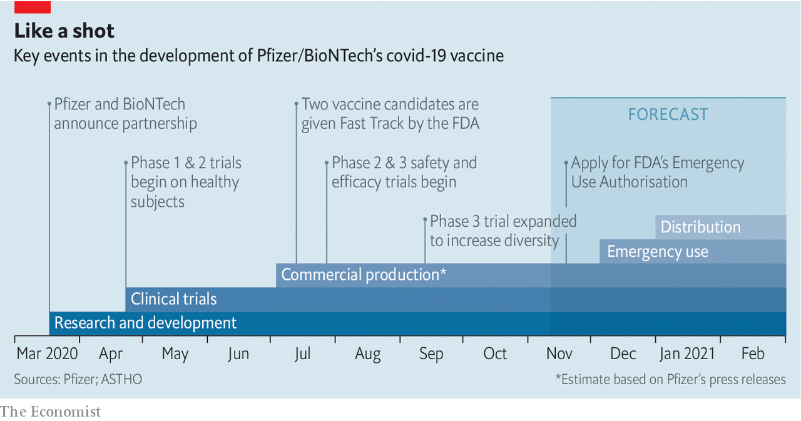
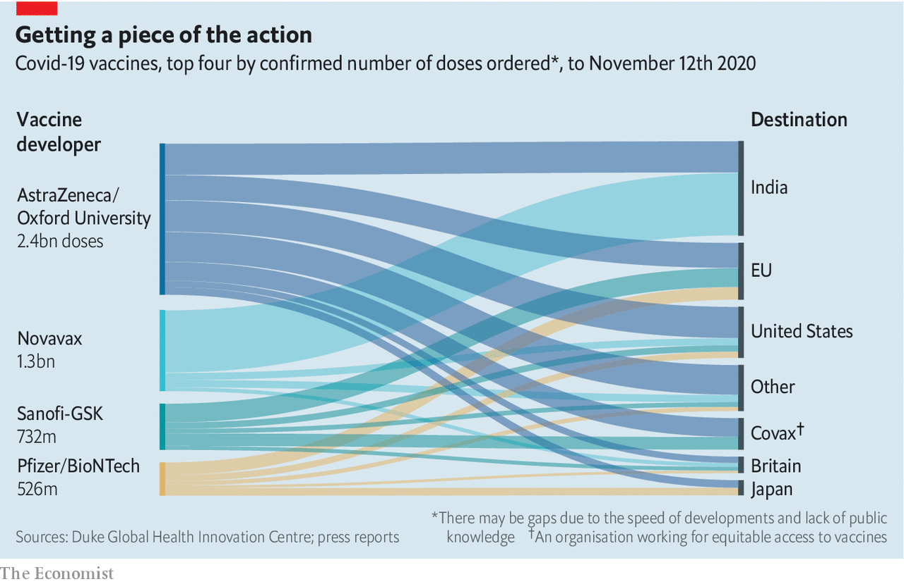

###### The technology of hope

# An effective covid-19 vaccine is a turning point in the pandemic 

##### It is a breakthrough for the history books. But a lot still needs to be done 

 

> Nov 14th 2020 

Editor’s note: Some of our covid-19 coverage is free for readers of The Economist Today, our daily . For more stories and our pandemic tracker, see our 

DELIVERANCE, WHEN it arrives, will come in a small glass vial. First there will be a cool sensation on the upper arm as an alcohol wipe is rubbed across the skin. Then there will be a sharp prick from a needle. Twenty-one days later, the same again. As the nurse drops the used syringe into the bin with a clatter, it will be hard not to wonder how something so small can solve a problem so large.

On November 9th Pfizer and BioNTech, two firms working as partners on a vaccine against covid-19, announced something extraordinary about the first 94 people on their trial to develop symptoms of the disease. At least 86 of them—more than nine out of ten—had been given the placebo, not the vaccine. A bare handful of those vaccinated fell ill. The vaccine appeared to be more than 90% effective.


Within a few weeks the firms could have the data needed to apply for emergency authorisation to put the vaccine to use. The British and American governments have said that vaccinations could start in December. The countries of the EU have also been told it will be distributed quickly.

The news lifted spirits around the world, not to mention stockmarkets (see ). The end of the pandemic seemed in sight; scientific insight and industrial know-how had, in a bravura display of their power, provided an exit strategy. Pfizer and BioNTech have not just developed a vaccine against a previously unknown disease in a scant ten months. They have done so on the basis of an approach to vaccination never before used in people. And their novel vaccine has shown an unanticipated efficacy. Most in the field thought 70% efficacy was good as could be hoped for first time out; just 50% could have been good enough for regulatory approval. Exceeding 90% hits the virus for six.

Russia and China have been vaccinating some citizens against covid-19 for some time outside the scope of clinical trials. On November 11th the Russian Direct Investment Fund announced that data showed Russia’s vaccine, known as Sputnik V, to be 92% effective. Before the Pfizer announcement this would have seemed highly implausible. Now it may seem less so, though the evidence is weak compared with Pfizer’s. And neither Sputnik V nor the Chinese vaccines have yet had their safety and efficacy addressed by the stringent regulators at the Food and Drug Administration (FDA) in America and the European Medicines Agency (EMA).

Pfizer’s vaccine is now headed into that regulatory gamut with a small posse of followers hot on its heels (see table). Two other vaccines which are in phase-three trials—the sort of large, randomised trials designed to show the efficacy of a treatment—could submit data to the regulators fairly soon. Moderna, an American biotech firm, is expected to deliver interim findings about the efficacy of its vaccine in the next few weeks. AstraZeneca, a pharmaceuticals company working in partnership with the University of Oxford, should deliver results from its trial before the end of the year.

 


Challenges remain. Though the regulators will want to move quickly, they will still have to do their job. Missteps could erode confidence in the vaccine, as well as vaccination more generally. Plans for scaling up manufacture and for distribution on an unprecedented scale have been being made around the world for months, but it is hard to imagine that they will not require revision on the hoof. Even if the news continues to be good, the numbers vaccinated will remain small for months to come. But a fateful corner has been turned.


Listen on:  |  |  |  | 

The technology of hope

Great speed has come from great efforts. Cath Green, the boss of the clinical biomanufacturing facility at the University of Oxford, remembers the pressure to get the first candidate-vaccine vials filled in April. Everyone was doing double shifts and working on weekends. “We knew it had to be this fast if we were to get a vaccine to people this year,” she says.

But it was not just hard work. New technology, a lack of financial constraint and a commitment to speeding up regulatory processes without sacrificing standards mattered, too.

Technology first. Vaccines against viruses used to be based on the virus particles they were meant to stymie. Some were strains of the virus “attenuated” so as not to cause disease; some were normal virus particles inactivated so that they could not reproduce at all. Design was somewhat hit and miss. Today vaccine development is based on viral genomes. Researchers look for a gene which describes a protein the immune system seems likely to recognise. Then they put that gene into a new context.

In the case of SARS-Cov-2, the virus that causes covid-19, the genome was published on January 10th. Understanding its structure on the basis of their experience with other coronaviruses, would-be vaccine-makers immediately homed in on the gene for the distinctive spike protein with which the virus’s membrane is studded: just the sort of thing, they reckoned, to provoke a response from the immune system.

At BioNTech, a German biotechnology company that specialises in the use of mRNAS—sequences of genetic material that provide cells with recipes for making proteins—the spike-protein gene was more or less all it took. The company’s researchers made an mRNA version of it that could be injected into the body in tiny capsules made of lipids. There it would lead cells to produce the spike protein, and the immune system would then take note. Or so they hoped: no mRNA vaccine had been used in humans before. Moderna, too, has as its name suggests taken the mRNA route.

In Oxford a version of the spike gene was instead put into the genome of a harmless adenovirus originally found in monkeys; when the resultant virus infects cells it, too, makes them produce spike proteins that attract the immune system’s attention. The vaccine developed by J&amp;J also uses the adenovirus approach, as does Sputnik V.

It is no accident that the vaccines that have come along fastest are based on these novel strategies. Before the coronavirus struck these technologies were already being developed as platforms on which a rapid response to a new viral disease could be built, work supported in part by the Coalition for Epidemic Preparedness Innovations (CEPI). Vaccines which are built on such platforms are quick to engineer and comparatively easy to make.

The correct egg-to-basket ratio

That said, the work still requires money, which in the vaccine world is usually in short supply. With covid-19, though, governments have been willing to shovel cash at vaccine developers even though there was a risk they would get nothing in return. “We persuaded the UK government to fund us before they had any idea whether it would work,” says Dr Green. It was this ready cash, sometimes provided in the form of a commitment to buy the end product, which sped the process up, rather than any loosening of normal rules and procedures. “We haven’t cut any corners,” Dr Green continues. “And we haven’t taken any risks with our product.”

Rather than standing back, regulators in many countries have worked closely with companies to make sure their trials provide all the data needed for approval when the time is right. When it was safe to do so, the different phases of trials were allowed to overlap, with larger, later trials starting before smaller preliminary ones had produced all their data. At Oxford they were able to start human trials the day after animal safety data had been published.

Richard Hatchett, the head of CEPI, says Pfizer’s positive results increase the probability that other covid vaccines will be successful, too. They show that an mRNA vaccine can work, which is good news for Moderna; they also show that targeting the spike protein pays off. And the success goes beyond the current pandemic. Work CEPI expected to take five or ten years has been managed in less than one; if the various platforms in play all pay off, Dr Hatchett says, it will “transform vaccinology”.

The fact that there are more vaccines on the way matters for a number of reasons. One is that, despite this week’s good news, the Pfizer vaccine is not yet guaranteed approval. For one thing, its safety needs to be more fully ascertained. The firm says that no serious safety concerns have arisen during the trial. But the vaccine will come with side-effects, at least for some, and the company will only be in a position to request approval for the vaccine on an “emergency use” basis after it has two months of safety data showing such effects to be manageable. That requirement looks likely to be met in time for an application in the third week of November.

Then comes the question of what exactly the vaccine does: is it stopping infections completely—providing “sterilising immunity”—or simply amping up the body’s response so that infections do not cause disease? The latter attribute is undoubtedly a useful one for the individual concerned; all the better if, as well as lowering the chance of infection leading to disease, it also makes the disease less severe in those who succumb (there is as yet no available data on this). But it is a lot less desirable in public-health terms. If the vaccine stops disease but not infection, vaccinated people may be able to infect others while staying safe themselves.

If the Pfizer vaccine does not provide sterilising immunity there will be a need for one that does. And there are other ways that subsequent vaccines might prove preferable. Different vaccines can work better or worse with different populations, and for covid-19 it is important to find a vaccine which works well in old people. Their immune systems can often be unresponsive to vaccination, and they may do better with vaccines which, in the general population, do not look as effective. There is no guarantee that the best vaccine overall will be the best for the elderly.

And the Pfizer vaccine has some inconvenient characteristics. It needs to be kept at -70°C or even colder as it is moved from where it is made to where it is used, which requires a lot of equipment that other vaccines do not need. Seth Berkley, head of the vaccine finance group GAVI, warns that many countries do not currently have the wherewithal to meet that challenge. But he also notes that the lack is not insuperable. The Democratic Republic of Congo successfully deployed an Ebola vaccine that required similarly special care. “It’s a pain in the ass, it’s expensive, but it’s doable.”

Still, a vaccine which, if not liking it hot, at least liked it less cold would be a boon. So would one that only needed to be given once. The Pfizer, AstraZeneca and Moderna vaccines all require two jabs weeks apart. A one-and-done vaccine, which is what J&amp;J hopes for, makes setting up a vaccination programme far simpler. It also means a given number of doses will go a lot further.

On top of all this, the long-term efficacy of the vaccine will matter a lot. The Pfizer/BioNTech collaboration says that protection should last at least a year. But that will not be known for sure before they apply to regulators for full authorisation on the basis of final trial results, which they are expected to do in the first quarter of next year (as are the makers of the other front-runners). A vaccine that provides protection only briefly might well not be able to disrupt the virus’s transmission, instead feeding a constant stream of newly susceptible people back into the population at large. Marcus Schabacker, the boss of the Emergency Care Research Institute, an American organisation focused on the quality and safety of medical practices, thinks six months of follow-up data ought to be scrutinised, not just two, before final decisions are made on deploying the vaccine.

 


Such questions will be on the minds of regulators at the FDA and EMA when they are asked to consider the Pfizer vaccine for emergency use later this month and when Pfizer and the makers of other vaccines submit all the data from their trials next year. Their opinions will have worldwide effects, as the World Health Organisation (WHO) will use the analytical capabilities of those authorities to accelerate the review of vaccines for use in low- and middle-income countries.

If emergency authorisation is granted it is likely the agencies will restrict the use of these vaccines, initially, to those at highest risk of death or serious disease. If after seeing the full data the regulators still have worries they may continue to limit the vaccines’ use. Whatever they decide they are very likely to insist on years of follow up.

Andrew Pollard, director of the Oxford Vaccine Group, says it is important that all developers carry on with trials as long as possible. But this may be hard unless early use is restricted to specific groups. If a vaccine is approved for use in the general population, few will volunteer to take part in a trial for another vaccine that uses a placebo as a control (if Pfizer and BioNTech receive an emergency authorisation they plan to offer all the volunteers who were given a placebo the active vaccine). A trial that compares an experimental vaccine with one that is already approved needs to be very large to get results, since both wings can be expected to show comparatively few infections. Such trials are under discussion, but they will take a long time.

If vaccines are approved for widespread use, the world will face what some have called the largest supply-chain challenge in history. There is normally little spare vaccine-manufacturing capacity to repurpose. And production is not the only limiting factor. Analysts at UBS, a bank, warn that “fill and finish”, where the vaccine is put into vials and packaged, could be one of the most significant bottlenecks.

Pfizer says it will only be able to make enough vaccine to inoculate 25m people in 2020. Up to 1.3bn doses are possible, in theory, next year—enough for another 650m people. If other vaccines are approved then the supply will increase. In even the most optimistic scenarios, though, Dr Hatchett expects demand to exceed supply throughout 2021.

Various countries have already set up purchase agreements with vaccine developers (see chart). The COVAX facility set up by CEPI, GAVI and the WHO will buy vaccines for 150 countries, and aims to procure enough for them to get 20% of their populations vaccinated over the course of 2021. UNICEF, the UN’s children’s agency, will take a leading role in distribution. It normally procures 600m-800m syringes for routine childhood immunisations every year. The demands of covid are likely to treble or quadruple that number.

 


There is clearly a risk that nations will hoard some vaccine for their own use rather than that of the most needy, but it is not easy to say how large the problem will be. Pharma firms have cleverly placed manufacturing sites around the world, including in small countries such as Belgium and Switzerland which can quickly produce more vaccine than these countries could ever want. And the COVAX framework has wide international support.

That framework follows advice from the WHO in identifying three priority groups for early vaccination: front-line health- and social-care workers; the over 65s; and those under 65 who have underlying health conditions, such as diabetes, which put them at particular risk. Countries setting their own priorities are by and large prioritising the same groups. This means that young and middle-aged people not in any risk categories are unlikely to be vaccinated until well into next year. Social distancing and mask wearing will stay important for some time to come even after vaccination becomes widespread. But a more normal form of life looks unlikely to be too long delayed.

For vaccination to work as well as it can requires a widespread willingness to be vaccinated—something that cannot be taken for granted in a world where anti-vaccine disinformation has a strong foothold. The data on this front, though, are broadly encouraging. A survey of 20,000 adults in 27 countries undertaken for the World Economic Forum this August found that 74% would get a vaccine if it were available. In China the figure was 97%, in India 87%, in America 67%. Countries with low rates of acceptance were Russia (54%), Poland and Hungary (both 56%) and France (59%).

A cold coming

Better testing, new antibody treatments and improvements in care will continue to drive down the death rate for coronavirus both before widespread vaccination and after it. Vaccination will instead change the fundamentals. Its advent marks the beginning of the end of covid-19 as a pandemic.

But for all the hope that diligence and science have kindled, there are hard winter months to face before that spring. The official tally of daily deaths round the world is now for the first time higher than it was in the pandemic’s first peak, and the spread of the virus in America appears to be out of control (see ). In the next three months hundreds of thousands of people look likely to die. Not only will their loved ones have to come to terms with this loss, they will also have to live with the knowledge that a vaccine that could have saved them, even though developed at breakneck speed, arrived just too late.■

