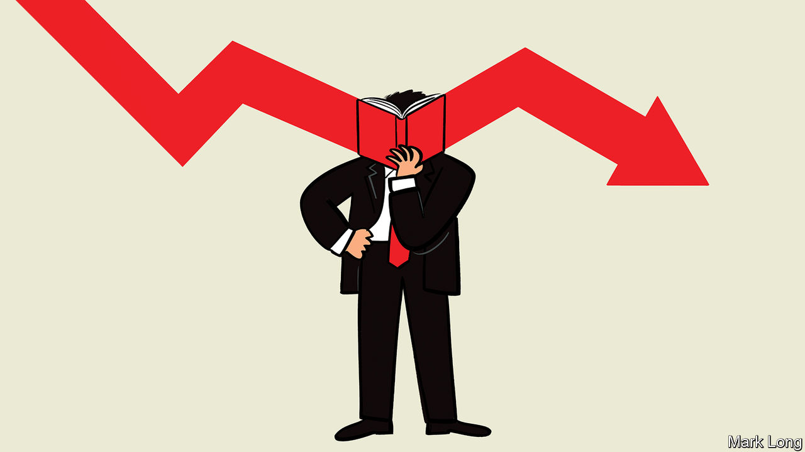
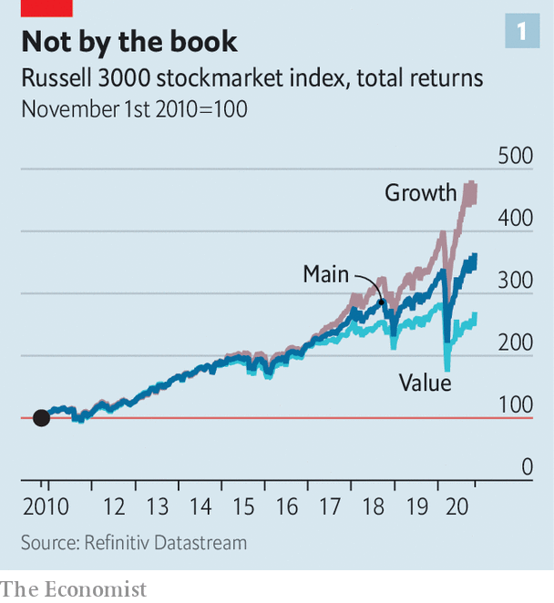
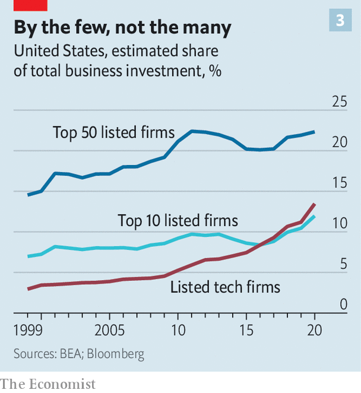
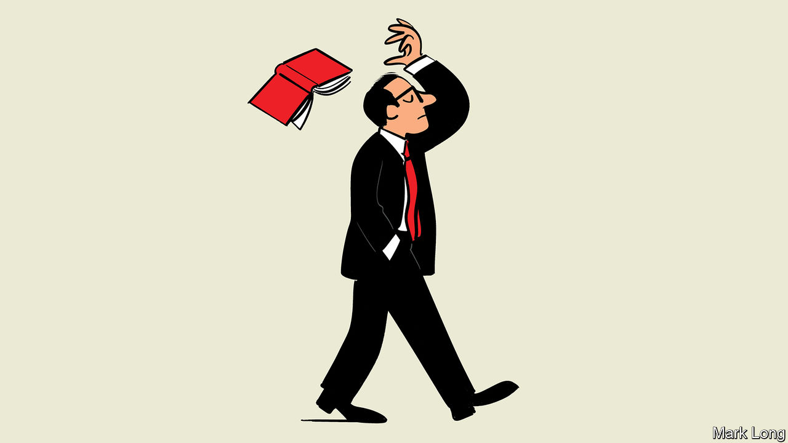

###### Diminishing value

# Value investing is struggling to remain relevant 

##### The main reason is the inexorable rise of hard-to-analyse intangible assets 

 

> Nov 12th 2020 

IT IS NOW more than 20 years since the Nasdaq, an index of technology shares, crashed after a spectacular rise during the late 1990s. The peak in March 2000 marked the end of the internet bubble. The bust that followed was a vindication of the stringent valuation methods pioneered in the 1930s by Benjamin Graham, the father of “value” investing, and popularised by Warren Buffett. For this school, value means a low price relative to recent profits or the accounting (“book”) value of assets. Sober method and rigour were not features of the dotcom era. Analysts used vaguer measures, such as “eyeballs” or “engagement”. If that was too much effort, they simply talked up “the opportunity”.

Plenty of people sense a replay of the dotcom madness today. For much of the past decade a boom in America’s stockmarket has been powered by an elite of technology (or technology-enabled) shares, including Apple, Alphabet, Facebook, Microsoft and Amazon. The value stocks favoured by disciples of Graham have generally languished. But change may be afoot. In the past week or so, fortunes have reversed. Technology stocks have sold off. Value stocks have rallied, as prospects for a coronavirus vaccine raise hopes of a quick return to a normal economy. This might be the start of a long-heralded rotation from overpriced tech to far cheaper cyclicals—stocks that do well in a strong economy. Perhaps value is back.


This would be comforting. It would validate a particular approach to valuing companies that has been relied upon for the best part of a century by some of the most successful investors. But the uncomfortable truth is that some features of value investing are ill-suited to today’s economy. As the industrial age gives way to the digital age, the intrinsic worth of businesses is not well captured by old-style valuation methods, according to a recent essay by Michael Mauboussin and Dan Callahan of Morgan Stanley Investment Management.

The job of stockpicking remains to take advantage of the gap between expectations and fundamentals, between a stock’s price and its true worth. But the job has been complicated by a shift from tangible to intangible capital—from an economy where factories, office buildings and machinery were key to one where software, ideas, brands and general know-how matter most. The way intangible capital is accounted for (or rather, not accounted for) distorts measures of earnings and book value, which makes them less reliable metrics on which to base a company’s worth. A different approach is required—not the flaky practice of the dotcom era but a serious method, grounded in logic and financial theory. However, the vaunted heritage of old-school value investing has made it hard for a fresher approach to gain traction.

Graham’s cracker

To understand how this investment philosophy became so dominant, go back a century or so to when equity markets were still immature. Prices were noisy. Ideas about value were nascent. The decision to buy shares in a particular company might by based on a tip, on inside information, on a prejudice, or gut feel. A new class of equity investors was emerging. It included far-sighted managers of the endowment funds of universities. They saw that equities had advantages over bonds—notably those backed by mortgages, railroads or public utilities—which had been the preferred asset of long-term investors, such as insurance firms.

This new church soon had two doctrinal texts. In 1934 Graham published “Security Analysis” (with co-author David Dodd), a dense exposition of number-crunching techniques for stockpickers. Another of Graham’s books is easier to read and perhaps more influential. “The Intelligent Investor”, first published in 1949, ran in revised editions right up until (and indeed beyond) Graham’s death in 1976. The first edition is packed with sage analysis, which is as relevant today as it was 70 years ago.

Underpinning it all is an important distinction—between the price and value of a stock. Price is a creature of fickle sentiment, of greed and fear. Intrinsic value, by contrast, depends on a firm’s earnings power. This in turn derives from the capital assets on its books: its factories, machines, office buildings and so on.

The approach leans heavily on company accounts. The valuation of a stock should be based on a conservative multiple of future profits, which are themselves based on a sober projection of recent trends. The book value of the firm’s assets provides a cross-check. The past might be a crude guide to the future. But as Graham argued, it is a “more reliable basis of valuation than some other future plucked out of the air of either optimism or pessimism”. As an extra precaution, investors should seek a margin of safety between the price paid for a stock and its intrinsic value, to allow for any errors in the reckoning. The tenets of value investing were thus established. Be conservative. Seek shares with a low price-earnings or price-to-book ratio.

The enduring status of his approach owes more to Graham as tutor than the reputation he enjoyed as an investor. Graham taught a class on stockpicking at Columbia University. His most famous student was Mr Buffett, who took Graham’s investment creed, added his own twists and became one of the world’s richest men. Yet the stories surrounding Mr Buffett’s success are as important as the numbers, argued Aswath Damodaran of New York University’s Stern School of Business in a recent series of YouTube lectures on value investing. The bold purchase of shares in troubled American Express in 1964; the decision to dissolve his partnership in 1969, because stocks were too dear; the way he stoically sat out the dotcom mania decades later. These stories are part of the Buffett legend. The philosophy of value investing has been burnished by association.

It helped also that academic finance gave a back-handed blessing to value investing. An empirical study in 1992 by Eugene Fama, a Nobel-prize-winning finance theorist, and Kenneth French found that volatility, a measure of risk, did not explain stock returns between 1963 and 1990, as academic theory suggested it should. Instead they found that low price-to-book shares earned much higher returns over the long run than high price-to-book shares. One school of finance, which includes these authors, concluded that price-to-book might be a proxy for risk. For another school, including value investors, the Fama-French result was evidence of market inefficiency—and a validation of the value approach.

All this has had a lasting impact. Most investors “almost reflexively describe themselves as value investors, because it sounds like the right thing to say”, says Mr Damodaran. Why would they not? Every investor is a value investor, even if they are not attached to book value or trailing earnings as the way to select stocks. No sane person wants to overpay for stocks. The problem is that “value” has become a label for a narrow kind of analysis that often confuses means with ends. The approach has not worked well for a while. For much of the past decade, value stocks have lagged behind the general market and a long way behind “growth” stocks, their antithesis (see chart 1). Old-style value investing looks increasingly at odds with how the economy operates.

 


In Graham’s day the backbone of the economy was tangible capital. But things have changed. What makes companies distinctive, and therefore valuable, is not primarily their ownership of physical assets. The spread of manufacturing technology beyond the rich world has taken care of that. Any new design for a gadget, or garment, can be assembled to order by contract manufacturers from components made by any number of third-party factories. The value in a smartphone or a pair of fancy athletic shoes is mostly in the design, not the production.

In service-led economies the value of a business is increasingly in intangibles—assets you cannot touch, see or count easily. It might be software; think of Google’s search algorithm or Microsoft’s Windows operating system. It might be a consumer brand like Coca-Cola. It might be a drug patent or a publishing copyright. A lot of intangible wealth is even more nebulous than that. Complex supply chains or a set of distribution channels, neither of which is easily replicable, are intangible assets. So are the skills of a company’s workforce. In some cases the most valuable asset of all is a company’s culture: a set of routines, priorities and commitments that have been internalised by the workforce. It can’t always be written down. You cannot easily enter a number for it into a spreadsheet. But it can be of huge value all the same.

A beancounter’s nightmare

There are three important aspects to consider with respect to intangibles, says Mr Mauboussin: their measurement, their characteristics, and their implications for the way companies are valued. Start with measurement. Accounting for intangibles is notoriously tricky. The national accounts in America and elsewhere have made a certain amount of progress in grappling with the challenge. Some kinds of expenditure that used to be treated as a cost of production, such as R&amp;D and software development, are now treated as capital spending in GDP figures. The effect on measured investment rates is quite marked (see chart 2). But intangibles’ treatment in company accounts is a bit of a mess. By their nature, they have unclear boundaries. They make accountants queasy. The more leeway a company has to turn day-to-day costs into capital assets, the more scope there is to fiddle with reported earnings. And not every dollar of R&amp;D or advertising spending can be ascribed to a patent or a brand. This is why, with a few exceptions, such spending is treated in company accounts as a running cost, like rent or electricity.

 


The treatment of intangibles in mergers makes a mockery of this. If, say, one firm pays $2bn for another that has $1bn of tangible assets, the residual $1bn is counted as an intangible asset—either as brand value, if that can be appraised, or as “goodwill”. That distorts comparisons. A firm that has acquired brands by merger will have those reflected in its book value. A firm that has developed its own brands will not.

The second important aspect of intangibles is their unique characteristics. A business whose assets are mostly intangible will behave differently from one whose assets are mostly tangible. Intangible assets are “non-rival” goods: they can be used by lots of people simultaneously. Think of the recipe for a generic drug or the design of a semiconductor. That makes them unlike physical assets, whose use by one person or for one kind of manufacture precludes their use by or for another.

In their book “Capitalism Without Capital” Jonathan Haskel and Stian Westlake provided a useful taxonomy, which they call the four Ss: scalability, sunkenness, spillovers and synergies. Of these, scalability is the most salient. Intangibles can be used again and again without decay or constraint. Scalability becomes turbo-charged with network effects. The more people use a firm’s services, the more useful they are to other customers. They enjoy increasing returns to scale; the bigger they get, the cheaper it is to serve another customer. The big business successes of the past decade—Google, Amazon and Facebook in America; and Alibaba and Tencent in China—have grown to a size that was not widely predicted. But there are plenty of older asset-light businesses that were built on such network effects—think of Visa and Mastercard. The result is that industries become dominated by one or a few big players. The same goes for capital spending. A small number of leading firms now account for a large share of overall investment (see chart 3).

 


Physical assets usually have some second-hand value. Intangibles are different. Some are tradable: you can sell a well-known brand or license a patent. But many are not. You cannot (or cannot easily) sell a set of relationships with suppliers. That means the costs incurred in creating the asset are not recoverable—hence sunkenness. Business and product ideas can easily be copied by others, unless there is some legal means, such as a patent or copyright, to prevent it. This characteristic gives rise to spillovers from one company to another. And ideas often multiply in value when they are combined with other ideas. So intangibles tend to generate bigger synergies than tangible assets.

The third aspect of intangibles to consider is their implications for investors. A big one is that earnings and accounting book value have become less useful in gauging the value of a company. Profits are revenues minus costs. If a chunk of those costs are not running expenses but are instead spending on intangible assets that will generate future cashflows, then earnings are understated. And so, of course, is book value. The more a firm spends on advertising, R&amp;D, workforce training, software development and so on, the more distorted the picture is.

The distinction between a running expense and investment is crucial for securities analysis. An important part of the stock analyst’s job is to understand both the magnitude of investment and the returns on it. This is not a particularly novel argument, as Messrs Mauboussin and Callahan point out. It was made nearly 60 years ago in a seminal paper by Merton Miller and Francesco Modigliani, two Nobel-prize-winning economists. They divided the value of a company into two parts. The first—call it the “steady state”—assumes that that the company can sustain its current profits into the future. The second is the present value of future growth opportunities—essentially what the firm might become. The second part depends on the firm’s investment: how much it does, the returns on that investment and how long the opportunity lasts. To begin to estimate this you have to work out the true rate of investment and the true returns on that investment.

 


The nature of intangible assets makes this a tricky calculation. But worthwhile analysis is usually difficult. “You can’t abdicate your responsibility to understand the magnitude of investment and the returns to it,” says Mr Mauboussin. Old-style value investors emphasise the steady state but largely ignore the growth-opportunities part. But for a youngish company able to grow at an exponential rate by exploiting increasing returns to scale, the future opportunity will account for the bulk of valuation. For such a firm with a high return on investment, it makes sense to plough profits back into the firm—and indeed to borrow to finance further investment.

Picking winners in an intangible economy—and paying a price for stocks commensurate with their chances of success—is not for the faint-hearted. Some investments will be a washout; sunkenness means some costs cannot be recovered. Network effects give rise to winner-takes-all or winner-takes-most markets, in which the second-best firm is worth a fraction of the best. Value investing seems safer. But the trouble with screening for stocks with a low price-to-book or price-to-earnings ratio is that it is likelier to select businesses whose best times are behind them than it is to identify future success.

Up, up and away

Properly understood, the idea of fundamental value has not changed. Graham’s key insight was that price will sometimes fall below intrinsic value (in which case, buy) and sometimes will rise above it (in which case, sell). In an economy mostly made up of tangible assets you could perhaps rely on a growth stock that had got ahead of itself to be pulled back to earth, and a value stock that got left behind to eventually catch up. Reversion to the mean was the order of the day. But in a world of increasing returns to scale, a firm that rises quickly will often keep on rising.

The economy has changed. The way investors think about valuation has to change, too. This is a case that’s harder to make when the valuation differential between tech and value stocks is so stark. A correction at some stage would not be a great surprise. The appeal of old-style value investing is that it is tethered to something concrete. In contrast, forward-looking valuations are by their nature more speculative. Bubbles are perhaps unavoidable; some people will extrapolate too far. Nevertheless, were Ben Graham alive today he would probably be revising his thinking. No one, least of all the father of value investing, said stockpicking was easy. ■

