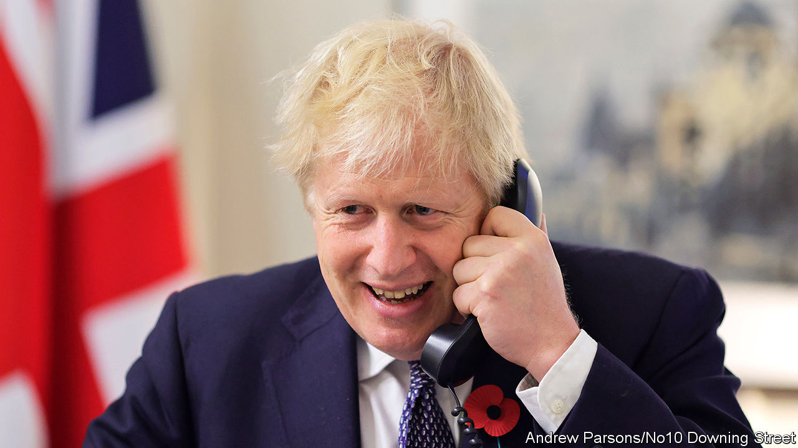

###### Brexit and Biden

# Biden puts pressure on Johnson to do a deal with the EU 

##### Joe calling 

 

> Nov 12th 2020 

DOWNING STREET was cock-a-hoop on November 10th when Joe Biden, America’s president-elect, telephoned Boris Johnson before any other European leader. Yet the call was not just a friendly one to cement the “special relationship”. There was an implicit threat in it: if Mr Johnson allowed Britain to leave the EU without a deal, thus undermining the Good Friday Agreement (GFA) that brought peace to Northern Ireland, Britain would not get a trade deal with America.

Just seven weeks remain until the end of the standstill transition period, with no trade deal in sight. Talks are continuing, but agreement is elusive on the most contentious issues: a level playing-field for competition (including limits to state aids), fisheries, and dispute resolution. Michel Barnier, the EU negotiator, says the talks are not currently on a path to a deal. David Frost, his British counterpart, insists solutions must fully respect UK sovereignty, a tricky condition since any treaty inevitably impinges on it.


As ever, Northern Ireland looms large. On November 9th the House of Lords decided by 433 to 165 votes to strike out clauses in the internal-market bill seeking to overturn parts of the Northern Ireland protocol in the withdrawal treaty. Mr Johnson vowed to reinstate the clauses when the bill returns to the Commons. He also plans to use the finance bill for other changes to the protocol. This breach of international law has been denounced by all living former Tory prime ministers, as well as by Michael Howard, a former leader who is a passionate Brexiteer.

The EU says that Mr Johnson’s changes undermine the GFA by risking a hard border in Ireland. Mr Biden, who has Irish roots, agrees. Optimists believe his election makes it more likely that Mr Johnson will compromise to get a deal and drop his rewrite of the Northern Ireland protocol. To be out in the cold with no trade deal with either the EU or America would be uncomfortable. And if it involved breaking international law, it would also stymie Mr Johnson’s ambitions for “Global Britain” and make Britain’s chairmanship of the G7 and the COP26 climate-change summit next year more awkward.

Coming on top of covid-19, the disruption and cost of a no-deal Brexit also argue for compromise. Charles Grant of the Centre for European Reform, a think-tank, says the next weeks will see growing pressure for a deal from business and pro-business cabinet ministers and Tory MPs. Mr Johnson’s rising unpopularity and reputation for incompetence also suggest he badly needs to show he can at least get a much-promised Brexit trade deal.

Yet some make the opposite argument. Fabian Zuleeg of the European Policy Centre, a Brussels think-tank, sees a danger that EU leaders may conclude that, since Mr Biden’s victory will push Mr Johnson towards making a deal, there is now no need to offer him face-saving compromises. But Mr Johnson’s troubled relations with Tory MPs leave him wary of giving concessions. Many Brexiteers now criticise those he made in the withdrawal treaty. Mujtaba Rahman of Eurasia Group, a consultancy, notes that almost all members of the new group of lockdown-sceptic MPs are hard Brexiteers who prefer no deal to compromise. As a new National Audit Office report shows, even a deal will bring huge disruption at the borders. It would be easier for Mr Johnson to blame this on the EU if it came after no deal than after a deal.

The other concern is that time is short. The EU is famous for missing deadlines, but its claim that a deal must be done within a week or two is serious. Lengthy trade treaties typically take months to translate, put into legal form and ratify. This one needs to be approved by national governments as well as the European Parliament. Several members of the parliament have said that, unless Mr Johnson drops his plans to change the Northern Ireland protocol, they will reject a deal.

The risk that no-deal may come about because time runs out is not small. If that happens, Mr Johnson has nobody to blame but himself, for in June he had the opportunity to extend the transition period and chose not to do so. ■

