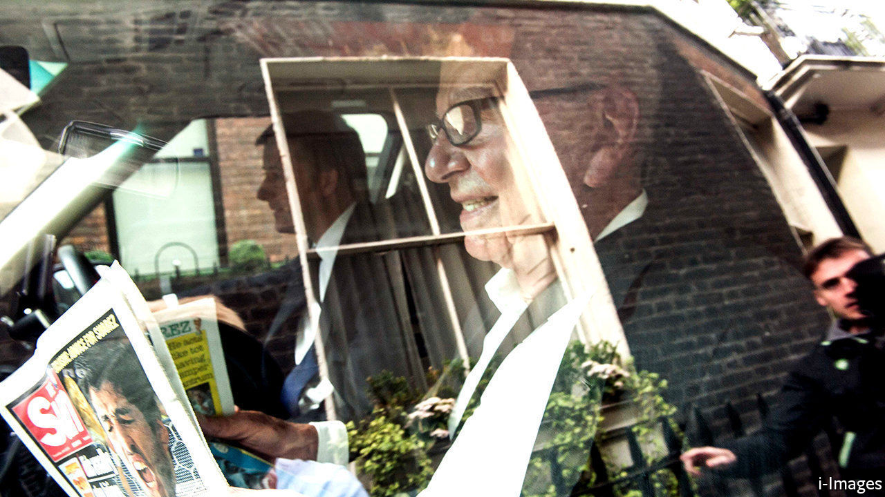

###### Phone-hacking

# Why the phone-hacking story won’t go away 

##### Hanging on the telephone 

 

> Nov 14th 2020 

WHEN A NEWSPAPER is written about on a rival’s front page, you can be sure it isn’t good news. So it proved in July 2011, with a flurry of stories about illegal news-gathering techniques at the News of the World, a tabloid that once boasted of shifting more copies than any other English language newspaper and that, thanks to its principal obsession, was known to reporters as the Screws. Within three days Rupert Murdoch ordered the closure of the paper he had bought in 1969, his first acquisition outside New Zealand and his native Australia. “Thank you,” its final headline blared, “&amp; goodbye”. That, it seemed, was that.

Hardly. Nine years later, the paper’s publisher, News Group Newspapers (a division of Mr Murdoch’s News Corporation), is still settling legal claims for past dodgy practices like blagging confidential information about the subject of a story or hacking into their voicemail messages. Mirror Group Newspapers, part of the publisher Reach, also faces scores of claims, some of which are listed for trial next January. “It’s got an incredibly long tail,” says Christopher Hutchings of Hamlins, a law firm representing some of the claimants. “I don’t see any immediate end in sight.”


Thanks to the slow-burning litigation, the High Court sometimes seems stuck in the 1990s and early 2000s. In one judgment, Mr Justice Mann considered the circumstances of a footballer’s row in a supermarket and argued that a story about another player requiring a custom-made seven-foot bed would be “too trivial to attract a sensible claim for damages”, even had the information not already been disclosed by his now wife. The evidence recalls an era predating smartphones, when rambling voicemails were a popular means of communication. “It’s almost going back to Dickens,” says one of the lawyers.

Three factors explain the saga’s length. First, the scale of alleged wrongdoing. When evidence of phone-hacking was first unearthed in 2006, the News of the World insisted it had been commissioned by “one rogue reporter”, Clive Goodman, who was jailed in 2007. In fact, it emerged that the paper targeted not only the royal family—as in the Goodman case—but also celebrities and members of the public such as Milly Dowler, a schoolgirl who was kidnapped and murdered in 2002. A lawyer estimates that News has so far settled about 1,000 cases. The Mirror Group denied for years that its newspapers had hacked any phones at all. It took years of dogged work by journalists, lawyers and campaigners to establish how widespread the practice was.

The second reason is procedural. The Crown Prosecution Service dropped a corporate prosecution of News and individual prosecutions of Mirror staff in 2015. The second phase of the Leveson Inquiry, an official sleuthing exercise into media malpractice, was also dropped. Had it continued, claims one of the campaigners, “this would have been wrapped up a long time ago.” In the absence of a compensation scheme, which News established in 2011 but closed two years later, the civil courts are the only forum left for redress. Since the wrongdoing alleged differs in time, scope and nature in each case, claims cannot be resolved in one go.

The third factor is the clandestine nature of the hacking. There is a six-year limit to such claims, but it runs from the time a claimant discovered—or might be expected to have discovered—the alleged wrongdoing, not when it took place. One case often throws up evidence of phone calls between one of the claimant’s contacts—say, his agent or his mother—and the defending newspaper. A lawyer for the original claimant may then speak to that contact to establish whether there was a legitimate reason for the call. If not, it might indicate that the contact’s phone was hacked, too, potentially adding a new claimant to the roll. “Person Y then puts forward their associates,” says Mr Hutchings. “It becomes a web.”

Justice delayed may be justice denied but the lawyers, at least, are unlikely to complain on that count. Settlements and legal costs already amount to hundreds of millions of pounds. The final bill has yet to arrive but Hacked Off, a campaign group, reckons it could run to £1bn. “I couldn’t genuinely argue that it hasn’t been a lucrative area to be involved in,” says Mr Hutchings, with a lawyerly double negative.■

