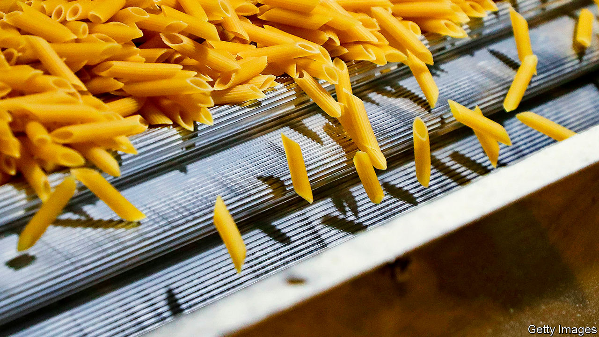

###### Recipe for success

# Stockpiling pasta boosts Italy’s foodmakers 

##### A Italian staple is a pandemic favourite 

 

> Nov 14th 2020 

SUPERMARKET SHELVES stripped bare by stockpilers were familiar scenes as anxious shoppers loaded up with toilet rolls and pasta when lockdowns were first imposed. The taste for long-lasting dried food has been a boon for Italy, a country in deep recession. Although Italians remain the biggest eaters of pasta worldwide, munching through 23kg per head annually, the country’s pasta-makers export 60% of their production, mostly to Europe and America. While stuck at home far more cooks made plates of spaghetti, fettuccine and farfalle. According to ISTAT, the Italian statistics agency, exports of pasta increased by 30% in the first six months of the year compared with the same period in 2019.

Barilla, the world’s biggest pasta-maker with sales of €3.6bn ($4.2bn) last year, must keep up with increased demand for its core product. The 143-year-old family firm also owns Wasa, the world’s biggest maker of Swedish crisp bread, as well as a host of smaller snack brands. The company’s high-tech headquarters in Parma operated at close to capacity, producing 1,000 tonnes a day, throughout Italy’s harsh lockdown in spring. Some other Barilla factories produced more pasta than ever, says Bastian Diegel of Barilla in Germany, albeit at significantly higher cost thanks to the additional safety measures. It continued to make all of its 120 varieties.


Maintaining supplies to Germany, one of Barilla’s most important markets, even required dedicated transport. Starting in March the job of providing 22% of the pasta and as much as 39% of the sauces eaten in Germany meant dispatching two trains a week from Parma to Ulm, its main warehouse in the country. Each train has 16 wagons transporting 490 tonnes of pasta, 60 tonnes of sauces and 50 tonnes of pesto. From June the trains ran three times a week; soon they might make four journeys.

The question for Barilla and other pasta-makers is whether the boom will outlast the pandemic. Luigi Cristiano Laurenza of the International Pasta Organisation is confident. Pasta consumption worldwide increased from 7m tonnes in 1999 to 16m tonnes last year, even before it became a pandemic staple. Italy may have lost its appetite a little in recent years but there is room for growth nearly everywhere else, in particular in Africa and Asia. Pasta is cheap, tasty and versatile, says Mr Laurenza, making it especially attractive for cash-strapped families battered by a pandemic.

It is especially important for Barilla that plates remain laden after a series of missteps. In 2002 it spent €1.8bn on a hostile takeover of Kamps, a German baker. It turned out to be a costly mistake and in 2010 Barilla sold Kamps to a private-equity firm. In September 2013, Guido Barilla, the company’s chairman, said that the firm’s family values meant that he would not do a “commercial with a homosexual family”. The comments provoked an outcry, in particular in America, and threats of a boycott. Mr Barilla was forced to apologise and the firm subsequently launched a limited-edition pasta box showing two women sharing a kiss over spaghetti. Although cooking pasta requires plenty of hot water, pasta-makers should stay out of it.■

