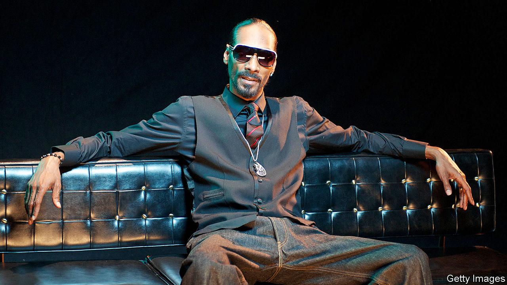

###### Smooth shopping

# Klarna, a Swedish payments unicorn, wants to conquer America 

##### The “buy now, pay later” firm has grown rapidly 

 

> Nov 12th 2020 

“AS A CHILD, when you see your parents struggling, it creates a drive,” says Sebastian Siemiatkowski, the chief executive and co-founder of Klarna, an online-payment-processing firm. His family moved to Sweden from Poland in 1981, the year he was born; his university-educated father was unemployed for long spells or just got by behind the wheel of a cab. The experience nurtured a strong ambition “to fix the economy for the family”.

Today, just shy of 40, Mr Siemiatkowksi is at the helm of one of Europe’s biggest fintech firms. A funding round in September raised $650m and valued Klarna at $10.65bn. Investors include Sequoia Capital, a venture-capital firm; Visa, a credit-card firm; and Snoop Dogg, a rapper who performs as “Smoooth Dogg” in a pepto-pink ad for the payments firm. Having gained a foothold in Europe, Klarna has its sights set on America.


Klarna is one of several “buy now, pay later” (BNPL) services that have grown rapidly in recent years. Its attraction, for both online retailers and their customers, is simplicity. Instead of entering their card details at checkout, shoppers sign up to Klarna’s app with their email and delivery address, and leave payment to be made in 14 or 30 days. Klarna pays the retailer in the meantime, bearing the risk that shoppers do not pay—something few other fintechs do—while charging the merchant a fee.

Customers are recognised when they use the app again, without needing to re-enter their details. Algorithms use publicly available credit information and details of the size, type and timing of the purchase to calculate the chance of fraud, and offer extended-payment plans, for a charge.

The ease of the process hugely increases the “conversion” rate—the share of customers who go ahead and buy an item after putting it into their virtual basket. That is why Klarna attracts retailers like bees to a honeypot. It has signed up 200,000 sellers in 17 countries and captured 10% of the e-commerce market in northern Europe. Etsy, an online marketplace for arts-and-crafts items, signed up on October 26th.

Last year Klarna’s revenue jumped by almost one-third to Skr7.2bn ($840m) as the value of wares sold through it rose by 32%. Merchant fees are the main source of its income; it also runs checkout infrastructure for some retailers. Late fees from customers make a smaller contribution.

It was Klarna’s success in Britain—where it has almost 10m customers and this year has opened some 95,000 accounts a week—that made it reckon that it could conquer America, where online-payments firms have typically struggled to gain market share. It began 2019 with its splashy “Smoooth Dogg” campaign and poured funds into its operations in New York, Los Angeles and Columbus, Ohio, ahead of its launch in America. The firm now has 9m customers there, and will probably go public there in the not-too-distant future.

It is expanding in other ways, too. Back in Europe, it obtained a banking licence in 2017, and has launched new products in some countries, such as a credit card. It has opened a tech hub in Berlin’s trendy Mitte neighbourhood that employs 500. This helps explain why last year Klarna ran its first loss since it was set up in 2005. “Profitability is for later,” says Mr Siemiatkowski.

Demand is certainly on Klarna’s side. According to Kaleido Intelligence, a research firm, BNPL will grow to $680bn in transaction value in 2025 worldwide, from $353bn in 2019, driven by young, credit-hungry shoppers. Covid-19 has only accelerated the rise in online shopping.

Still, the business model brings risks. One comes from some shoppers’ worsening finances. Klarna reported a net loss of Skr522m between January and June, a sevenfold increase from the net loss of Skr73m in the same period last year. Credit losses almost doubled to Skr1.2bn, more than 25% of revenue compared with 19% in the first half of 2019. The industry is also drawing criticism for encouraging people to overspend. “I am concerned about anything that makes it very easy to sleepwalk into debt,” says Martyn James of Resolver, a British consumer-rights group. In September Britain’s Financial Conduct Authority began a review of the unsecured-credit market, which includes BNPL. Having charmed shoppers and retailers, the firm may have to win over regulators too. ■

