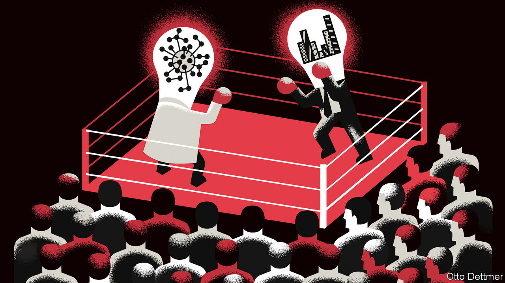

###### Free exchange

# Why relations between economists and epidemiologists have been testy 

##### Too often, economists are reluctant collaborators 

 

> Nov 14th 2020 

Editor’s note: Some of our covid-19 coverage is free for readers of The Economist Today, our daily . For more stories and our pandemic tracker, see our 

FOR EPIDEMIOLOGISTS, 2020 has been a trial by fire. Economists should be able to relate; it was just over a decade ago that their own practices and forecasts were subjected to the harsh glare of the public eye in the aftermath of the global financial crisis. Instead the relationship between the two disciplines has been a testy one. Some economists even questioned whether epidemiologists were intellectually equipped for the trial. “How smart are they? What are their average GRE scores?” wondered Tyler Cowen of George Mason University in April. The snootiness is unfortunate. The challenges posed by the coronavirus pandemic—and those that are still to come, as vaccines are distributed—cry out for co-operation. But too often, when economists venture into other academic areas, their arrival often looks more like a clumsy invasion force than a helpful diplomatic mission.

The two fields got off on the wrong foot early on in the pandemic. Back then there was an acute need for models that predicted the possible course of covid-19, in order to inform the policy response. Epidemiologists, like economists, use different sorts of models in their work, each subject to its own limitations and more useful in some contexts than others. In March researchers at Imperial College London used a model to calculate the potential death toll of the virus, assuming that people and governments took no measures to stop its spread. The analysis concluded that perhaps 500,000 Britons and 2.2m Americans would die in such circumstances (roughly ten times as many as have died so far). The numbers frightened governments into taking drastic steps to mitigate the spread of the virus, but they drew intense criticism, much of it from economists. Detractors argued that the model’s assumptions were unrealistic (a strange stone for an economist to throw). People would of course act to protect themselves from harm, they argued, meaning that the death toll would surely be much smaller.


The authors of the Imperial College study had been open about this assumption, though, and even noted that it was unrealistic. In a newly published essay in the Journal of Economic Perspectives Eleanor Murray, an epidemiologist at Boston University, says economists misunderstood the aim of the model, which was to set out a worst-case scenario as a baseline against which to estimate the effects of potential policy interventions. Criticisms of other modelling approaches were similarly rooted in misinterpretation of their intended audience and purpose, she reckons.

Given that building models is a favourite pastime of economists, the perception that epidemiologists’ efforts were not good enough led many to dig into the data themselves. This too proved problematic, writes Ms Murray. Drawing sound conclusions from the available epidemiological data is hard when the scope of potential uncertainty is unknown—because the share of covid-19 cases that are asymptomatic either cannot be determined or changes as the virus spreads, for example. Such ambiguities necessarily apply when dealing with a novel pathogen like the virus which causes covid-19, a fact that economists unaccustomed to dealing with epidemiological data may not have appreciated. Rather than attempting to outdo the experts, Ms Murray writes, economists ought to have taken advantage of specialisation, and focused their efforts on questions epidemiologists are less equipped to address.

This is a bit unfair. Yes, some modelling attempts by economists have been the work of dabblers. But the subfield of economic epidemiology has been studying how social factors influence the spread of a disease for decades. Much of the outpouring of recent economic work on issues related to covid-19 has steered clear of modelling its course, and focused instead on precisely those areas where economists can better add value. Confounding uncertainty notwithstanding, scholars have worked at great speed, producing hundreds of papers evaluating policy measures, analysing the economic costs associated with outbreaks and lockdowns, and assessing how the pandemic is reshaping the global economy—work that this newspaper has relied upon in its coverage of covid-19.

Still, economics could do better. Interdisciplinarity has long been eyed with suspicion. Robert Solow, a Nobel prizewinner, once dismissed critics of his profession by saying that, “When they want economics to be broader and more interdisciplinary, they seem to mean that they want it to give up its standards of rigour, precision and reliance on systematic observation interpreted by theory, and to go over instead to some looser kind of discourse.” Even those scholars interested in wandering off-piste face incentives not to collaborate with researchers in other fields, reckons Tony Yates, an economist formerly of the University of Birmingham. For academics seeking tenure, publication in top economic journals is of paramount importance. Co-operation with a non-economist places some control over research in the hands of scholars for whom acceptance by a top journal is less of a priority. Economists’ forays into other disciplines therefore benefit much less from knowledge-sharing across fields than is ideal.

A lack of disciplines

All this is especially unfortunate, because epidemiologists’ chief source of frustration in the pandemic is one that also bedevils the economics profession. As Ms Murray notes, the epidemiological community was unprepared for the way in which its policy recommendations would be politicised and its public statements warped by agents of misinformation. Economists should empathise. Their efforts to explain complicated ideas to the masses, from the virtues of trade to the need for bank bail-outs, have often foundered. Such failures encourage economists to become more insular. But, as the pandemic has revealed, sometimes the effects of a policy hinge on how well the public understands what is being done and why. A profession that is more open to collaboration might also learn from the communications struggles of others. ■

