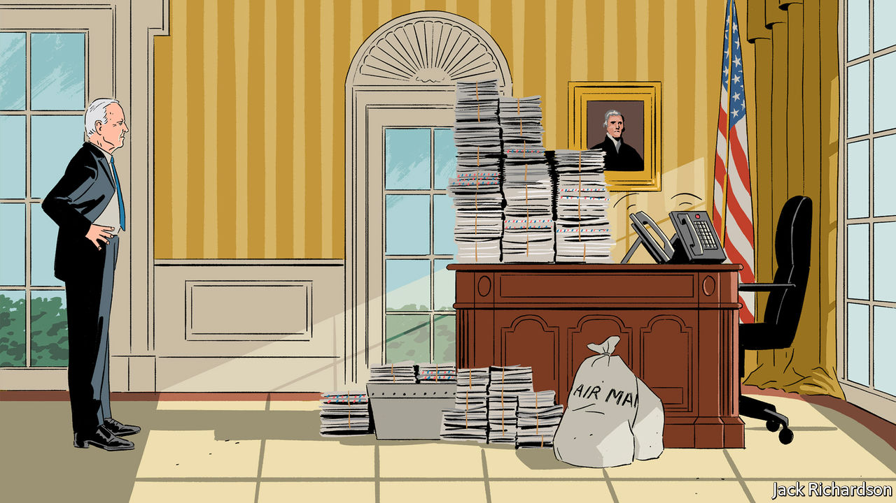
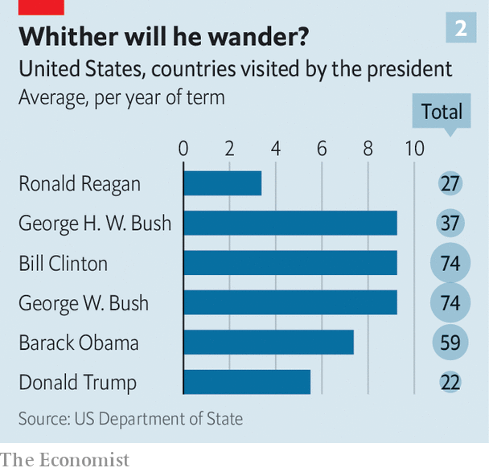
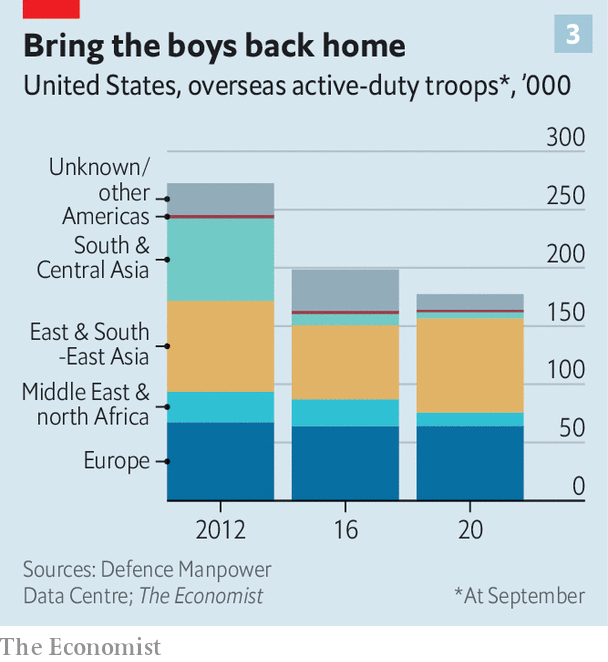
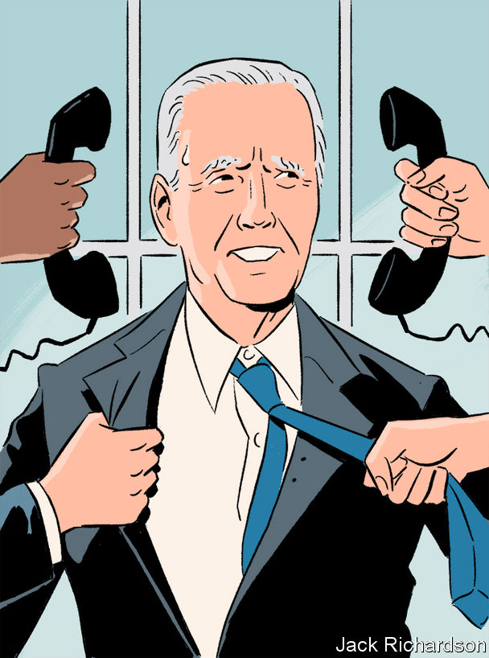

###### Predictability, for a start

# What the world wants from Joe Biden 

##### The president-elect will face a torrent of demands 

 

> Nov 14th 2020 

ON THE MORNING after the polls closed last week, America withdrew from the Paris agreement on climate change. The effects will be short-lived. President-elect Joe Biden has promised to rejoin the pact as soon as he enters the White House.

Donald Trump’s defeat has evoked strong reactions around the world. The main one “is relief”, says Andreas Nick, a German MP. But the world will not return to how it was in 2016, and Mr Biden will not please everyone.


Consider climate change. Most countries are eager to welcome America back into the club of those that care about it. In the past eight weeks, China, Japan and South Korea have vowed to reduce net emissions to zero by mid-century or thereabouts. Four of the five largest economies have now committed themselves to emissions cuts that are in line with limiting global warming to 2°C above pre-industrial levels or less (see chart 1).

 


Mr Biden has said he intends to adopt a target of net-zero emissions by 2050, which modellers say will shave 0.1°C off their temperature projections for the end of the century. To rejoin the Paris deal, he will need formally to submit this goal alongside an updated national pledge to slash emissions. Most observers believe a 45-50% decrease from 2005 levels by 2030 would be tough but feasible, fair and commensurate with what Europe is doing.

Mr Biden can re-enter the Paris deal without congressional approval, but he will need some degree of buy-in from both sides of the aisle to make his pledges credible. Integrating green infrastructure, energy, and research and development into any new government stimulus would help. American public opinion is broadly favourable. In exit polls two-thirds of voters said that climate change was a serious problem. Whether they will accept higher energy prices to fix it remains to be seen.

Outsiders are watching to see if Mr Biden structures his team in a way that makes it clear that he wants to integrate climate action across his foreign and domestic policy. The importance of having America back on the climate train is hard to overstate. Over the past four years, voters around the world have noticed not only warmer temperatures, but increasing numbers of floods, droughts and forest fires. Europe is pushing through an ambitious green deal at home and working closely with China, the world’s largest emitter. If Mr Biden can formalise America’s emissions targets for 2030 and 2050 before the COP26 UN climate summit next year, that will help convince other governments that the country intends to pull its weight. That should give others—including China—the guts to decarbonise faster.

However, not all governments will welcome a carbon warrior in the White House. Oil- and coal-producers are wary. So is Brazil’s President Jair Bolsonaro, not least because Mr Biden has threatened “economic consequences” if Brazil continues to tear down the Amazon rainforest. Mr Bolsonaro, who thinks foreign eco-scolds have imperialist designs on Brazilian territory, tweeted “OUR SOVEREIGNTY IS NON-NEGOTIABLE” and spoke vaguely of needing “gunpowder” to defend it. Brazil’s carbon emissions rose by a whopping 9.6% in 2019, mainly due to deforestation.

Another area where the world expects more collaboration is health. Mr Trump announced in July that America was pulling out of the World Health Organisation (WHO), the main global body for fighting pandemics (among other things), grumbling that it was beholden to China. Mr Biden says he will reverse this rash decision on the first day of his presidency.

By executive order, he can stop the clock on the withdrawal process, which was to be completed by July 2021. It is unclear how big the disruption will be. America is the WHO’s biggest donor: in 2019 it provided around 15% of its budget. With Mr Biden in charge, America is also expected to join a global coalition funding the development of covid-19 tests, drugs and vaccines and their distribution to poorer countries. International co-operation is likely to work better than “America First”. The pandemic “won’t be over in the US if it’s not over in Mexico,” notes a Mexican official.

Governments everywhere are asking how Mr Biden will affect their national interest. China’s state media have given him a cautious welcome. Global Times, a tabloid, even called him an “old friend”. China’s regime may have relished the decline of American soft power under Mr Trump, but it also chafed at the capriciousness of his China policy and the hawkishness of his officials. In its view, the Trump administration is to blame for pushback in much of the West against Chinese influence.

China does not expect a Biden presidency to reduce Western anxiety. But it hopes for more predictability. Under Mr Trump, China feared a sudden policy shift towards Taiwan that might have brought the two countries closer to war. It hopes that Mr Biden will be more careful.

China would also like a less choppy trade relationship. It doubts that Mr Biden will ramp up tariffs in a futile effort to make bilateral imports equal to exports, as Mr Trump did. It hopes that he will cut some of those tariffs. It does not expect any change in America’s attitude towards Chinese involvement in building 5G networks, or its military build-up in the South China Sea.

India’s prime minister, Narendra Modi, was quick to fire congratulatory messages both to Mr Biden and to his running-mate. Kamala Harris inspires “immense pride” not just among her chittis (aunties) but among all Indian-Americans, Mr Modi gushed. Indian pundits speculate that he is keen not to be punished for having bet heavily on Mr Trump, his fellow populist.

He probably won’t be. Whoever is in charge, bilateral ties have warmed in recent decades. “The US cannot create an effective balance of power against China without India,” notes Ashley Tellis of the Carnegie Endowment for International Peace, a think-tank. Mr Biden’s campaign website took India to task for its backsliding on democracy and human rights. India’s unspoken retort, in the words of Sadanand Dhume of the American Enterprise Institute, another think-tank, is “Let us do whatever we like, because we are with you on China.”

When it comes to asserting hard power, America’s friends in Asia want Mr Biden to be closer to Mr Trump than to Barack Obama. Mr Obama drew red lines in the South China Sea, but then did little when China crossed them. The Trump administration, by contrast, more vociferously rejected China’s claims in the sea and upped the American naval presence. It reaffirmed America’s defence commitment to Japanese islands harassed by China. And it sold arms to Taiwan. Bilahari Kausikan, formerly Singapore’s top diplomat, says that when Mr Trump told President Xi Jinping of China, his guest at Mar-a-Lago in 2017, that he had just bombed Syria over its use of chemical weapons, he did much to restore the credibility in Asia of American power.

Say it ain’t so Joe

Some Asians worry that Mr Biden might make security concessions to China in pursuit of other goals, such as co-operation on climate change. Where Mr Obama “put emphasis on engagement first, it’s time to put deterrence first,” says Miyake Kunihiko of the Canon Institute for Global Studies, a think-tank in Tokyo. “They shouldn’t leave China with any illusions it would be able to attack Taiwan,” says Sasae Kenichiro, a former Japanese ambassador to the United States. Still, many would like to see Mr Biden approach China in closer co-ordination with allies, and with less blind rage. For all that Japanese policymakers wish to constrain their huge neighbour, they are, given China’s proximity and the two countries’ enmeshed economic ties, reluctant to confront it. They dread the kind of open break with China that the Trump administration has seemed bent on.

 


Japan’s new prime minister, Suga Yoshihide, surely hopes for a more conventional relationship with his country’s main ally. “It’s extremely important for us to have professional consultations with the United States, and with a head of government who is knowledgeable about foreign policy,” says Tanaka Hitoshi, a former deputy foreign minister.

South Koreans would agree. Mr Trump tore up a trade deal and constantly threatened to withdraw American troops from Korean soil if Seoul did not pay more for their presence. Mr Biden, in an op-ed for South Korea’s national news agency, called such threats “reckless” and vowed to strengthen the alliance. In a poll before the election, almost two-thirds of South Koreans said they wanted Mr Biden to win.

Likewise, in South-East Asia, Mr Trump’s calls for an ideological crusade against “Communist China”, to be fought on every front, showed an administration out of touch with diplomatic realities, argues Dino Patti Djalal, an Indonesian former ambassador to America, in the Diplomat, a magazine. Yes, China causes headaches in South-East Asia. But it has posed no ideological threat for decades. For now, he says, the region’s priority is to overcome the pandemic (with China’s help) and chart an economic recovery (in which China will be the motor of growth). The American presence is welcome, but having to take sides is not—which is why Indonesia recently refused to offer a home to American spy planes.

As for Mr Biden, Asians are counting on a return of what Kevin Rudd, an Australian former prime minister, calls “strategic and economic ballast” to America’s relationship with Asia, and “a more nuanced diplomacy”. Is that likely? Mr Rudd thinks so. Mr Biden is pulling together a team of Asia experts for whom “the granularity of the Indo-Pacific is like second nature”.

During the Trump years the European Union (EU) unexpectedly found itself the guardian of multilateralism. After Mr Biden’s victory, Europeans hope this burden will be shared. Besides rejoining the Paris agreement, they would like America to stop undermining the World Trade Organisation and to revive the Iran nuclear deal. Mr Biden has suggested he will do so.

In grand strategic terms, the EU’s main aim is to avoid being dragged into a hegemonic struggle between America and China. It wants to be slightly firmer and less credulous with China, but may not support Mr Biden if he pursues confrontation.

Mr Biden will not undermine NATO as his predecessor did. And he will insist that NATO allies, two-thirds of whom fail to spend 2% of GDP on defence, invest more in their own armed forces. Germany hopes that this message will no longer be accompanied by threats to slap tariffs on German cars, and that disputes between allies will be settled quietly, rather than over Twitter.

France hopes for a fresh American push to resolve regional conflicts that affect European security, from Turkish expansionism in the eastern Mediterranean to instability in Lebanon and Libya. Germany and France will welcome a return of American civility and seriousness, and an end to Mr Trump’s efforts to divide Europe.

Yet there is also a clear-eyed recognition in European capitals that, even under Mr Obama, Europe had begun to slip out of American sight. “The Americans are obviously indispensable,” says a French presidential source, “but the world has changed.” France now wants Europe to do more for itself, and differently. Emmanuel Macron, France’s president, will need to persuade the Biden team that his ambitions to build up “strategic autonomy” in Europe are not aimed at sidelining NATO.

Not your average Joe

Britain hopes to secure a trade deal with America (to offset the damage done by Brexit) and to punch above its weight globally via its “special relationship” with the superpower. However, Mr Biden, who has Irish ancestry, has hinted that Britain can forget about a trade deal if it reimposes a hard border between Northern Ireland and the Republic of Ireland. He has described Boris Johnson, Britain’s prime minister, as “the physical and emotional clone of Donald Trump”, which is not meant as a compliment. That Mr Johnson was the second world leader to speak to Mr Biden after his victory will allay some fears, but Britain will probably lose its role as the bridge between the United States and Europe.

In the Middle East reviving the Iran nuclear deal will not be easy. Most American Republicans and some Democrats revile it. Mr Biden may lift some sanctions and then try to negotiate a follow-up agreement. Israel and the Gulf states will want it to go much further than the original 2015 version—to impose limits on Iran’s ballistic-missile programme and perhaps its support for militant groups. Iran is unlikely to agree to such terms, though, in which case America’s Middle Eastern partners will urge Mr Biden to maintain the sanctions.

Mr Trump had a notable success in persuading Arab states to recognise Israel. Mr Biden will be under pressure to continue the thaw. Israel’s prime minister, Binyamin Netanyahu, was close to Mr Trump, and will have to mend ties with Mr Biden. However, his country retains strong support in America. The Palestinians hope to reverse some of Mr Trump’s more antagonistic moves, such as closing their diplomatic mission in Washington and cutting aid. They are unlikely to convince Mr Biden to move America’s embassy in Jerusalem back to Tel Aviv. Most countries want Mr Biden to slow the drawdown of American troops from Afghanistan, where fighting between the government and the Taliban is intensifying, and to keep a foothold in Iraq, where Islamic State is active (see chart 3).

 


For the world’s populists and nationalists Mr Trump’s presence in the White House was evidence that theirs was the ideology of the future. “The value Bolsonaro derived from Trump was the narrative,” says Oliver Stuenkel of the Fundação Getulio Vargas, a university in São Paulo. Andrés Manuel López Obrador, Mexico’s left-wing populist president, has so far refused to congratulate Mr Biden.

Viktor Orban, Hungary’s illiberal prime minister, supported Mr Trump on the ground that Mr Biden’s party stood for “moral imperialism”. Poland’s rulers did so for similar reasons. Janez Jansa, prime minister of Melania Trump’s native Slovenia, insisted for days that Mr Trump had won and retweeted fake news to that effect.

Back to life, back to reality

These countries now face a president who sees upholding the rule of law as a foreign-policy priority. As vice-president, Mr Biden repeatedly toured eastern Europe explaining that America saw corruption as a tool of Russian influence, and fighting it as crucial to NATO’s security. Daria Kaleniuk of AntAC, an anti-graft group in Kyiv, hopes Mr Biden will be “much stronger and more involved”.

 


Many autocratic leaders will miss Mr Trump’s tendency to overlook their sins. Saudi Arabia’s crown prince, Muhammad bin Salman, will find his regular WhatsApp chats with Jared Kushner less useful. Vladimir Putin expects frostier relations. Hence, perhaps, the histrionics of Dmitry Kiselev, his propagandist-in-chief. “For a long time, they have been trying to teach us [democracy],” he said. “But now the teacher has staged a debauchery, smashed the windows and shit his pants.”

Many poor countries hope that Mr Biden will notice them. Governments in Africa want support to deal with the economic fallout of the pandemic. Central America wants aid to curb violence and give people an alternative to emigration. Developing countries everywhere would like less bluster about a new cold war with China and more American trade and investment.

Human-rights groups would like a vocal ally in the White House, or even a long-winded one. “We will clearly see a more serious voice on democracy and human rights in Africa,” says Judd Devermont of the Centre for Strategic and International Studies, a think-tank. “The Trump administration’s absence was most deafening on politics and governance.”

Finally, the world expects America to welcome more foreign talent. Mr Biden vows to repeal Mr Trump’s toughest immigration curbs, stop building the wall, stop putting children in cages and offer a path to citizenship for people living in America illegally. Countries that send lots of emigrants, such as India, are pleased.

So are the migrants themselves. Arvin Kakekhani, an Iranian researcher at the University of Pennsylvania, designs catalysts to turn water and carbon dioxide into clean fuels. After Mr Trump’s “Muslim ban” he felt “so insecure”, not knowing whether he would be able to stay in the country, he recalls. He has had to live apart from his Iranian wife for two years. “My dream is to use expertise to tackle the climate crisis,” he says, adding that with Mr Biden’s victory, he is “now much more motivated to stay” and do it in America. ■

Dig deeper:For the latest on the election, see our , read the  and then sign up for Checks and Balance, our  and  on American politics.

