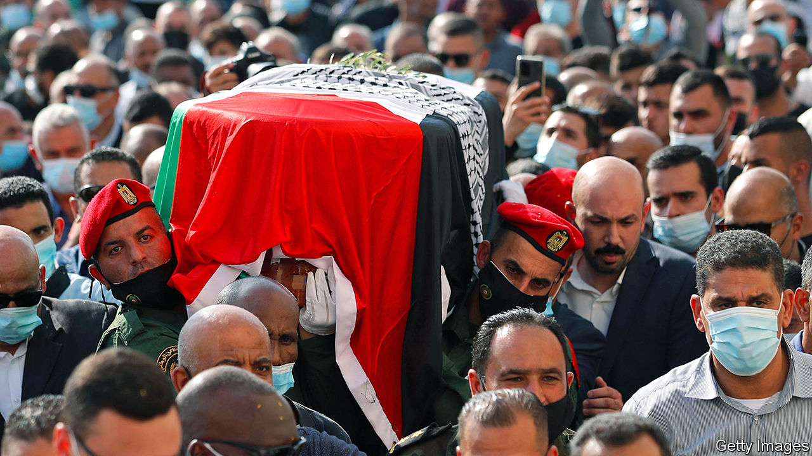

###### A negotiator in winter

# Saeb Erekat, a Palestinian who talked to Israel, dies of covid-19 

##### His life’s work is on life support as well 

 

> Nov 14th 2020 

IT WAS 1991, and dozens of men were huddled around a long white table in Spain, clad in the formless dark suits that are de rigueur at diplomatic functions. Only one stood out: a bearded, bespectacled university professor, shoulders draped in a keffiyeh, the chequered scarf that has become a symbol of Palestinian nationalism. Saeb Erekat caused a stir at the Madrid conference, the first direct talks between Israel and the Palestinians. Binyamin Netanyahu, then a mere spokesman for the Israeli delegation, suggested that his dress was a “provocation”. But, for Mr Erekat, the summit would start a diplomatic process that became his life’s work.

On November 10th Mr Erekat died in Jerusalem at the age of 65. He tested positive for covid-19 in October, a grim diagnosis for a man who had a lung transplant in 2017. Israel allowed him to receive treatment at Hadassah hospital, but he never recovered.


Born in 1955, he grew up in Jericho, an ancient city nestled in the Jordan valley. After university studies in America and Britain he returned to the West Bank and became a loyal member of Fatah, now the territory’s ruling party. A mediator rather than a militant, he would play an integral role in the earliest agreements between Israel and the Palestinians, including the second Oslo accords, signed in 1995.

The two-state solution became an obsession. He never bought into the idea of a binational state where Jews and Arabs would coexist under a single political system: in his mind Israel would never relinquish its Jewish majority. Only divorce—territorial partition—would grant his people their rights. In public he could be obstinate, prone to legal diatribes and occasional outbursts. In private, though, he often recognised that he had a bad hand.

Palestinian critics accused him of playing it badly. A batch of leaked memos, published in 2011 by Al Jazeera, revealed that Mr Erekat and his team offered to cede nearly all of east Jerusalem when negotiating with Israel in 2008. The Palestinians claim that land as the capital of their future state. In Mr Erekat’s words, though, he was ready to give Israel “the biggest Yerushalayim in Jewish history” (the Hebrew name for the city). He got nothing in return—and resigned soon after the documents were published, something he did every few years. His departures were always short-lived.

In its immediate ramifications, Mr Erekat’s death may say more about domestic politics than about the moribund peace process. Mahmoud Abbas, the Palestinian president, turns 85 on November 15th and has been ailing for years. His term should have ended 12 years ago. Yet he clings jealously to his post and views would-be successors with suspicion. Mr Erekat was one of the few to stay in his good graces and had been a contender to replace the ageing president. Instead Mr Abbas will have to replace him; his choice may hint at who leads in the succession struggle.

Still, it is hard to escape the symbolism of his death. In Jordan last year your correspondent asked Mr Erekat about his health. “I’m fine,” he replied. “On two feet, working for two states.” Typical Saeb: earnest and folksy, even at a time when there was little for him to negotiate. The Obama administration dispatched John Kerry, its secretary of state, on a quixotic quest to broker an agreement. Talks stalled in 2014 and never resumed. President Donald Trump had his “deal of the century”, unveiled in January and dead on arrival.

Mr Trump’s successor, Joe Biden, is unlikely to spend much time on his own effort, likely to be futile. Mr Netanyahu, now the Israeli prime minister, has devoted his career to obstructing an agreement that would lead to a Palestinian state. The Palestinians are mired in divisions and increasingly cast doubt on the two-state idea. Mr Erekat will be mourned as a fighter for the Palestinian cause. When the eulogies are done, many Palestinians will wonder if his is a fight worth continuing. ■

Editor’s note: Some of our covid-19 coverage is free for readers of The Economist Today, our daily . For more stories and our pandemic tracker, see our 

