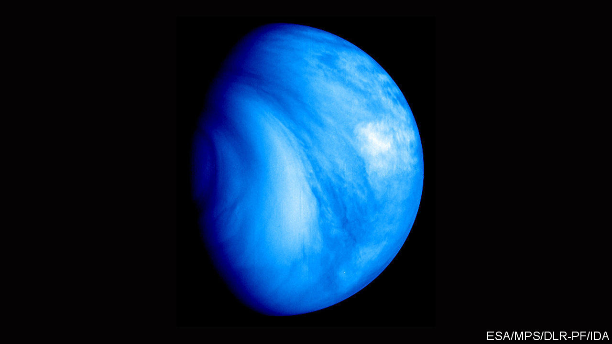

###### Planetary science

# Is there really phosphine on Venus? 

##### Further study casts doubts on a head-turning recent discovery 

 

> Nov 14th 2020 

EXTRAORDINARY CLAIMS require extraordinary evidence. So goes the dictum, usually credited to Carl Sagan, a celebrated astronomer, on the need for caution when interpreting radical new ideas in science. And there are few claims more extraordinary than that of the discovery of life beyond Earth.

Jane Greaves of Cardiff University, in Britain, has not actually made that claim. But she came close to it when, in September, she and her colleagues published research that appeared to show the existence of a gas called phosphine in the clouds of Venus. This substance, a compound of phosphorus and hydrogen, should be able to survive only briefly in an atmosphere like that of Venus. But Dr Greaves’s team reported that it actually seemed to be persistent there, at a concentration of 20 parts per billion. This turned heads because, on Earth, the minuscule amounts of phosphine around have only two sources: chemists and microbes. The former are surely absent from Venus, so the question became whether there was a plausible, natural, but non-biological explanation for the gas being there. Neither Dr Greaves nor anyone else has yet come up with one, so that leaves open the tantalising possibility that it is a sign of life on the planet.


But there is another possibility. This is that the signal Dr Greaves and her team suggest is phosphine isn’t. And, in the weeks since the results were published, other groups have been busy poring over them, conducting their own analyses and attempting to poke holes in the original claims. Their concerns are twofold. One is an inability to find evidence for phosphine in independent observations of Venus’s atmosphere. The other is whether Dr Greaves and her colleagues have processed their data correctly.

Crucial gaps

Those data came from the Atacama Large Millimetre Array (ALMA), a set of radio-telescope dishes that sit at an altitude of 5,000 metres in the mountains of Chile. The solar radio spectrum reflected from Venus has, according to Dr Greaves, a gap known as an absorption line in it at a wavelength of around 1.1 millimetres. Phosphine molecules are known to absorb radiation of this wavelength.

But phosphine also absorbs other wavelengths. A robust way to verify Dr Greaves’s findings, therefore, would be to find similar characteristic gaps in other parts of Venus’s reflected solar spectrum. Therese Encrenaz of the Paris Observatory set herself this task, and went hunting for appropriate gaps in the infrared region of that spectrum. She combed through data collected using TEXES, a spectrograph at the Gemini Observatory in Hawaii, between 2014 and 2016. But she drew a blank. That result, published in the November issue of Astronomy &amp; Astrophysics, seems to be a contradiction to the original claim of phosphine on Venus.

The second possible contradiction, of Dr Greaves’s data-processing methods, comes from Ignas Snellen of Leiden University in the Netherlands. Any work of this sort requires the data to be passed through a software noise-filter in order to subtract the effects of both Earth’s atmosphere and the telescope array itself. Dr Snellen and his colleagues have reprocessed the original ALMA data using a different noise-filter, to see if similar results emerge.

In a paper posted on arXiv (a website for so-called preprints, which have not yet been peer-reviewed but which their authors wish nevertheless to put into the public domain), they found some evidence for phosphine, but not enough to claim a confident discovery. More troubling, perhaps, was that when they used Dr Greaves’s noise-filter on a wider portion of the Venusian spectrum they found five other strong signals for molecules not actually believed to be present in the planet’s atmosphere.

Dr Greaves’s claim in September was, then, just the starting gun. Investigations about phosphine will continue, probably for years and perhaps for decades, as astronomers spiral in on the truth. Indeed, as if to highlight both the messiness of the current uncertainty and the desire of most scientific researchers to get at the truth regardless, Dr Greaves herself is one of the co-authors of the phosphine-dissenting paper published by Dr Encrenaz.

One way to settle the matter would be to send a spacecraft to Venus and take close-up measurements of its atmosphere. There are hopes here. India’s space agency plans to launch Shukrayaan-1, which is intended to orbit the planet, in 2025. Meanwhile, NASA, America’s space agency, has two Venus probes—VERITAS and DAVINCI+—in the final selection stage for its next programme of missions. Rocket Lab, a private space company with a launch site in New Zealand, is also considering dispatching a mission as soon as 2023. Perhaps it won’t take decades after all. ■

