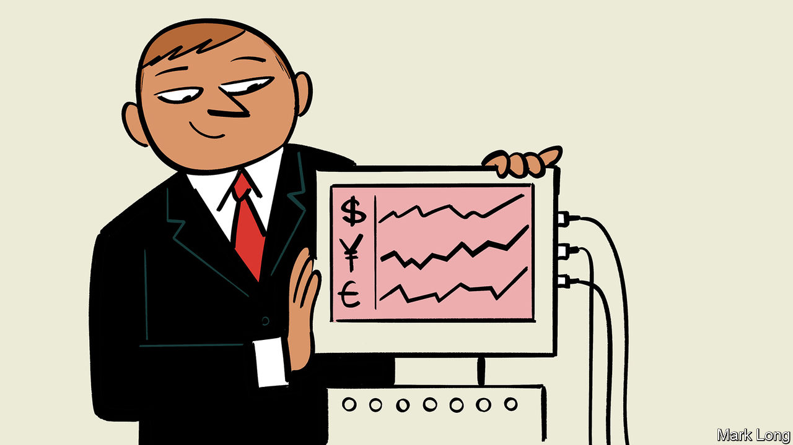
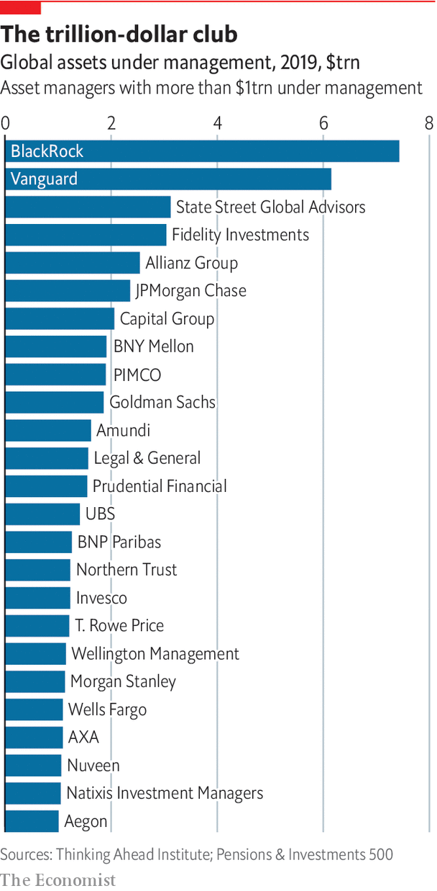
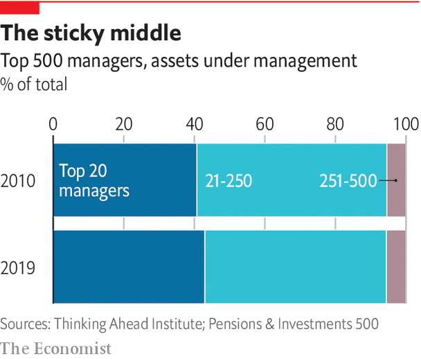

###### Index funds

# Passive attack 

##### How index investing is reshaping the asset-management industry 

 

> Nov 12th 2020 

THE STORY of a quiet revolution in asset management begins with Jack Bogle. Actually, it starts in 1974 when Paul Samuelson, an economist and Nobel prizewinner, published an article in the Journal of Portfolio Management arguing that the bulk of mutual-fund managers should go out of business. Most failed to beat the market average and those that did could not be relied upon to repeat the trick. An archetype was required. Someone should set up a low-cost, low-churn fund that would do nothing more than hold the constituents of the S&amp;P 500. Mr Bogle decided that Vanguard, the mutual-fund group he founded in 1975, should take up the challenge. His index fund was denounced on Wall Street as unAmerican. It received only a trickle of inflows. But by the time of Bogle’s death last year, Vanguard was one of the world’s biggest asset managers, largely on the strength of its index funds.

An investor can now buy exposure to the market return (beta, as it is known) for a few basis points. Indeed, “beta is becoming free” is an article of faith among industry bigwigs. Technology allows access to stockmarkets at vanishingly low cost. BlackRock and State Street Global Advisors, the other firms of a leading triumvirate, owe their growing heft to index (or “passive”) investing. These three are the industry’s big winners; everyone else is “fighting for scraps”, as the boss of a midsized asset manager puts it.


These firms benefit from a virtuous circle, in which lower costs mean lower fees, more inflows and yet lower costs. Their dominance is only the most salient sign of consolidation in the asset-management industry. The biggest firms are getting bigger. A global elite has emerged of firms that each manage more than a trillion dollars in assets. Unsurprisingly the idea has taken hold that size is a strategic advantage. If you are not a niche player in an industry, you had better be a scale one, says business-school wisdom. No one wants to be stuck in the middle.

Bigger is not always better in asset management. A point arrives when size becomes a spoiler of performance. The portfolio manager may lose focus. The size of the fund begins to push up trading costs, notably in illiquid assets in which the buying and selling of large tranches tends to move prices adversely. But asset managers benefit from operational gearing. As the value of managed assets goes up, profits rise even faster. Fees are a fixed percentage of assets under management: the bigger the fund, the higher the revenues. But costs—mostly the wages of research analysts, office space, marketing and so on—do not rise in lock-step.

 


Scale is both a friend and an enemy, says Manny Roman, boss of PIMCO, a giant fixed-income manager. If you have a lot of exposure to bad positions, it is hard to escape. But buying at scale can also mean keener prices—on new corporate-bond issues or from a seller looking to get out of a big position. There are other advantages. Research capabilities and technological muscle can be spread over a large number of similar markets and securities.

Industry types distinguish between manufacturing (managing assets) and distribution (selling funds to retail investors). Fidelity, a family-owned Boston-based giant, does both. Scale matters in retail distribution, where brand is important. In indexing there is also a real scale advantage, says Cyrus Taraporevala, of State Street Global Advisors. Index funds hold stocks in proportion to their market capitalisation—by the value weighting in the index. Trading costs are tiny. The fund buys a stock when it qualifies for the index (as a handful of new ones do each year) and sells any that drop out. In between it simply holds them. The market for large-capitalisation stocks is liquid enough to absorb sales or purchases whenever index funds need to match inflows or redemptions. The marginal cost of running an ever-bigger fund is trivial: it just requires a bit more computing power. There are no expensive portfolio managers.

Beta is not the only passive strategy. Trillions of dollars are also invested in “factor-based” or “smart-beta” strategies. These rely on powerful computers to sort stocks by characteristics, such as low price-to-book (“value”) or high profitability (“quality”), that have been shown to beat market averages in the long run. The churn in these portfolios is higher than for index shares. But the analysis and trading are automated. Increasingly bond investing is going passive, too. The value of bonds held in exchange-traded funds (or ETFs, baskets of securities listed on an exchange like company shares) passed $1trn last year. The largest bond ETFs track an index, such as the Bloomberg-Barclays Aggregate, and are often more liquid than the individual bonds they contain. Factor-based bond ETFs are also growing in popularity.

The growth of the big three passive managers is part of a trend towards greater industry concentration. Of assets managed worldwide by the industry’s leading 500 firms, the proportion managed by the top 20 firms has risen from 37% in 2005 to 42% now. But the search for scale economies to offset pressure on fees is not the only factor behind this. The bigger fund-management groups increasingly look to offer expertise across asset classes, from large-cap equities to private assets. A lot of asset managers, including BlackRock, are betting on the benefits of scope as much as scale.

 


The heads of big pension funds now want three things, says David Hunt, boss of PGIM, the asset-management arm of Prudential Financial, an insurance giant. They want to understand their whole portfolio of assets (to get a sense of how diversified it is); to push fees down by concentrating their buying power; and to have a long-term relationship with asset managers. That means cutting the number they use. So managers offering the full spectrum of products (stocks, bonds, property, private assets and so on) will have an edge. This trend towards fewer managers is happening on the retail side as well. The proliferation of funds sows confusion. There is too much choice. So the retail gatekeepers—the brokerages, online platforms and mobile apps—are starting to cut back the number of funds they carry.

If index funds and ETFs are winning investors, who is losing them? One way to infer this is the spread of fees. The more liquid the assets, the greater the fee pressure. The managers of so-called “core” active funds, generally large-company shares listed in rich-world stockmarkets, have seen fees fall towards the indexers’ level. It is hard to categorise but industry wisdom is that “closet indexers” are gradually being winnowed out. These funds are ostensibly “active” (ie, they are stockpickers) but they manage their portfolios to ensure that their performance does not deviate much from the index.

For all the talk about polarisation, the change in asset management is not that dramatic. The squeezed middle—firms in the top 250 but outside the top 20—have lost around five percentage points of market share since 2005. But they retain a 50% share. Inflows follow performance, but outflows do not. Investors are remarkably conservative. For individuals, a move from one mutual fund to another often triggers capital-gains tax. Institutional investors suffer from inertia, or perhaps from a failure of nerve. What if your underperforming active managers suddenly improve after you drop them? As a consequence, says an executive at a big asset manager, the industry’s market structure “forms like stalactites and stalagmites—drip by drip”.

In any other industry, mergers would speed up the sorting into scale and niche. There has been a spate of tie-ups in recent years: Standard Life and Aberdeen Asset Management in Scotland; the marriage of Janus, an American outfit, with Henderson, a British one; Invesco and Oppenheimer; and Franklin Templeton and Legg Mason. None has been a roaring success. Perhaps that is not surprising. In an industry where human capital plays a big role, it is not easy to find cost savings. People are not as fungible as offices. Integrating IT systems is a headache. Corporate-culture clashes are common. There is a risk of losing clients if things go wrong—and even if they don’t. New clients will steer clear while a merger is pending.

Despite the pitfalls, the merger wave continues. Morgan Stanley recently acquired Eaton Vance to fold into its asset-management business. Nelson Peltz, an activist investor, has taken biggish stakes in Janus-Henderson and Invesco with a view to pursuing mergers. The industry seems set for a shake-up. A bold response for a midsized firm would be to downsize: strip back to the core; cut prices; offer fewer products; and focus on those in which one has a chance to be distinctive. In a different industry Steve Jobs followed something like this strategy when he returned to Apple in 1996. Apple was fighting for its survival, however. Things are not that desperate in asset management. The fee pressure on new business is intense, but a lot of existing customers will stay put. A mediocre firm with a big back-book can stay alive for quite a while.

Perhaps that explains all the talk of “zombie” asset managers—firms from which life is slowly draining as their initially fat margins grow ever thinner. Is there another means of escape? The virtue of passive funds is their low cost; they buy stocks in the index or whatever the quantitative screen prescribes. There is no need to think deeply about the companies behind the securities. But that virtue is also a vice. Investors increasingly care about what companies do. And many active asset managers hope there might be a living from that.■

