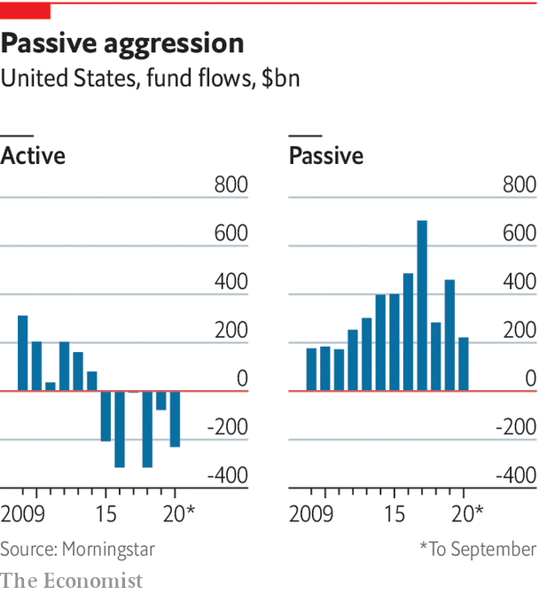

###### Asset management

# The money doctors 

##### The asset-management industry is at last sorting the quacks from the true specialists, argues John O’Sullivan 

 

> Nov 12th 2020 

IN MARCH 1868 a prospectus appeared for a new kind of money-market scheme. The Foreign &amp; Colonial Government Trust would invest £1m ($5m at the time) in a selection of bonds. For £85 an investor could buy one of 11,765 certificates giving an equal share. The trust promised a 7% yield. Its aim was to give “the investor of moderate means the same advantages as the large capitalist in diminishing the risk of investing…by spreading the investment over a number of different stocks.” The modern asset-management industry was born.

A week later The Economist ran a leading article broadly welcoming the new trust. But—setting the tone for 150 years of financial punditry—it quibbled about the selected bonds. A chunk was allocated to Turkey and Egypt, countries that “will go on borrowing as long as they can, and when they cease to borrow, they will also cease to pay interest.” Fears were expressed that Europe was disintegrating. “In lending to Italy, you lend to an inchoate state; and in lending to Austria, you lend to a ‘dishevelled’ state; in both there is danger.”


The trust was the brainchild of Philip Rose, a lawyer and financial adviser to Benjamin Disraeli. His idea of a pooled investment fund for the middle class caught on. In 1873 Robert Fleming, a Dundee-based businessman, started his own investment trust, the First Scottish, modelled on Rose’s fund but with a bolder remit. It was largely invested in mortgage bonds of railroads listed in New York. The holdings were in dollars, not sterling. And whereas Rose’s trust was a buy-and-hold vehicle, the trustees of the First Scottish reserved the right to add or drop securities as they saw fit.

Rose’s trust survives to this day, but asset management is now a far bigger business. Over $100trn-worth of assets is held in pooled investments managed by professionals who charge fees. The industry is central to capitalism. Asset managers support jobs and growth by directing capital to businesses they judge to have the best prospects. The returns help ordinary savers to reach their financial goals—retirement, education and so on. So asset management also has a crucial social role, acting as guardian of savings and steward of firms those savings are entrusted to.

It is a business unlike any other. Managers charge a fixed fee on the assets they manage, but customers ultimately bear the full costs of investments that sour. Profit margins in asset management are high by the standards of other industries. For all the talk of pressure on fees, typical operating margins are well over 30%. Yet despite recent consolidation, asset management is a fragmented industry, with no obvious exploitation of market power by a few large firms and plenty of new entrants.

In many industries firms avoid price competition by offering a product distinct from their rivals—or, at least, that appears distinctive. Breakfast cereal is mostly grain and sugar, but makers offer a proliferation of branded cereals, with subtle variations on a theme. Asset management is not so different. Firms compete in marketing, in dreaming up new products and, above all, on their skill in selecting securities that will rise in value.

 


The industry has not performed well. Ever since a landmark paper by Michael Jensen in 1968, countless studies have shown that managers of equity mutual funds have failed to beat the market index. Arithmetic is against them. It is as impossible for all investors to have an above-average return as for everyone to be of above-average height or intelligence. In any year, some will do better than the index and some worse. But evidence of sustained outperformance is vanishingly rare. Where it exists, it suggests that bad performers stay bad. It is hard to find a positive link between high fees and performance. Quite the opposite: one study found that the worst-performing funds charge the most.

Why do investors put up with this? One explanation is that investment funds are more complex than breakfast cereals. At best they are an “experience good” whose quality can be judged only once consumed. But they are also like college education or medical practice: “credence goods” that buyers find hard to judge immediately. Even well-informed investors find it tricky to distinguish a good stockpicker from a lucky one. Savers are keen to invest in the latest “hot” funds. But studies by Erik Sirri and Peter Tufano in the 1990s show that, once fund managers have gathered assets, those assets tend to be sticky. They are lost only slowly through bad performance.

Firms have a fiduciary duty to act in the best interest of customers. Securities regulators (eg, the Financial Conduct Authority (FCA) in Britain and the Securities and Exchange Commission (SEC) in America) oversee asset managers. Unlike banks, which borrow from depositors and markets, asset managers are unleveraged and so not subject to intensive rules. The assets belong to beneficial investors; they are not held on a firm’s balance-sheet. The thrust of regulation is consumer protection from fraud and conflicts of interest. It does not prescribe investment strategies or fees. An investigation by the FCA in 2016 found that investors make ill-informed choices, partly because charges are unclear. The problem of poor decision-making is most acute for retail investors. But even some institutional investors, notably those in charge of small pension schemes, are not very savvy. Around 30% of pension funds responding to a survey by the FCA required no qualifications or experience for pension trustees. Investors are a long way from the all-knowing paragons of textbook finance theory.

Medical manners

A paper in 2015 by Nicola Gennaioli, Andrei Shleifer and Robert Vishny argued that fund managers act as “Money Doctors”. Most people have little idea how to invest, just as they have little idea how to treat health problems. A lot of advice doctors give is generic and self-serving, but patients still value it. The money doctors are in the same hand-holding business. Their job is to give people the confidence to take on investment risk.

In asset management, as in medicine, manner and confidence are as important as efficacy. “Just as many patients trust their doctor, and do not want to go to a random doctor even if equally qualified, investors trust their financial advisers and managers,” say Mr Shleifer and his co-authors. This may explain why investors stick with mutual-fund managers even in the face of only so-so performance. As long as asset prices go up, a rising tide lifts most boats in the asset-management industry—including a lot of leaky vessels.

But the seas are getting rougher. Over the past decade, investors have placed more capital with low-fee “passive” funds. These funds invest in publicly listed stocks or bonds that are liquid—that is, easy to buy or sell. The most popular are “index” funds, run by computers, that track benchmark stock and bond indices. The industry’s big winners have been indexing giants whose scale keeps costs down and fees low. The two largest, BlackRock and Vanguard, had combined assets under management of $13.5trn by the end of 2019. The losers were active managers that try to pick the best stocks.

High fees have not disappeared. The boom in passive investing has spawned its antithesis: niche firms, run by humans, in thinly traded assets charging high fees. A growing share of assets allocated by big pension funds, endowments and sovereign-wealth funds is going into privately traded assets such as private equity, property, infrastructure and venture capital. What has spurred this shift is a desperate search for higher returns. The management of private assets is an industry for boutiques rather than behemoths. But it has its own big names. A quartet of Wall Street firms—Apollo, Blackstone, Carlyle and KKR—have captured much of the growth in assets allocated to private markets.

The shake-up in asset management owes a lot to macroeconomics. The investors who snapped up certificates in Rose’s trust were dissatisfied with 2% interest in the money markets. Today investors would sell their grandmothers for such a yield. Interest rates in parts of the rich world are negative. In Germany and Switzerland, government-bond yields are below zero across the curve, from overnight to 30 years. Inflation is absent, so ultra-low interest rates are likely to persist. The expected returns on other assets—the yields on corporate bonds, the earnings yields on equities, the rental yield on commercial property—have accordingly been pulled down. The value of assets in general has been raised.

The steady decline of long-term rates is a nightmare for pension funds, because it increases the present value of future pension promises. Industry bigwigs often blame the Federal Reserve and other central banks. But interest rates have been falling steadily since the 1980s. There are deeper forces at work. The real rate of return is in theory decided by the balance of supply and demand for savings. The balance has shifted, creating a bonanza for asset managers, whose fees are based on asset values.

There are competing explanations for the savings glut. Demography is one: people are living longer, but average working life has not changed much. More money must be salted away to pay for retirement, with much of the saving taking place in the years of peak earnings in middle age. A bulge in the size of the middle-age cohort has pushed the supply of savings up. Another factor is the growth of China and other high-saving emerging markets. At the same time, the demand for savings has fallen. When Robert Fleming set up his investment trust, enterprises like railways were capital-intensive. Today the value of firms lies more in ideas than in fixed capital. Big companies are self-financing. Small ones need less capital to start and grow. The upshot is that more money is chasing fewer opportunities. Investors are responding by trying to keep fund-management costs down and putting more money into private markets in hopes of higher returns than in public markets. This response is reshaping the asset-management business.

This special report will consider the outlook for the industry and ask what it means for the economy, for the stewardship of firms, for capital allocation and for savers who place their trust in the money doctors. It will examine whether China’s untapped market can be a source of renewed growth. A good place to start is with the forces shaping the industry’s elite.■

