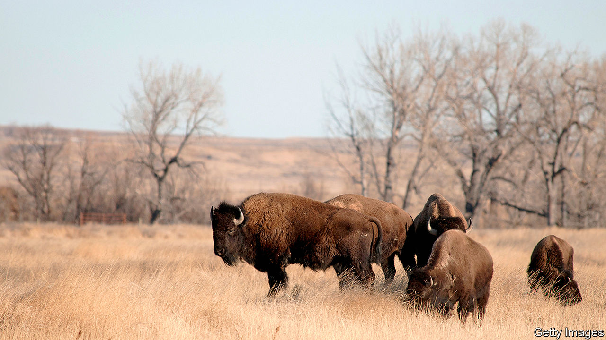

###### Where the wild things are

# America’s answer to the Serengeti is spreading in Montana 

##### In the contest between wildlife and ranchers, the bears have the upper paw 

 

> Nov 14th 2020 

DEANNA ROBBINs and her husband, ranchers in a wild patch of central Montana known as the Missouri Breaks, fought a blizzard this week. They ploughed through knee-deep snow, spending hours to find a herd of black Angus cattle. Then, to feed the cows, they had to dig out bales of buried hay. “We were trudging through drifts, it’s hard work,” she says, but she relished every moment of it. “It has to be in your blood,” she says. Her family have been ranchers in Montana for the past century.

Could anything chase her out? She dislikes change among her neighbours. Abutting her sprawling ranch on three sides is federal land that is being incorporated into a wildlife park. The American Prairie Reserve (APR) was founded as a charity in 2001 and aspires to become the largest park in the Lower 48 states. Already it stretches over nearly 420,000 acres (from 29 ranches it has bought so far), and will eventually grow and stitch together another 2.75m acres of public land. Its aim is for prairie dogs, sage grouse, coyote, bighorn sheep and other species of native plants, birds and mammals to thrive in a contiguous space the size of Connecticut.


For environmentalists, scientists and the APR’s donors—notably wealthy Silicon Valley folk—this is a bold, market-friendly experiment in massive conservation. The area is precious: one of only four vast, temperate, grassland ecosystems left on Earth (steppe land in Mongolia, Kazakhstan and Patagonia are the other three). This territory of shortgrass prairie could become America’s answer to the Serengeti, along the upper reaches of the Missouri River.

In the view of many ranchers, whose beef industry is worth $1.5bn annually in Montana, that is a grim prospect. They worry about more ranch land disappearing into the reserve. “They’d be idling 3.5m acres from food production,” complains Mrs Robbins. She helps to run a campaign against the “elite” APR, known as “Save the Cowboy”. It opposes the sale of ranches to the reserve and argues that the Bureau of Land Management is wrong to allocate federal lands to it. Its placards, showing the silhouette of a big-hatted horserider in an orange sunset, are ubiquitous in central Montanan towns.

A large one is in Lewistown, where the APR will open a centre for tourists. Residents sound less than keen. “We’re trying to preserve the ranching way of life against a bunch of billionaires who came in and got control”, says Kari Weingart. Her husband’s family is unhappy that its old ranch has been sold to the reserve. She says younger Montanans, unexcited by city ways, are growing interested in farming again but struggle to find land. A rancher’s wife, Joann Bristol, suspects the project is a ruse by outsiders to take over from locals. The spending power of the reserve is “scary” while promises of gains from tourism are “overblown” says another.

Then there are long-standing fears of dangerous animals. The odd prairie dog may be cute, but ranchers long ago exterminated wolves, mountain lions and grizzly bears which threatened their stock. Now the APR wants them all back. Wolves and bears may return on their own, from Canada or Yellowstone. The first 850 bison have already been reintroduced; they could eventually number 10,000. Farmers worry bison could trample fences or spread a disease, brucellosis, to cattle. Worse could be the impact of huge increases in elk numbers. The APR wants 40,000 of them, ten-times more than now, to serve as tasty prey for predators. Ranchers fear escaping elk will chomp grass their own cattle need.

Beth Saboe, of the APR, says complaints are overblown. Land prices are rising in Montana, she agrees, but not because of the deep-pocketed charity. One recent factor is that outsiders, fleeing cities because of covid-19, are keen on second homes or land in Big Sky Country. Nor is the APR hostile to agriculture, she says. It lets farmers, for now, graze 14,000 head of cattle on its land and runs a company to sell bison meat. With 63m acres in Montana for farming, it also sees plenty of space for cowboys. Nowhere else in America, however, could host a prairie wildlife reserve of this scale.■

Editor’s note: This article has been changed to clarify that Ms Robbins dislikes change among her neighbours, not the neighbours themselves

