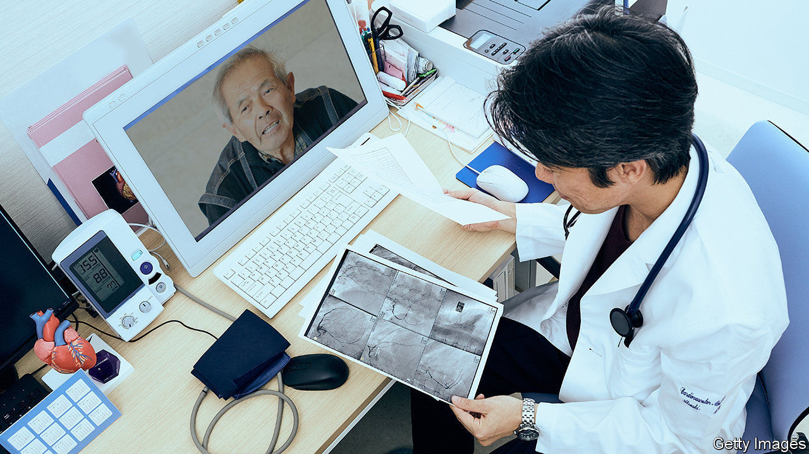

###### Technological stunting

# The pandemic is inducing Japanese doctors to go digital 

##### Telemedicine and electronic record-keeping are at last on the rise 

 

> Nov 21st 2020 

AS COVID-19 SPREAD through Japan this spring, a doctor despaired. What appalled him was not the pace of infection, or a lack of protective equipment, but the archaic systems used to tabulate test results and so track the course of the epidemic. “Even with corona, we’re handwriting and faxing,” he groaned on Twitter.

Japan has excellent health care. Life expectancy at birth is 85 years, the highest in the world. But doctors have been slow to embrace the efficiencies of information technology, despite Japan’s reputation for technical wizardry. The OECD, a club mostly of rich countries, ranks it last among its members for its management and use of data in health care. A commission of experts convened by the Asia-Pacific Initiative, a think-tank in Tokyo, declared Japan’s response to covid-19 a “digital defeat”.


But the coronavirus is also providing a sharp spur for change. The new prime minister, Suga Yoshihide, has made digitising Japan the centrepiece of his economic agenda. The potential benefits are especially big in health care, because costs are rising as the population ages. Spending on health accounted for 11% GDP last year, up from 7% in 2000.

Telemedicine could help cut costs. But the Japan Medical Association (JMA), a powerful lobby, has long opposed online consultations, citing concerns about safety and privacy. Resistance is in part generational. Japan’s 327,000 doctors are ageing alongside their patients: nearly half are over 50. In small clinics, the average age is 60. Toyoda Goichiro of Medley, a telemedicine firm, says his colleagues often have to help new clients with digital basics, such as choosing computers and setting up Wi-Fi networks. But there is also an economic disincentive. As a government official puts it, “There are people in the JMA who are afraid of competition from telemedicine.”

In 2015 the government allowed telemedicine to treat a few conditions, albeit for less compensation and with more paperwork. Predictably, it did not take off: less than 1% of all medical institutions offered online consultations in 2018. But many restrictions on telemedicine were suspended in April because of the pandemic, sending patients and doctors flocking to their screens. The situation “changed radically”, says Hara Seigo, the boss of MICIN, another telemedicine firm, which saw monthly registrations jump ten-fold. Government surveys show the share of institutions using telemedicine has risen to nearly 15% this year. Mr Suga hopes to make the changes permanent.

Mr Toyoda, who gave up a career in brain surgery to work in digital health care, hopes that wider adoption of telemedicine will also promote the use of electronic medical records. Japan’s medical system is overwhelmingly paper-based, laments Tsuchiya Ryosuke, a former head of the National Cancer Centre Hospital. (Mr Tsuchiya uses a smartphone, but keeps “a fax machine ready just in case”.) Only 42% of clinics have digitised their data on patients. Big hospitals do better: 85% keep at least some digital records. But information tends to sit on proprietary systems that are often incompatible with each other.

Linking and analysing those data could help to reduce costs. Duplicate procedures would be easier to avoid. The effectiveness of treatments could be measured. Having a clearer picture of patients’ history is also essential if Japan is to shift from its fee-for-service system, whereby doctors get paid more for ordering more tests, to a system in which their pay is based on outcomes, as the health ministry wants. “To fix problems, you need to have records,” says Shibuya Kenji of King’s College London. “It’s not about just abolishing stamps or faxes, it’s about integrating data sources.”

For Koizumi Keigo, a doctor who serves two remote islands in Mie prefecture, the expansion of telemedicine has been a huge boon. Previously, when he was visiting one of the islands, patients on the other were left without a supervising physician. This year he began keeping tabs over video chat. Nurses hold up an iPad at patients’ bedsides, while Bluetooth devices monitor blood pressure. That is enough to give him a sense of how his charges are doing. They are pleased with the extra attention, too. Now, he says, “even the grandmas” would like to see more doctors go online. ■

