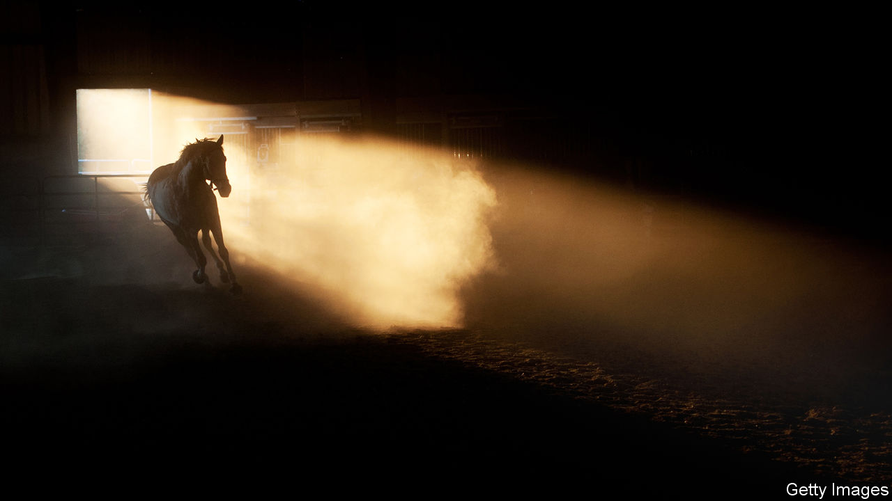

###### Four legs good

# Jane Smiley’s anthropomorphic tale of friendship and freedom 

##### In “Perestroika in Paris”, Perestroika is not a Soviet policy but a horse 

 

> Nov 19th 2020 

Perestroika in Paris. By Jane Smiley. Knopf; 288 pages; $26.95.

THIS ECCENTRIC novel could not be more different from Jane Smiley’s best known book and her most recent ones. “A Thousand Acres” (1991), which won a Pulitzer, was an audacious retelling of “King Lear” featuring an Iowan farmer and his three daughters. “Some Luck” (2014), “Early Warning” (2015) and “Golden Age” (2015), known collectively as the “Last Hundred Years” trilogy, tracked the fortunes of another Iowan farming family across several generations. In “Perestroika in Paris” Ms Smiley swaps the Midwest for France and, for the most part, people for animals.


This Perestroika is not a Soviet policy but a racehorse—Paras for short. After finishing first at Auteuil racecourse, the “curious filly” trots out of her open stall and gambols off into the City of Light. She encounters Frida, a streetwise German short-haired pointer, lonely since the death of the busker who owned her. They bond with a polyglot raven called Raoul, who takes them under his wing and off to the green expanse of the Champ de Mars where they pool resources and live in peace.

Gradually, humans intrude. Pierre is head gardener of their urban idyll, Anaïs a baker who keeps Paras in oats. Étienne, an eight-year-old orphan, gives the animals refuge at his great-grandmother’s house as snow falls and Christmas approaches. But when Étienne’s aged relative dies and Paras is reunited with her groom and trainer, the future looks uncertain for the ragtag group of friends.

Ms Smiley has employed anthropomorphism before. “Moo” (1995) lampooned academia; “Horse Heaven” (2000) sent up horse-racing. But “Perestroika in Paris” is no satire, nor a foray into surrealism or magical realism. Rather it is an immersive fable. Through the unlikely alliance and beguiling adventures of her runaway horse, stray dog and know-it-all raven (plus two rats and a pair of mallards) Ms Smiley explores themes of diversity, loyalty, fellowship and freedom. Along the way her animals wryly comment on the oddities of human behaviour: “Quite often they flock together in large, bright rooms,” Raoul explains, “and then they plume themselves and establish rankings.”

Deeper undercurrents of menace or moments of panic would have given the yarn more edge. But in general Ms Smiley avoids excessive whimsy and sentimentality to deliver a comforting read at the end of a difficult year—a winter’s tale full of wit, warmth and charm.

