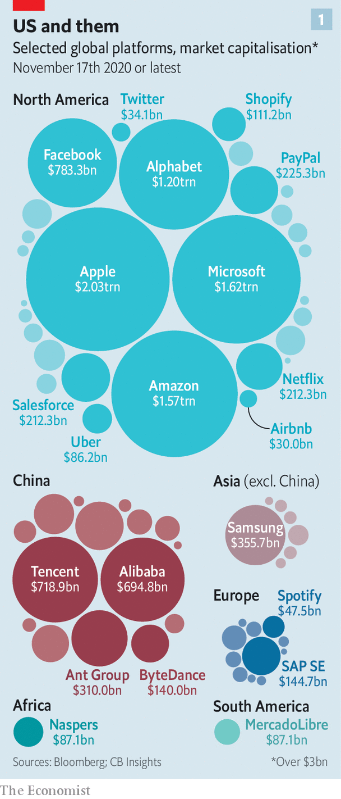
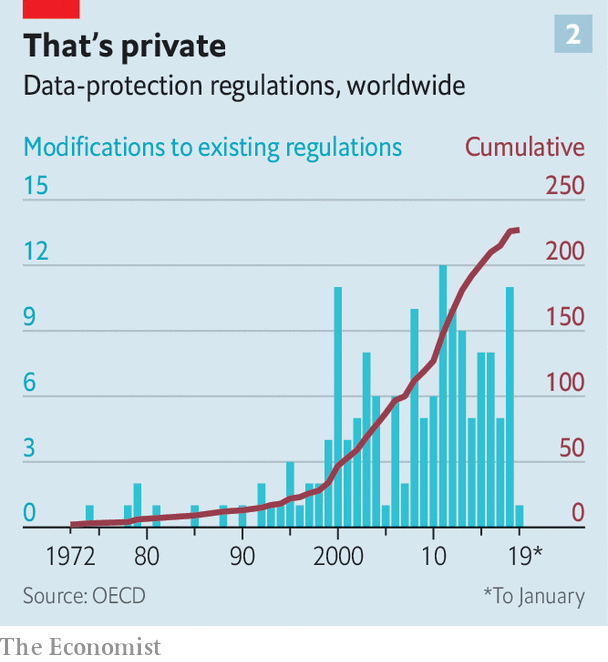
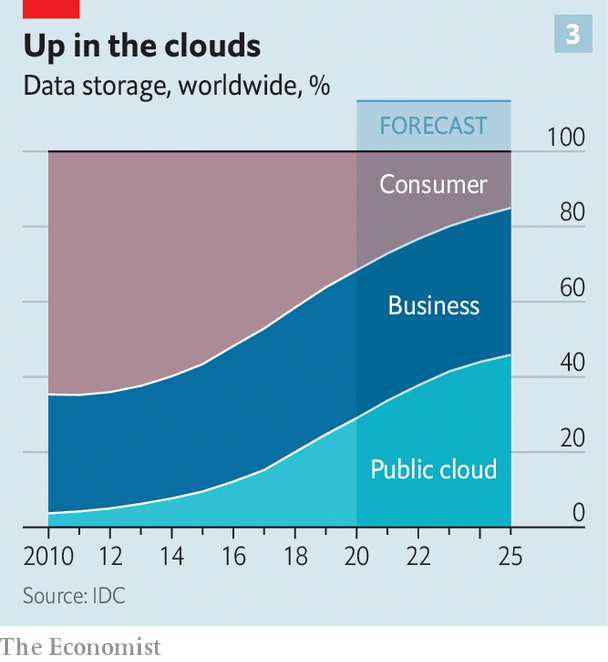

###### A grand bargain

# Democracies must team up to take on China in the technosphere 

##### A robust alternative is needed to China’s autocratic approach 

 

> Nov 19th 2020 

AMERICA HAS long dominated the world in information technology (IT). Its government, universities and enterprising spirit have provided it with decades of leadership in hardware and software. Its military drones, satellites and “system of systems” give its armed forces a powerful edge over those of any competitor. Silicon Valley is more visited by foreign dignitaries and finders-of-fact than any other business locale in the world. One of its tech giants is currently worth over $2trn; three more are worth over $1trn. The contribution technology makes to the buoyancy of its markets is without equal.

China, too, has digital resources in abundance, not least its huge population of 1.4bn, which means it will eventually boast an even deeper pool of data and experts to develop AI models. The country’s digital giants, from Alibaba to Tencent, have already become AI and cloud-computing powers in their own right. Its people live online to an extent that Americans—many of whom still have cheque books—do not. The country’s Great Firewall keeps undesirable digital content out. Within the wall, tech firms are allowed to fight it out as long as they are happy helpers of China’s surveillance state.


And China is on the move. It is investing billions in emerging technologies, from AI and chip fabrication to quantum computing and 5G, a new generation of mobile networks. It is hacking other countries’ computer systems and grabbing intellectual property where it can. It is packing the organisations that develop global technical rules, such as the International Telecommunication Union. And it is pulling other countries into its orbit with initiatives such as the “digital Silk Road”, helping them build out their digital infrastructure.

President Donald Trump saw, correctly, that this made China a serious challenger to America’s digital supremacy. His humbling of Huawei, a Chinese telecoms-equipment maker, has begun a decoupling of Chinese and American IT infrastructures and of the supply chains between China and America that will continue.

Many device-makers have already moved part of their production out of China and some will end up with two separate supply chains. Apple’s contract manufacturers, for instance, are setting up plants in India. TSMC, a Taiwanese chip firm, announced in May that it will build a facility in Arizona. Feeling its dependence on American semiconductor technology, China is doubling down on efforts to build its own. In software and other areas, too, bifurcation has begun—and not just because of bans against Chinese apps.

What Mr Trump was unable or unwilling to understand, though, was that China and America are not the only economies that matter in this contest, and that fact provides America with a potentially decisive advantage. India, the European Union, Japan and others all play crucial roles in the world’s IT system—as do tech giants such as Alphabet, Apple and Microsoft.

All these entities, whether national or corporate, are at odds with the American government and often with each other over something or other in the IT world, whether it be visas, privacy rights or competition complaints. But they would also all prefer a world in which international agreements, practices and expectations for IT embody the values and interests they share with America, rather than those of China. And if democratic countries cannot agree on common rules in the digital realm, China could end up setting the rules for large swathes of the world. The result would be a technosphere engineered for the comfort and support of autocracies.

A partial catalogue of the past few months’ disagreements shows the fractiousness that stops the free world coming together on this—and how many opportunities for dealmaking there would be if it decided it should. America’s commerce department told foreign firms they could sell no more chips made using American technology to Huawei; its justice department filed an antitrust lawsuit against Google. America also pulled out of talks at the Organisation for Economic Co-operation and Development (OECD), a club of mostly rich countries, about how to tax the tech giants. India blocked dozens of Chinese apps, including TikTok, a popular video-sharing service, which the American government also wants to ban. The European Court of Justice (ECJ) struck down the “Privacy Shield” agreement between America and the European Union (EU), thus throwing the legal basis on which personal data flows across the Atlantic into doubt.

Europe has been trying for some time to carve out its own space in the digital realm as a protector of the citizenry—a noble goal made easier by the fact that the companies from which its citizens are being protected are mostly based the other side of the ocean. This has heightened tensions between Brussels, Washington and Silicon Valley. The ECJ’s ruling on the Privacy Shield is one example. The European Commission is drafting legislation that would weaken the power of America’s tech giants. Its proposed Digital Services Act would outlaw some of the firms’ business practices, such as bundling their services to take over new markets or displaying them more prominently than competing ones.

We will rock you

Some of the EU’s member states have also begun defending their right to rule their own digital roost, something now called “digital sovereignty”. There is talk of creating a European cloud within the American one. GAIA-X is a step down that road—a federation of clouds, launched by Germany and France in June, whose members agree to certain rules, such as allowing customers to choose where their data are stored and move freely to providers’ competitors if they wish. There is more to come: a “data strategy” on the table in Brussels would, if fully implemented, create “data spaces” ruled by European law and give people more rights on how their data are used.

These disputes offer ample space for mutually beneficial trade-offs. If America and its allies can reach good enough accommodations on the most contentious issues—notably privacy and competition—and find ways to live with the smaller contradictions and conflicts which remain, they can become a force to be reckoned with—one that others will need little encouragement to join. An insular America can remain a technology superpower. A connected America cemented into the rest of the world by means of a grand technopolitical bargain could be the hub of something truly unsurpassable.

 


There is a range of ideas about how to do this. In a recent report for the Council on Foreign Relations, a think-tank, Robert Knake imagines such a grand bargain taking the form of a “digital trade zone”, complete with a treaty organisation. America would “weaponise its digital trade relationships” in order to promote such things as cyber-security, privacy protection and democratic values on the internet. Only countries that comply with the organisation’s rules on such matters would be able to become members and only members would be allowed fully to trade with each other digitally. Violations would be dealt with by imposing sanctions and tariffs. “If the digital trade zone grows strong enough, China might see more benefit to co-operative engagement than to continued disruptive behaviour,” writes Mr Knake.

Others prefer to imagine something less formal, rules-based and punitive. In October three other think-tanks—the Centre for a New American Security (CNAS), MERICS of Germany and the Asia-Pacific Initiative of Japan—outlined a less exclusive construction. They propose that democratic countries form a “technology alliance” not subject to a formal treaty. It would be like the G7, which consists of America, Britain, Canada, France, Germany, Italy and Japan, and could one day, perhaps, include India and other countries from the Global South. It would hold regular meetings, as the IMF and World Bank do, and issue consensus opinions, and it would invite other stakeholders—from NGOs to tech firms—to pitch in.

Let us cling together

Until this month, such ideas seemed premature. But with Joe Biden soon in the White House, they have become more realistic: IT will be high on the agenda of the “summit of democracies” he has promised to convene. Closer co-ordination and some new institutions to back it up are also more needed, and not just because of the Chinese threat. The coronavirus, by pushing much of human activity into the cloud, has emphasised the importance of the digital realm and its governance. Left alone, the world of technology will continue to disintegrate into a splinternet in which digital protectionism is widespread—much as the global financial system fell apart before the second world war.

To make sense of all this, it helps to see the political world as one in which technology is beginning to look ever more like geography. The geopolitical way of looking at the world, which was born in the 19th century and revolutionised strategic thinking in the 20th, was based on the idea that the geographical aspects of the physical world could be crucially important to the relations between states. Mountains that blocked transit and plains that permitted it; oilfields and coalfields; pinch-points where maritime traffic could be constrained. Where a state’s territory stood in respect to such geographical facts of life told it what it should fear and what it might aspire to, whose interests conflicted with its own and whose might align with them. In other words, geography was destiny.

 


The units of analysis for today’s nascent technopolitics are platforms: the technologies on which other technologies are built—and alongside them, increasingly, businesses, governments and ways of life. The platform of all platforms is the internet. Some of the things which stand upon it are huge and widely known, such as Facebook, others small and obscure, such as Kubernetes, a sort of software used in cloud computing. Like geographical territories, these platforms have their own politics. They have their own populations, mostly users, coders and other firms. They have their own laws, which lay out who can change code and access data. They have a position with respect to other platforms which underpin, compete with or build on them, just as territories have defined relationships with their neighbours.

And they have their own governance systems. Some are “open”. The most famous is Linux, an operating system created and maintained through co-operative efforts to which all are, in principle, free to contribute and from which all are welcome to benefit. Others are “closed”, as is the convention among many corporate-software makers, such as Oracle. Some are run like absolute monarchies, such as Apple under Steve Jobs, who was the final arbiter over the smallest details in his tech empire.

Don’t stop me now

Their dominant positions in this world of platforms give companies like Facebook and Google powers approaching or surpassing those of many countries. Yet countries can—as their economies become more digitised—be increasingly understood as platforms, too: national operating systems of sorts. Natural resources still count, but digital resources are gaining ever more relevance: skilled and well-trained tech workers, access to scads of data, computing power, internet bandwidth, industrial policy and venture capital. And as with technology platforms, a country’s competitiveness will, to a large extent, depend on how it manages and multiplies these resources.

America is a platform like Microsoft’s Windows and Android, Google’s mobile operating system. These mix aspects of open and closed systems, allowing others to develop applications for their platform, but also closely control it. America combines monopolies and a strongish state with lots of competition. Mainly thanks to this profitable amalgam, the country has given rise to most of the world’s leading tech firms. China is more like Apple and Oracle, which combine being closed with lots of internal competition. The European Union is best compared to an open-source project such as Linux, which needs complex rules to work. India, Japan, Britain, Taiwan and South Korea all run differently and have technology bases to match.

The rise of cloud computing and AI—the first a truly global infrastructure, the second its most important application—has heightened the tensions between these platforms. More and more value is created by using oodles of computing power to extract AI models from digital information generated by people, machines and sensors. The models can then be turned into all sorts of services. Transport, health care, teaching, campaigning, warfare—these parts of society will not become “data-driven” as fast as many predict, but in time they will all be transformed. Whoever controls the digital flows involved can divert much of the rent they generate. Knowledge is power in the virtual world even more than in the real one—and it generates profit. Ian Hogarth, a British tech thinker, summarised the sudden sense of urgency when he wrote in a paper in 2018 that “AI policy will become the single most important area of government policy”.

Many rich countries have drawn up ambitious industrial-policy plans for AI. Some have also instituted national data strategies which limit the data that can leave the country. A few have begun attacking other countries’ platforms by hacking their computer systems and spreading misinformation. In short, they are behaving increasingly like the companies producing the technology reshaping their world. “Everybody has become much more techno-nationalist,” says Justin Sherman of the Atlantic Council, a think-tank.

 


That the 21st-century internet would be a splinternet was, perhaps, inevitable. It is not just that nations act in their own interests; they also have different preferences and values, for instance regarding privacy. High digital borders behind which data get stuck, however, are not in the interests of most countries—though they may be in the interest of some governments. Russia wants to create a “sovereign internet” that can be cut from the rest of the online world at the flip of a switch (while retaining the capability to mess around in more open systems). Countries interested in using flows of data to improve their citizens’ lot, though, will see few advantages. In a splinternet world choice will be limited, costs will rise and innovation will slow. And all the while China, with the biggest silo and thus the greatest access to data, loses least.

You’re my best friend

It is against this background that a grand bargain needs to be struck. Its broad outline would be for America to get security guarantees and rule-making bodies in which its interests can be taken seriously. In return it would recognise European privacy and other regulatory concerns as well as demands that tech titans be properly taxed. Ideally, such a deal would also include India and other developing countries, which want to make sure that they do not risk becoming mere sources of raw data, while having to pay for the digital intelligence produced.

In terms of security, the parties to the bargain would ensure each other secure, diverse supply chains for digital infrastructure. To get there, the CNAS proposes, in effect, to partially mutualise them: among other things, members of a tech alliance should co-ordinate their efforts to restructure supply chains and might set up a semiconductor consortium with facilities around the world. Supporting open technologies and standards that create a diverse set of suppliers would help, too. An example is OpenRAN, a mobile network that allows carriers to mix and match components rather than having to buy from one vendor. A world with open infrastructure like this need not, in principle, just depend on a few suppliers, as is the case today with Huawei, Nokia or Ericsson.

To give in to Europe on other fronts in return for help in such matters would be costly to America, which has largely opposed attempts to regulate and tax its tech giants abroad. In terms of statecraft, that is an attractive part of the arrangement; to be willing to pay a cost shows that you place real value on what you are getting.

 


If an alliance of democracies is to deliver a China-proof technosphere, America will have to accept that the interdependence of the tech world on which the whole idea is based means that it cannot act unconstrained. Henry Farrell of Johns Hopkins University argues that America has so far simply “weaponised” this interdependence, using chokepoints where it has leverage to strangle enemies and put pressure on friends. But Europe’s resistance to banning Huawei’s gear and the ECJ’s decision show that even friends can balk. America needs to give if it is to receive.

It might not have to give all that much. European views on regulating platforms more strictly because of their tendency to become quasi-natural monopolies are not exactly mainstream in Washington, DC, but nor are they completely alien to the political debate there. A recent congressional report about how to limit big tech’s power included many ideas already touted in Brussels, such as banning tech giants from favouring their own services and refusing to connect to competing ones. Positions on regulating speech online are not that far apart either. As in Europe, there is growing agreement in America that legislation is needed to push social-media firms to do more to rid their services of hate speech and the like.

A deal on taxing tech firms seems within reach, too. The Trump administration resisted efforts to compel them to pay taxes where they do business rather than in tax havens, regarding this as a grab for the profits of American companies. A Biden administration is likely to be more open to the argument that more of the taxes on digital firms should go to places where their customers live. Expect negotiations on the matter at the OECD to be revived—as they must be to keep countries from charging digital taxes unilaterally. Barring a compromise, France, Spain and Britain will start collecting such a levy early next year.

In parts of the world’s international bureaucracy the grand bargaining has already begun. When Japan presided over the G20, a club of developing and rich countries, last year, it succeeded in getting the group to launch the “Osaka Track”, an attempt to come up with rules to regulate global data flows. This summer also saw the launch of the Global Partnership in AI, which is meant to come up with rules for the responsible use of AI, and of the Inter-Parliamentary Alliance on China, which brings together lawmakers from 18 countries. These new groups join a few established ones, such as the OECD and the Internet Governance Forum, which have long pushed for common rules in the digital realm. NATO has started to do the same for AI and data-sharing among its members.

One of the key parameters in the bargaining will be how formal a framework the parties want. In some ways, formal is better: everyone knows where they stand. In others, formal is worse: agreement is harder. Take the example of trade, thoroughly formalised within the WTO. Trade agreements take years to negotiate, often only to be blocked by legislatures at the last minute. This is why a Biden administration will probably aim for a much looser form of co-operation, at least initially. An idea discussed in foreign-policy circles close to Mr Biden is that, instead of agreeing on certain policies that then have to be implemented nationally, governments should opt for a division of labour within certain red lines. If Europe wants to go ahead with rules to regulate big tech which do not amount to expropriation, America would not put up a fight—thus allowing the EU regulation to become the global standard of sorts, rather as it has done with the GDPR.

The show must go on

Compromises that provide something for everyone are not hard to spot. But reaching them will not be easy. After four years of President Trump, “the mistrust on the European side runs deep,” says Samm Sacks of CNAS. On the other side of the Atlantic, Congress will not want to make life more difficult for its intelligence agencies, for whom social media and online services have become a crucial source of information. In order for a grand bargain to be reached, all of that must be made more difficult. If the ECJ struck down the Privacy Shield, it was mostly because the court believed that America does not provide enough safeguards to protect European data from the eyes of its intelligence and law-enforcement agencies.

Another big barrier on the way to a bargain will be the question of how much America’s tech titans need to be reined in. “To bring globe-spanning technology firms to heel, we need something new: a global alliance that puts democracy first,” argues Marietje Schaake, a former member of the European Parliament who now works for the Cyber Policy Centre at Stanford University, in a recent article. Many in California and elsewhere in America like the sound of this, but Congress will only go so far in restricting its tech giants and their business model, which is increasingly based on extracting value from data.

Even if a grand bargain can be reached, many small ones will need to be done as well. That is why, in the long run, the world needs more than bilateral deals and a loose form of co-operation, but something more robust and specialised. It may even have to be something like a World Data Organisation, as Ian Bremmer of the Eurasia Group has suggested (or at least a GADD, a General Agreement on Data and Digital Infrastructure, a bit like the General Agreement on Tariffs and Trade, as the WTO’s predecessor was called). Given the sorry state of the WTO, this may seem fanciful, but without such an organisation today’s global data flows may shrink to a trickle—much as protectionism limited trade in the days before the GATT and the WTO.

 


Will it ever happen? Yes, if history is any guide. In July 1944 representatives of 44 countries met in Bretton Woods, New Hampshire, to hash out a new financial order, including the IMF and the World Bank. Granted, the pandemic is no world war. But, with luck, living through it may provide enough motivation to try again in the digital realm. ■

