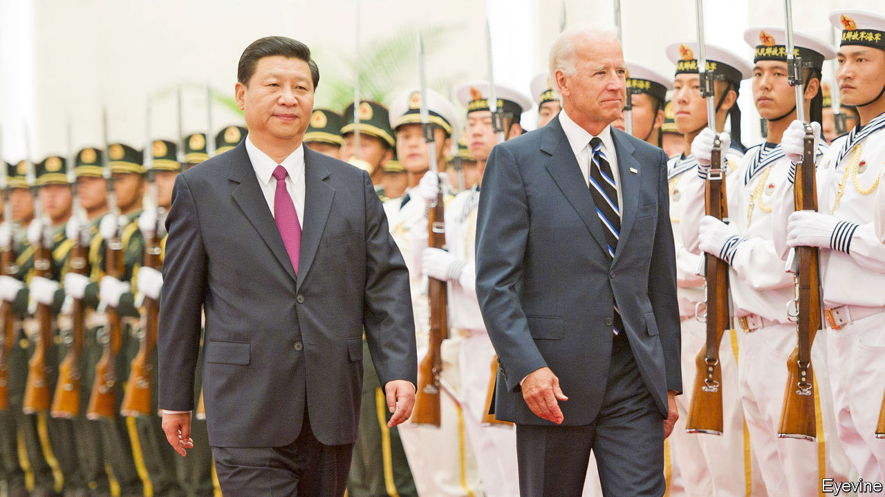
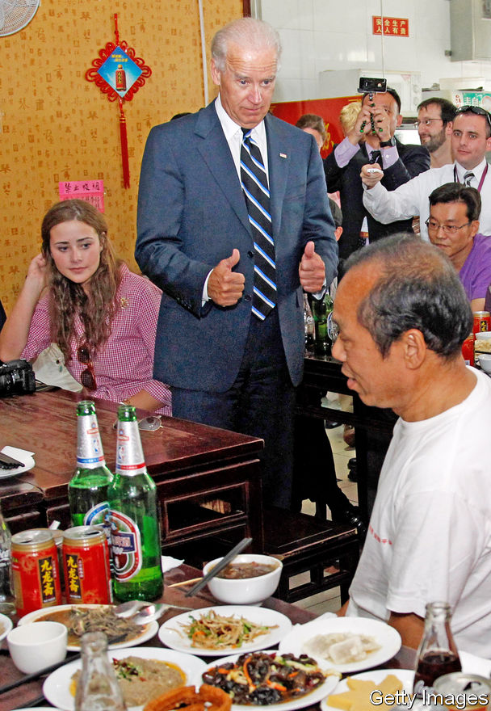

###### To a different tune

# Joe Biden’s China policy will be a mix of Trump’s and Obama’s 

##### America’s next president will throw fewer wild punches 

 

> Nov 19th 2020 

EARLY IN HIS campaign for the presidency, Joe Biden rejected the notion that China was much of a worry. He argued that no leader in the world would trade the challenges facing China for their own. “China’s going to eat our lunch? Come on, man,” Mr Biden scoffed. “I mean, you know, they’re not bad folks, folks. But guess what? They’re not competition for us.” He was speaking in May 2019. Tempered by his contest with Donald Trump, who tried to rally support by highlighting the threat posed by China, Mr Biden now avoids such words. But as president, will his policy towards China be very different from Mr Trump’s? He has yet to spell out his plans, but he will throw fewer wild punches.

Mr Biden’s political rivals attacked his remarks in Iowa City, accusing him of being naive about China. Even some of his own advisers were troubled. At the time, Mr Biden was still bragging about the many hours he had spent with Xi Jinping when he served as vice-president under Barack Obama (he is well remembered in Beijing for dropping in at a neighbourhood eatery in 2011—see picture). He was also being less blunt about China’s hard authoritarian turn under Mr Xi. Since Mr Trump became president in 2017, relations between China and America have become much more hostile. But Mr Biden seemed stuck in the mindset of the Obama administration, which described its co-operation with China as “unprecedented” in scope. During the campaign Mr Biden had to be “reprogrammed” on China, says an adviser.

 


It seems to have worked. Mr Biden has since called Mr Xi “a thug”. He has criticised Mr Trump for praising Mr Xi (for example, during the early days of the covid-19 outbreak) and being indifferent towards, even tolerant of, China’s human-rights abuses. In August his team accused China of “genocide” against ethnic Uyghurs in the far-western region of Xinjiang. Mr Biden finished his campaign sounding nothing like the candidate who started it or the administration he had once served. He was vowing to be “tough on China”.


China may be wondering whether all this is bombast. Before Mr Trump’s presidency, there had been a long tradition of candidates berating China on the campaign trail, only to tone down their rhetoric and try to keep relations on an even keel once in office. Mr Biden’s remarks give him wriggle-room to do the same. Despite referring to China as America’s “biggest competitor”, he has not called it the biggest threat. That, he says, is Russia (although the Biden administration is expected to keep the label of “strategic competitor” used under Mr Trump to describe China). Advisers to Mr Biden’s team say there will be “no reset” in the relationship. But the president-elect does talk about co-operation with China on issues such as climate change and global health, which Mr Trump eschewed.

What can be discerned of Mr Biden’s China policy looks like an amalgam of Mr Trump’s and Mr Obama’s: a Trumpian wariness of China combined with a preference for caution in handling strategic matters. He will be constrained by a Congress that has become far more hostile to China in recent years. A Senate that may remain in Republican control will restrict his freedom to appoint people who hawks fear will favour more engagement with China (see ). Public opinion may affect his policy, too—negative views of China have reached an historic high.

Of the many disputes between China and America that have grown more fraught under Mr Trump, trade is among the most bitterly contested. Mr Biden will inherit a smouldering trade war with China that was launched by Mr Trump in a vain attempt to reduce a soaring bilateral trade deficit. Unlike Mr Trump, America’s leader-in-waiting is no fan of using tariffs to achieve such goals. But he is unlikely to move swiftly to dismantle Mr Trump’s tariffs on Chinese goods—even though they are, in effect, a tax that is mostly paid by American consumers. Some of Mr Biden’s advisers hope that retaining them, at least for now, will give America leverage in negotiations with China over trade and other matters.

In the Obama era, Mr Biden supported efforts to forge a trade deal among 12 countries, including America, around the Pacific—hoping it would eventually draw in China and bind it to Western trading norms. Mr Trump withdrew from that project. There is little chance that Mr Biden will resume interest in it. Winning approval from the Senate for multilateral trade pacts would be daunting, if not impossible.

Avoiding a hot war with China will also be a priority for Mr Biden. In recent months China has stepped up exercises in the Taiwan Strait and sent fighter jets on numerous sorties into Taiwanese airspace. Mr Biden will continue arms sales to Taiwan, which have picked up pace under Mr Trump. But he may scale back symbolic shows of support, such as high-level trips to Taiwan by cabinet members (in August Alex Azar, the health secretary, became the highest-ranking American to visit the island since America severed official ties with it in 1979). Some of Mr Biden’s advisers see these as needlessly provocative.

But Mr Biden is likely to retain some of Mr Trump’s toughest measures against China related to national security. He will persist with efforts to strangle Huawei, a Chinese telecoms giant that America regards as a security threat, by keeping Trump-era restrictions on doing business with the firm (see ). Mr Biden will stress the need for America to keep ahead of China in technology. “Decoupling” in high-tech areas will remain the trend. This may involve government support for making semiconductors in America to avoid reliance on ones made in China.

Despite its disregard for multilateral forums, the Trump administration did try to build the Quadrilateral Security Dialogue, a group of four China-sceptic countries—America, Australia, India and Japan—into something sturdier. A military exercise involving all four members of the club took place this month in the Bay of Bengal. Mr Biden can be expected to continue efforts to beef up the Quad, as it is known (see Banyan). He will also maintain “freedom of navigation” patrols by the American armed forces in the South China Sea and Taiwan Strait. Mr Obama was reticent about these, but they became routine under Mr Trump. Mr Biden will assure China’s neighbours that America will be active in Asia; some allied diplomats in the region had grumbled that Mr Obama’s “pivot” to Asia was too half-hearted.

Making values great again

Unlike Mr Trump, Mr Biden is expected to take a personal interest in the challenge posed by human-rights abuses in China, including repression in Xinjiang and Hong Kong. He may make more effort to contest China’s influence in the UN, where Mr Xi has sought to insulate himself from criticism of his human-rights record. Mr Biden is likely to maintain sanctions on China imposed by the Trump administration, including those on officials and companies deemed complicit in violating human rights. Soon after taking over he may stage an international “Summit for Democracy” to make his values clear.

But the next president will avoid giving the kind of fiery ideological speeches favoured by the likes of Mike Pompeo, Mr Trump’s secretary of state, and William Barr, his attorney-general, who have described the Chinese Communist Party as an existential threat to the free world. Such rhetoric does not mesh well with his belief that America can still co-operate with China in some areas.

Mr Biden will abandon aspects of Mr Trump’s China policy that he views as harmful to openness and tolerance. He may remove visa-related impediments, introduced by the Trump administration, to study in America by people from China. Mr Biden believes that more foreigners should be recruited to American campuses, and that America gains from their presence. Investigations will continue into suspected espionage involving Chinese researchers, but Mr Biden’s administration may tone down Trumpian rhetoric that instilled fears among ethnic Chinese living in America of a “red scare” fuelled, in part, by racial hostility towards them.

Mr Biden will certainly avoid Mr Trump’s use of racially charged language to describe covid-19’s links with China. He can also be expected to rejoin the World Health Organisation and try to resume the stationing in China of specialists from America’s Centres for Disease Control, who used to work with their Chinese counterparts on public health.

In the battle against climate change, Mr Biden may seek to persuade China to stop building carbon-belching projects such as coal-fired power plants in other countries. Such efforts will be made easier by America’s rejoining, under Mr Biden, of the Paris agreement on climate change. In September Mr Xi announced a goal of reaching net-zero carbon emissions by 2060. Some climate experts say Mr Biden should announce an even more ambitious climate target, and encourage a race with China to develop a green economy. That would mesh well with what Mr Biden’s advisers believe should be a pillar of his China strategy—strengthening America itself, including by spending more government money on renewable energy. But the Senate, if it remains in Republican control, could frustrate such ambitions.

It is not only Republicans who will limit Mr Biden’s room for manoeuvre on China. Much of the machinery of government—from the Commerce Department to intelligence agencies—has been recalibrated in response to China’s growing challenge, with more staff and energy focused on the country and its transgressions than ever before. New laws, sanctions and other policies specifically targeting China are in place. This helps to keep China at the forefront of political debate and makes it more difficult for leaders to turn a blind eye to the Communist Party’s bad behaviour. “It’s very different from the past when a new president came in and could very quickly if they wanted make significant changes,” says Bonnie Glaser of the Centre for Strategic and International Studies, a think-tank.

In keeping with the new mood, Mr Biden is expected to send early signals that he intends to stand firm against China. Advisers suggest that he wait longer than usual to take a congratulatory call from Mr Xi, and not fall for any language Mr Xi may use to suggest a new framework for the relationship. Initially, at least, Mr Biden will focus on domestic issues like covid-19 and the economy, as well as on strengthening ties with allies. He will want their support when he turns his attention China-wards.

Mr Xi will surely look for a chance to test Mr Biden’s mettle. In the build-up to a crucial Communist Party gathering in 2022, he will not wish to appear weak. How Mr Biden responds to any provocation will depend, in part, on the advice he receives from his senior officials. Some of those whom he is expected to pick as his national-security advisers are veterans of the Obama administration who shied away from confrontation with China. Others believe in more muscular responses to its increasingly assertive behaviour, including a clearer commitment by America to defend Taiwan against any Chinese attack. As vice-president Mr Biden displayed caution about the use of American force. In his dealings with China, the risk of a dysfunctional relationship turning into a violent one will loom large in his calculations. ■

Dig deeper:Read our , and then sign up for Checks and Balance, our  and  on American politics.

