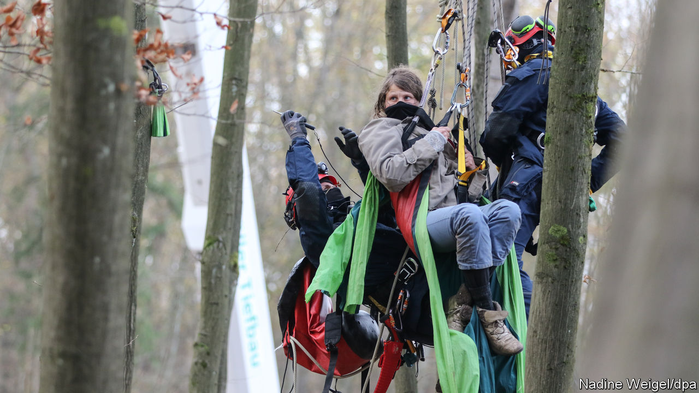

###### Green on green

# Some activists are running out of patience with Germany’s Green Party 

##### Especially where a motorway threatens a forest 

 

> Nov 21st 2020 

OVER A YEAR ago protesters installed themselves in and around the 250-year-old oak and beech trees of the Dannenröder, a forest and water reserve in the southern German state of Hesse. From their lofty treehouses and makeshift huts, they vow to protect 27 hectares of “Danni” that face clearance for an extension to the A49 motorway. Police have begun to evict the protesters, sparking scuffles, arrests and a handful of injuries. But what looks like a familiar environmental protest resonates beyond the wildlands of Hesse, especially for Germany’s Greens. Dannenröder tests the party’s ability to balance its radical promise with its ambitions to govern.

Nationally the Greens, who sit in opposition, urge a moratorium on motorway-building. But in 11 of Germany’s 16 states, including Hesse, they form part of ruling coalitions, which means grappling with the messy compromises of government. Tarek al-Wazir, Hesse’s Green economy and transport minister, says he opposes the A49 but is obliged to implement it, as motorways are a federal responsibility. Bettina Hoffmann, a Green MP fighting to halt the A49, insists the state and national parties are united in leaning on the federal government to stop the project. But tensions are clear.


In recent years the Greens have been doing the splits: aiming to harness the energy of climate movements like Fridays for Future (FFF) while reaching beyond their base of well-heeled urbanites—including to the sort of voters who might use the A49. The success of the Greens’ two leaders, Annalena Baerbock and Robert Habeck, who have cemented the party in second place in polls, seemed to have ended tensions between the Greens’ centrist Realo and radical Fundi wings. But a new generation of campaigners have grown frustrated with a party they see as insufficiently committed to meeting Germany’s climate pledges. “I sometimes think the Greens don’t know what we mean by ‘climate emergency’,” says Luisa Neubauer, an FFF activist and party member.

The strains matter. In Baden-Württemberg, the only state where the Greens lead a ruling coalition, activists irritated by the party’s cosiness with the car industry have formed a “Climate List” to contest state elections in March. Winfried Kretschmann, the state’s Green premier, says the list threatens his re-election bid. Party insiders grumble that young activists do not understand the give-and-take of democracy. The ascendancy of climate politics has helped the Greens’ rise. Now it complicates it.

For more coverage of climate change, register for The Climate Issue, our fortnightly , or visit our 

