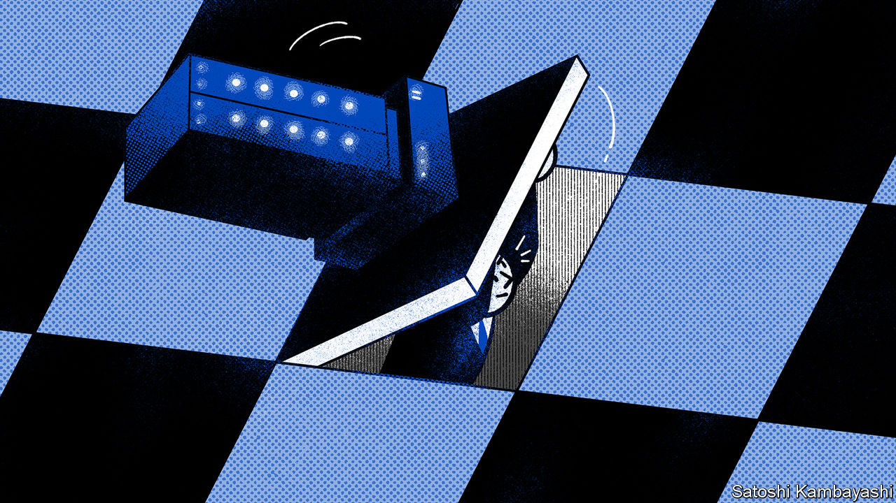

###### Buttonwood

# Why 2020 has been rotten for quant funds 

##### Quants rely on history. This year has had few precedents 

 

> Nov 21st 2020 

WHAT IS IT like to lose to a machine? In 1997 the world’s best chess player, Garry Kasparov, was beaten by Deep Blue, a $10m super-computer made by IBM. Twenty years later he wrote “Deep Thinking”, a book about the experience. What comes across vividly is how exhausting each game was. Chess players, even great ones like Mr Kasparov, get tired and frustrated. Doubts begin to creep in. By contrast, Deep Blue just needed the occasional reboot.

Now turn the tables. What is it like to win against the machines? By New Year’s Eve the least smart buy-and-hold investor in an index fund might be able to boast of such a victory. For 2020 has been rotten for “quant” funds, which use powerful computers to sift market data for patterns that might predict future prices. “Long-short” momentum—buying recent winners and selling recent losers—had been one of quant’s better strategies this year. Yet on November 9th, when news broke of an effective vaccine for covid-19, it had its worst ever day.


Quants rely on history. If something happens that is without precedent, such as a vaccine in a pandemic, they have a problem. No doubt a few quant hedge funds are nursing heavy losses. And perhaps a few discretionary funds have made a killing. The terrain on which human traders can beat the machines is much diminished. But November 9th shows it is still possible. Chalk it up as a small victory for the species.

It is no small irony that momentum trading takes advantage of human weaknesses. One of these is “conservatism bias”. Investors tend to stick to prior views too rigidly and change them only slowly in response to new information. They may give undue emphasis to the price paid for a stock as a marker of its true value and, as a consequence, sell winning stocks too soon and hang on to dud stocks for too long. There is also a contrasting tendency to extrapolate past success. So as well as under-reacting to news, people also over-react to it. Momentum trading seeks to exploit this.

A lot of long-short strategies, including momentum, rank stocks by a particular attribute and then buy the top decile (or quintile) of the group and sell the bottom one. This requires machines. Sorting through thousands of securities quickly is beyond the meagre talents of a living, breathing portfolio manager. It requires algorithms that first establish and then fine-tune the optimal period over which to do the sorting. And it needs speedy and seamless access to automatic trading platforms and market data. You would not want to do all this by hand and brain.

In chess, the brute force of computing power eventually wins out. In investing, the strength of synthetic traders is in dealing with reams of information that is machine-readable, such as tick-by-tick stock prices. The most powerful machines can make sense even of unstructured (“big”) data. But an event like the discovery of a vaccine can flummox even the smartest of them. Humans retain an edge. They are able to winnow down endless possibilities using mental shortcuts. They can imagine scenarios that the past has not thrown up—scenarios such as “a vaccine may become available soon, given the amount of money and effort being thrown at it”; and “news of such a vaccine might spark a sell-off in ‘stay-at-home’ shares and a rally in ‘get-out-of-the-house’ shares”.

But why were the moves in prices so dramatic? A good rule of thumb, says one quant guru, is that the faster you trade, the less capacity there is for your strategy. A speedy trading strategy, such as momentum, relies on liquid markets to keep turnover costs in check. The strategy can become crowded. And when the quants suffer losses, they may be forced by risk-management rules to close their positions. As everyone rushes to get out at the same time, it makes for extreme price movements. This is in part why sophisticated quant funds are constantly evolving. They look for unique datasets on which to train their machines. Or they try to come up with new ways to parse weaker signals that others cannot detect in the market noise.

The quants have had a rough time, but they are hardly in retreat. Their domain will only expand. The margin of advantage for discretionary trading—for human ingenuity, in other words—will shrink. It is worth remembering that the first time Mr Kasparov played against Deep Blue, in 1996, he won. Now, as he has pointed out, you can download free chess engines that are far more powerful. We should savour victories over the machines while we can.

