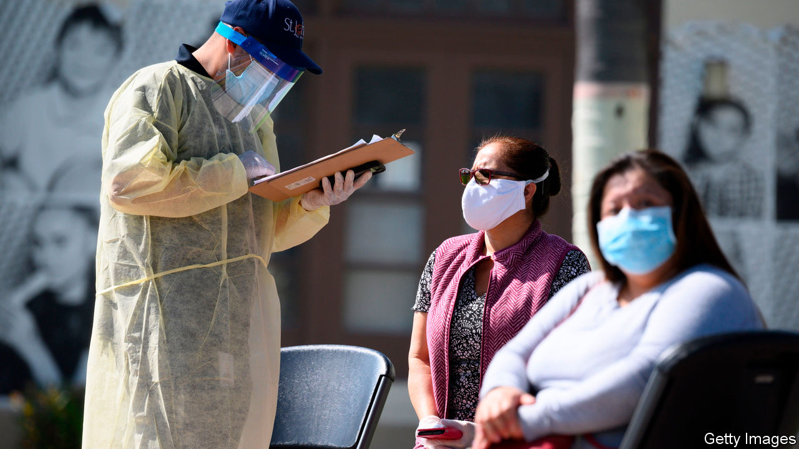
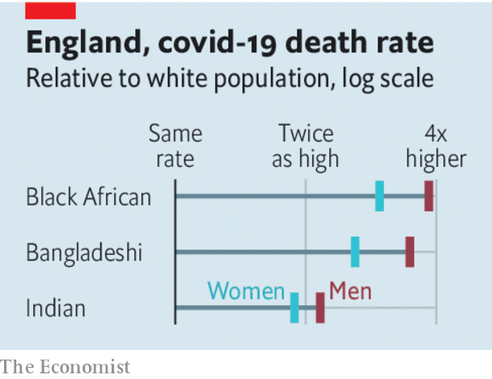

###### Race and health

# A lack of data on race hampers efforts to tackle inequalities 

##### Why governments need to overcome their qualms in gathering vital information 

 

> Nov 21st 2020 

Editor’s note: Some of our covid-19 coverage is free for readers of The Economist Today, our daily . For more stories and our pandemic tracker, see our 

COVID-19 IS NOT colour-blind. In England a black man is nearly four times more likely to die from the disease than a white man of a similar age. In the state of New York, in the first months of the pandemic, black and Hispanic children were more than twice as likely to lose a parent or caregiver to covid-19 than those who were white or Asian. Few countries publish health data filtered by race or ethnicity, but in those that do the pandemic seems to be killing more people from racial minorities. 

That confirms public-health officials’ worst fears. Covid-19 has laid bare countries’ broad racial inequities in health and exacerbated them (see ). The virus has also highlighted the scarcity of decent data on ethnicity or race. Most governments do not know if the pandemic is hitting particular groups harder, let alone why. In April a mere 7% of reports published in leading journals about covid-19 deaths recorded ethnicity. In western Europe most countries collect information only on people’s “migrant status” (often, where parents were born), a flawed proxy. 


Covid-19 should be a wake-up call. As in the debate about gender inequality, awareness of racial gaps has grown. Both suffer from too much intuitive argument and too little data. But whereas there has been something of a gender-data revolution, many remain uneasy about gathering data on ethnicity and race. Some countries, such as France, prohibit collecting such data. In Germany members of the Green party want to remove the word Rasse, a loaded term for “race”, from the constitution.

Such anxieties should not be ignored. It is no coincidence that the countries and communities, including Jews and Roma, most opposed to registering race or ethnicity have often seen how it can be used to facilitate discrimination, segregation and even genocide. More recent reminders of the harm that such information can do in the wrong hands include the war in Ethiopia (see ). 

 


Yet these are arguments for anonymising data, not ignoring them. Race itself is not the cause of most health differences, but it is often closely correlated with policy failures, such as access to education, health care or jobs, that do cause such disparities. It is only by understanding the roots of these failings that gaps can be reduced. Data should be carefully safeguarded and their use tightly regulated. Although recognising the sensitivity of information is crucial, so is gathering and sharing it. 

Inequalities and injustices can be tackled efficiently only once they become statistically visible. It was fear of inequality that led Britain, Finland and Ireland to make sure public bodies regularly gathered this data. Colombia, New Zealand and America, among the few places that collect statistics on indigenous people, use them to distribute federal funding. After Brazil started collecting data in the late 1990s by five different skin-colours, the gulf in infant mortality between indigenous and white babies became apparent. Public outrage led to serious efforts to start narrowing the gap. The Brazilian example shows that the data need to be granular. Catch-all terms such as “BAME” (Black, Asian or Minority Ethnic), used in Britain, are unhelpful. “Non-Western migrant” or “foreign born” contain even less information.

The data also provide a baseline. This lets you make comparisons and monitor progress. Canada makes regional ethnicity data available, in part, so that local employers can see whether their workforce is representative. 

The relationship between ethnicity and other factors, such as health or school performance, can change over time. The children of migrants are often better off than their parents were. And although the health of black Americans is still worse than that of whites, the gap is narrowing. The health of poor Americans, by contrast, remains much worse than that of rich ones and the gap is widening. So it is crucial also to have data on other characteristics, such as deprivation, education and parental income.

Collecting data is just the start. Governments must then resolve to use the information to grapple with the underlying causes of inequality in health, education or the labour market. But ignorance should not be a reason to hold back. ■

