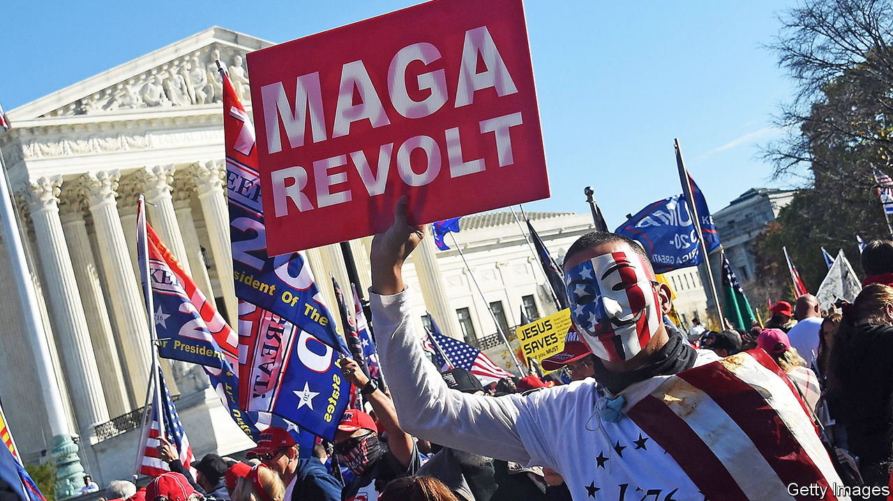

###### The art of losing

# Accepting a disappointing election result is a key part of democracy 

##### Donald Trump does not understand that, so elected Republicans must 

 

> Nov 21st 2020 

ALMOST TWO weeks after the votes that made him a one-term president were counted, Donald Trump is still claiming that he won. In reality there is no room for doubt. Joe Biden beat him by almost 6m votes, amassing 306 electoral-college votes to Mr Trump’s 232. Yet reality is a stranger to Mr Trump, who was crying fraud before the first vote had been cast. He has since fired an official who contradicted his view that the election was stolen and encouraged his supporters to protest against the result.

Most Republican leaders go along with the president. They include his attorney-general, Bill Barr, who told prosecutors to investigate “substantial allegations” of election fraud; Mitch McConnell, the Senate majority leader, who has championed the president’s right to go to court; and Lindsey Graham, one of Mr Trump’s staunchest Senate defenders, who Georgia’s secretary of state says pressed him to exclude legitimate ballots.


As so often in the Trump presidency, it is hard to know how seriously to take all this. No coup is under way in America. Mr Trump does indeed have the right to mount legal challenges. The counting and certifying of election results has withstood pressure from above. Most of the Trump campaign’s lawsuits have already been dropped or tossed out by the courts. Mr Barr’s prosecutors explained that they could find no evidence of the kind of systematic fraud that the president insists took place. Despite violent threats, Georgia’s secretary of state refused to buckle (see ).

Whatever he says or does, Mr Trump will be out on January 20th and Mr Biden will be inaugurated. Might ignoring him thus be the best strategy? Some wonder if it might be best to let the courts explain to forlorn Trump voters that their man lost.

Yet Republican conduct is expedience dressed up as principle. Lawmakers are cowed by the threat that Mr Trump might back a primary challenge against anyone he judges disloyal. They think they need Mr Trump’s support to win two run-off races in early January in which control of the Senate is at stake. Worse, their indulgence of Mr Trump imposes a cost on America. The effect of Republican leaders agreeing that perhaps Mr Trump really did win damages America’s ability to govern itself.

All Americans should wish the incoming administration to be competent. By delaying the transition, which in America’s spoils system entails the appointment of 4,000 new officials—all of whom must receive clearances before getting to grips with their new posts—Mr Trump is making that harder. When George W. Bush handed over to Barack Obama, they held a joint session of cabinet where outgoing officials sat with their replacements and ran through a series of hypothetical crises. The Biden officials will come into office with several existing crises to handle, including the logistics of a vaccination programme for covid-19 in which lives are at stake.

The president and his apologists are doing harm in another way, too. Voters have elected a divided government in Washington, with Democrats controlling the House and the presidency and Republicans favourites to keep the Senate. This requires both parties to work together, finding common interests where they can. If most Trump voters, encouraged by the likes of Mr McConnell, have come to believe that Mr Biden’s win is illegitimate, why should they want their representatives to work with him?

America has had bitter elections before, yet the electoral system has almost always generated loser’s consent. In 2000 a minority of Gore supporters (36%) thought the result was illegitimate; in 2016, 23% of Clinton voters thought so. In 2020, 88% of Trump voters currently think the result was illegitimate. It is up to their elected officials to explain why it was not. This requires more than waiting for the courts, local election officials—or anyone else—to speak up. Failure to do so does not just make America harder to govern. It betrays a contempt for the spirit of democracy and thus a lack of patriotism.■

Dig deeper:Read our , and then sign up for Checks and Balance, our  and  on American politics.

