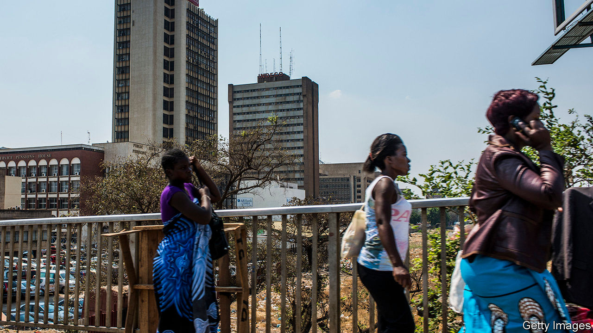
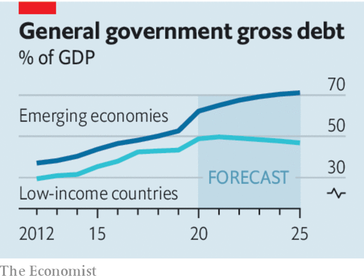

###### A better way not to pay

# Many countries need debt relief 

##### But how and from whom? 

 

> Nov 21st 2020 

WITH DEBTS looming and dollars scarce, Zambia has wrestled in recent months with a predicament. It knew that failing to pay bondholders would be damaging. But paying only them, having failed to pay others in full, could be worse. Other creditors would “blow off my legs”, the country’s finance minister said. So on November 13th Zambia became the sixth government to default on its bonds this year—after Argentina, Belize, Ecuador, Lebanon and Suriname. Others may follow. Although financial markets have regained much of the composure they lost in March, many countries still have more debt than they can comfortably handle. Thirty-eight governments have a credit rating that denotes a “material” risk of default or worse, twice the number at the end of 2009.

The debts of poor countries would be less daunting if they were not such a tangle of competing claims. The 73 poorest owe almost a fifth ($102bn) of their foreign debt to private creditors, from bondholders to banks, a similar amount to China, $76bn to other governments and the rest to multilateral lenders like the World Bank (see ). And that is just the stuff that international institutions can count. Crafting equitable debt-relief deals from such a hotch-potch is difficult. Three changes in particular would help: a more joined-up approach by government lenders, tougher legislation to curb awkward private creditors, and greater use of flexible instruments that align repayment more closely with a borrower’s circumstances.


Any debt debacle pits the interests of borrowers against those of lenders, but also pits lenders against each other. One creditor may be forgiving. But that allows others to free-ride on its generosity and collect payment in full. Thus every creditor wants to be sure others are doing their bit. In Zambia’s case Chinese lenders (which have agreed to defer some payments) and private bondholders (which have not) blame each other for the impasse.

 


To make sure each of them is doing their fair share, most rich-country governments offer debt relief jointly through the Paris Club, a grouping of government lenders. America has long urged China to join. And at a summit on November 21st-22nd, China will do the next best thing. Along with the rest of the G20 group of big economies, it will sign off on a “common framework” for relieving the debts of the world’s 73 poorest countries, if they prove impossible to bear. The framework is limited in scope. It will apply only to countries that request help, fess up to their full liabilities, submit to IMF-style policy prescriptions and show that they cannot sustain their debts. It won’t, in other words, deliver quick, unconditional debt relief to all poor countries, regardless of their need or demand for it. The framework requires all official creditors to do their share. It also obliges the borrowing country to seek similar help from private lenders.

The framework is a welcome step. The G20 should now consider some extensions. The same principles should also apply to other emerging markets, beyond the 73 poorest. The framework favours reducing interest rates or delaying repayments over cutting the stock of debt. That bias should change. It typically reflects accounting conventions in creditor countries rather than any strong economic rationale. Indeed, investment and growth respond more vigorously when debts are reduced, rather than payments lightened or lengthened. And if private creditors resist doing their share and pursue full payment in the courts, G20 governments should pass additional legislation to cap the gains that vulture funds can obtain from litigation. Such laws may look like clumsy infringements on creditors’ rights. But they can be justified if a creditor’s prospects for a favourable legal settlement depend on debt relief provided ultimately by taxpayers.

Debt crises can spur innovation in financial instruments as well as institutions. The Latin American debt crisis of the 1980s, for example, was ultimately solved only when illiquid bank loans were turned into tradable “Brady” bonds, named after Nicholas Brady, then America’s treasury secretary. To ward off future crises, the IMF and its sister organisations could help promote further innovations in the kinds of debt a country can offer.

Uncertain times have, for example, inspired new interest in bonds that automatically pay less when commodity prices tumble or natural disasters strike. Other instruments might pay out extra when GDP growth exceeds a threshold. Some of these instruments might need an independent institution to help standardise terms and referee disputes. Another idea worth exploring is “bendy bonds”, which would let the borrower lengthen their maturity in a pinch (and defer interest payments) in return for extra interest at the end of the bond’s extended life. Similar bonds already exist in the corporate-debt markets, which might make a sovereign version easier for investors to accept and price. Mr Brady’s clever idea revolutionised the market for developing-country debt. The time is ripe for another transformation. ■

