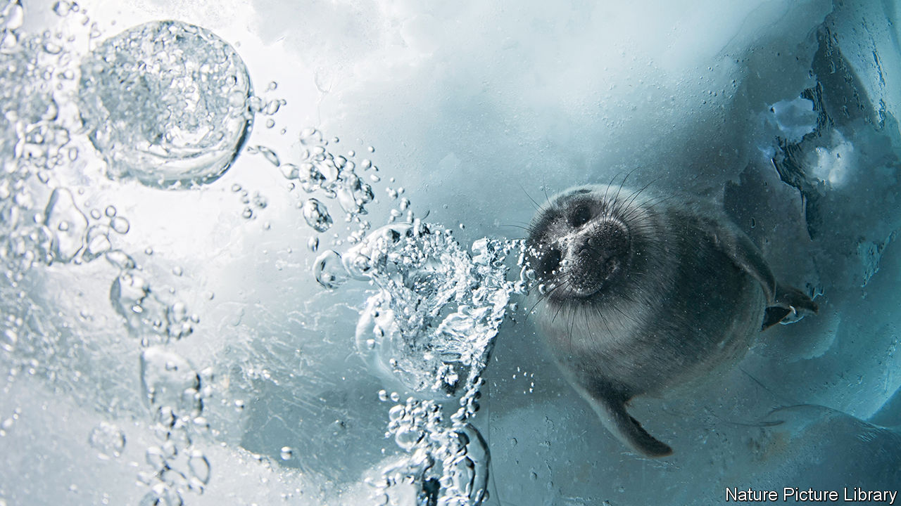

###### Cutting out the middle man

# Sieve-toothed seals may be whales in the making 

##### They filter small crustaceans from the water 

 

> Nov 21st 2020 

LAKE BAIKAL, near Russia’s border with Mongolia, is, by volume, the biggest body of fresh water on Earth. At 1.6km, it is also the deepest. Several unusual animals call it home, including the world’s only species of freshwater seal.

Baikal’s seals are abundant. There are about 100,000 of them. But the lake is nutrient-poor, so how they do so well has been a mystery. A study just published in the Proceedings of the National Academy of Sciences, by Watanabe Yuuki of the National Institute of Polar Research, in Tokyo, suggests the answer is by filtering tiny organisms from the water.


Most seals eat fish. And Baikal seals do, indeed, have needle-pointed canines of the sort expected of piscivores. But in 1982 researchers noted that they sport a second sort of specialised tooth behind those canines. These have frilled cusps which resemble combs. At the time, nobody knew what to make of them. But Dr Watanabe speculated that they might be an adaptation for feeding on other strange creatures dwelling in the lake.

Seals arrived in Baikal 2m years ago, from the Arctic Ocean. So too did some much smaller marine creatures, known as amphipods. These have diversified into more than 340 indigenous species. One of them, Macrohectopus branickii, spends its days hiding in the depths of the lake and then forages in the shallows at night in great numbers.

Marine mammals the size of seals would normally see amphipods as too small to hunt. But Dr Watanabe wondered if the Baikal seals’ comblike teeth might have evolved to enable them to rake these tiny crustaceans from the water in sufficient quantities to make them useful prey—much as some whales collect krill using comblike structures called baleen plates. He and his colleagues therefore attached waterproof video cameras and accelerometers to a few seals, to monitor what they were getting up to. This equipment remained attached to the animals for between two and four days, before coming loose and floating to the lake’s surface, whence the researchers were able to recover it.

Footage from the cameras and data from the accelerometers showed that the seals were indeed pursuing the dense amphipod aggregations that form at night. They would dive in with their mouths open and collect prey before making another pass. Dr Watanabe estimates that each seal captures an average of 57 amphipods per dive—and thus thousands of them a day. The needlelike canines are not redundant, for the seals do hunt fish as well. But they also compete with those fish for the amphipods, thus partially bypassing a link in the food chain and perhaps thereby maintaining themselves in larger numbers than would otherwise be possible.

Whether, were some of these filter-feeding seals to make it back to the ocean, they would follow the baleen-whale path and evolve into giants, is an interesting speculation. But even confined to their lake, Baikal seals provide an intriguing example of parallel evolution.

