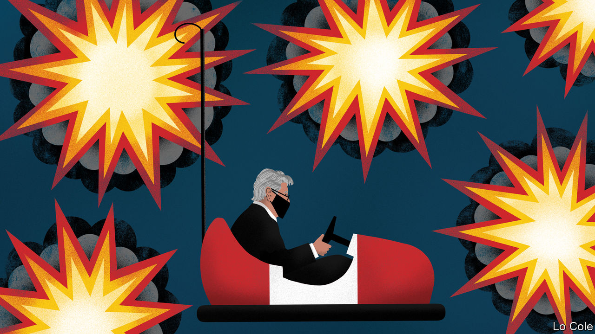

###### Bello

# Peru’s politics of destruction, and creation 

##### The country has overcome its immediate crisis, but faces a bumpy ride 

 

> Nov 19th 2020 

TIME WAS when investors believed that Peru’s fast-growing economy was immune to its politics. That contention, always questionable, was tested almost to destruction this month. With the country suffering a power vacuum and on the brink of descending into violent chaos, on November 16th a shamefaced Congress chose Francisco Sagasti, a 76-year-old centrist academic, as the country’s caretaker president. He is the fourth man to hold the top job since the last presidential election in 2016.

In Mr Sagasti Peru has come up with a winning ticket in its political lottery. His are the safest hands imaginable, but his task is not simple. It is to tackle the pandemic and the economic slump, both particularly severe in Peru, while steering the country through a general election due in April. His anointing followed the failure of a power grab by elements in Congress, who on November 9th voted by 105 to 19 to oust Martín Vizcarra, the president since 2018, on grounds of “moral unfitness”.


Power passed to Manuel Merino, the speaker of Congress. Rightly or wrongly, many Peruvians saw in this a plot to postpone the election and to advance murky private interests. Mr Merino named as prime minister Ántero Flores-Aráoz, a 78-year-old of the hard right who won just 0.4% of the vote in the 2016 presidential election. His law practice represents substandard private universities that are trying to overturn a university reform. His backers wanted to raid the treasury through populist giveaways.

This takeover prompted the biggest street protests in Peru for 20 years, mainly by young people and in defiance of a pandemic-related state of emergency. They met a brutal police response. Two protesters were killed and scores injured. With his gambit collapsing, Mr Merino resigned and promptly vanished. His putsch highlighted the way that political parties in Peru have become vehicles for private interests and for evading justice. Some legislators pay for places on party lists and expect a return. Although 68 of Congress’s 130 members face criminal charges of various kinds, the legislature protects its own from prosecution.

This month’s episode marked the climax of years of conflict that runs along several axes. One dates back to Alberto Fujimori, who ruled as an autocrat from 1990 to 2000. He defeated the Shining Path terrorist movement and reformed the economy, but his regime was corrupt. His daughter, Keiko, narrowly failed to win the election in 2016 because anti-fujimoristas of all stripes united against her. Her party used its majority in Congress to thwart the governing programme of the winner, Pedro Pablo Kuczynski.

Another source of conflict involves corruption and its weaponisation. Mr Kuczynski resigned in 2018 to avoid impeachment over conflicts of interest. He remains under house arrest. His three predecessors are all accused: one is awaiting extradition from the United States, one killed himself and a third spent time in jail. Corruption is indeed systemic in Peru, and Peruvians know it. But the presumption of innocence and a sense of proportion have been lost. No leader has been tried. Ms Fujimori spent 16 months in jail for alleged campaign-finance violations. Prosecutors are seeking to drive her party out of existence. Mr Vizcarra was popular, despite a mediocre record and woeful management of the pandemic, because he championed the cause of anti-corruption. But the pretext for his summary ousting was evidence that he had been corrupt when he was a provincial governor (an allegation that he denies).

The third faultline is the battle between the executive and Congress, which Mr Vizcarra exacerbated. He tried to push through political reforms. One of the few that was approved unwisely barred legislators from consecutive terms. Last year he dissolved Congress in a battle over appointments to the Constitutional Tribunal. The new Congress, elected in January, is even less biddable. Since its members will serve for only 19 months and cannot stand next year, they have no incentive to behave decently.

More useful reforms are coming into effect for April’s election, including a cull of minor parties and a bar on candidates charged with serious crimes. Several presidential hopefuls are populists, some of them dangerous ones. Those who are not will find it hard to assemble a reformist coalition in the next legislature. One thing is clear: the crowds of millennials out on the streets want a better democracy. Getting it will be a lot harder than chasing out Mr Merino.

