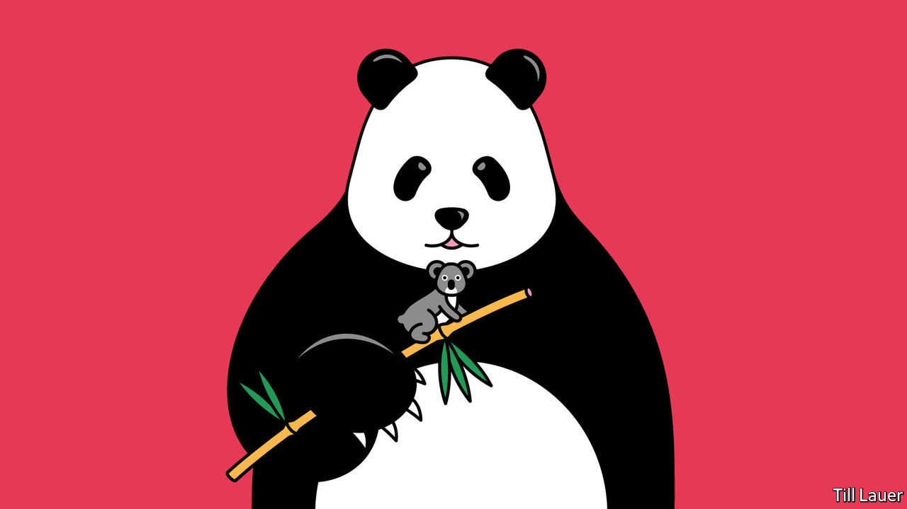

###### Banyan

# Could Australia’s government have handled China better? 

##### The Lucky Country is the object of an unusual amount of bile 

 

> Nov 26th 2020 

IT IS THE oldest move in the Communist Party’s playbook: to lock a country in the doghouse when it has offended the cosmic order. Yet even by China’s standards, the 14 grievances presented to the government of Australia this month are striking in scope and animosity.

The charges include speaking out against Chinese activities in the South China Sea, Xinjiang and Hong Kong; excluding Huawei from 5G telecoms networks; calling for an independent inquiry into the origins of covid-19; passing a law against foreign interference in politics; pressing the state of Victoria to end its involvement in President Xi Jinping’s flagship infrastructure initiative; blaming cyber-attacks on China; and accusing Chinese journalists of being state agents. China also griped about Australia’s hostile media and think-tanks. Make China the enemy, a Chinese official told an Australian broadcaster, and “China will be the enemy”.


The hypocrisy is breathtaking. China severely limits foreign investment, expels foreign journalists, takes innocent people hostage as a diplomatic weapon and routinely interferes in other countries’ politics. As Richard McGregor of the Lowy Institute in Sydney puts it, any provincial boss in China who tried to run a freelance foreign policy in the manner of the Victorian government would never be heard of again.

Meanwhile, China has all but shed any legal pretence for blocking Australian imports. Yet complaining gets Australia nowhere. Coal-carriers are anchored off the Chinese coast, unable to land their cargoes. Australian wine sits stranded on the quay in Hong Kong. For decades Chinese demand has stoked Australian prosperity. In just weeks China has raised obstacles to 13 products which generate over a third of Australia’s total exports to China. Barley, sugar, timber, lobsters and copper ore have all been banned. Wheat is next. Two biggies, iron ore and LNG, have been spared, but presumably only because it is hard to find alternatives quickly.

Could Australia have avoided the doghouse? From cyber-attacks to influencing elections, China poses a threat, and the prime minister, Scott Morrison, insists Australia’s sovereignty is non-negotiable. Yet members of his own Liberal Party as well as the opposition Labor Party think the government’s handling of China has, in the words of Allan Behm of the Australia Institute, been “cack-handed and lacking nuance”. Why, in August, block the Chinese purchase of (Japanese-owned) Lion, a big dairy and drinks company, when the foreign-investment board had already given the nod? And calling alone for a covid-19 inquiry instead of with other countries was inviting Chinese spleen.

Hawkish dynamics within his party are one reason why Mr Morrison has, as Hugh White of the Australian National University puts it, “gone out of his way to poke China in the eye”. One group of MPs, sporting claw-mark stickers on their office windows, calls itself the Wolverines, in homage to trigger-happy American teenagers resisting a Soviet invasion in a cult 1980s film. A member, Senator Eric Abetz, says its anti-China stand is about calling out barbarism: “That’s the Australian ethic—we call a spade a spade.” Yet the antics of members (who include Labor MPs) are “immature, juvenile and destructive”, a foreign-policy expert, Allan Gyngell, recently warned. At one parliamentary hearing Mr Abetz called on Chinese-Australians to denounce the Communist Party.

Still, wariness of China is no longer a fringe activity. In two years the number of Australians who trust China to “act responsibly in the world” has plunged from 52% to 23%, according to the Lowy Institute. In this context, Mr Morrison’s talk of sovereignty, Mr White argues, has a primal appeal: plucky Oz standing up to a bully. But as American power ebbs and Chinese power is in flood, Australians, Mr White contends, “have no conception of how to make [their] way”.

The lack of plan, says John Hewson, a former Liberal leader, is all too evident in the government’s handling of China. The prime minister needs to get out of the fix without appearing to back down. The small businesses suffering from China’s boycott are his party’s natural constituency. The departure of President Donald Trump may help: Mr Morrison got special bile from China for hewing close to him. But the gap he needs to close is wide. Six years ago Mr Xi addressed Parliament in Canberra. Today the Australian government cannot even get a phone call answered. Welcome, China seems to be saying, to the new order.

