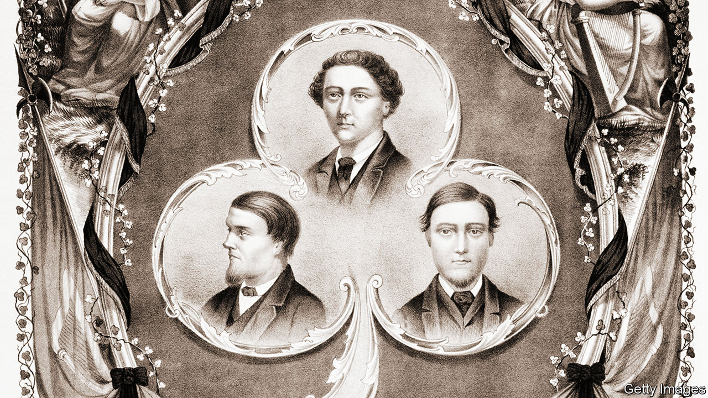

###### Cops and plotters

# In “The Abstainer”, Ian McGuire returns to the 19th century 

##### The author of “The North Water” weaves a tale of policemen and Irish insurgents in Manchester 

 

> Nov 28th 2020 

The Abstainer. By Ian McGuire.Random House; 320 pages; $27. Scribner; £14.99.

SET LARGELY in the Greenland whale fisheries of the 1850s, Ian McGuire’s “The North Water” (published in 2016) was dark, violent and propulsive. It was snapped up for a television adaptation starring Colin Farrell that is due to air soon. That novel’s many admirers will wonder whether Mr McGuire’s new book, “The Abstainer”, has the same page-turning pull.


This time the setting is tamer. It is 1867 and James O’Connor, a Dublin policeman, is on secondment in Manchester, though the assignment is not of his choosing. He is a man adrift: when his beloved wife and young son died of illness in Ireland, he took to drink, and this job is his last chance. O’Connor is the abstainer of the title, haunting coffee houses instead of saloons.

The fictional copper arrives just as three real historical figures are to be hanged for the murder of a policeman; the men were Fenians (agitators for Irish independence) and afterwards became known as the “Manchester Martyrs”. O’Connor sees that this is what they will become, and that the hangings are merely cruelty and bombast: “Yet cruelty and bombast are what the English prefer.”

His antagonist is Stephen Doyle. Born in Sligo, Doyle left for America as a teenager and fought in the civil war; he has now come to Manchester as a Fenian operative. He has about him something of the terror of Henry Drax, the animating force of wickedness in “The North Water”, though Doyle’s character is softened by a compelling backstory and the reader’s understanding of his ultimate political aim.

This blend of politics, personal tragedy and revenge is moreishly compelling. The book’s powerful setting is almost a character in itself. Mr McGuire teaches creative writing in Manchester and his passion for the city shines through. The physical world that he imagines assails the reader’s senses: the stink of a tannery, the clangour of factory bells and the way O’Connor’s grief drives him to a ruthlessness beyond his nature.

The novel’s weakness is its ending, when Mr McGuire swerves away from the consummation readers may be expecting. A small shame—but it is still worth raising a toast to “The Abstainer”.

