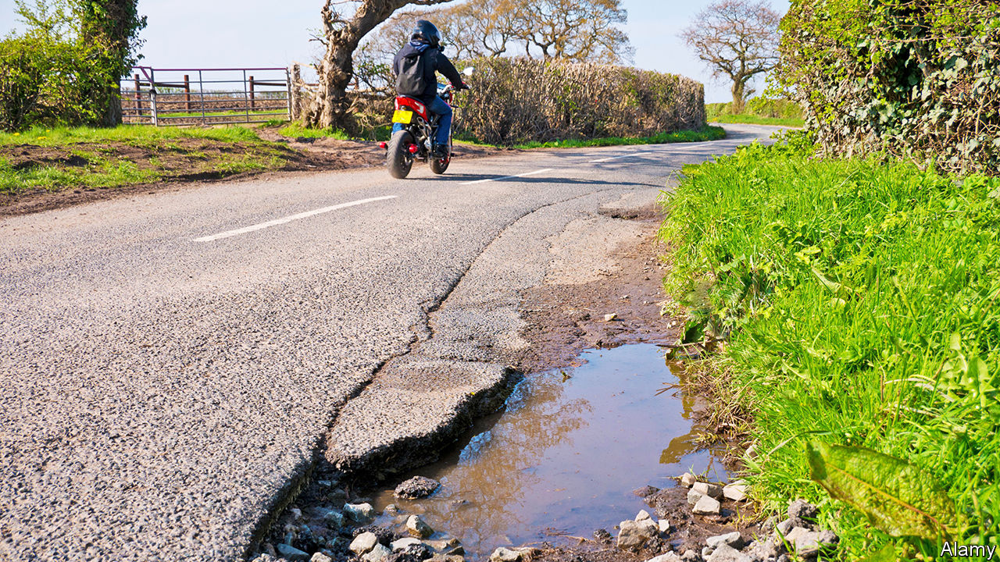

###### Potholes

# Britain’s big pothole problem 

##### Politics, the pandemic and innovation may mitigate it 

 

> Nov 28th 2020 

LAST DECEMBER, councillors Bob Smytherman and Martin McCabe threw a birthday party—not for a friend, a relation or a celebrity, but for a pothole. Cars in Worthing, West Sussex, had been bumping over it for a full two years, despite pleas that it be mended. The stunt worked. The following day it was filled in, and a second party—a lavish affair, with cake and candles—marked its demise. But plenty of its fellows survive. Mr Smytherman says the town has so many craters, it’s like “walking on the moon”.

Potholes arouse passions in Britain—not surprisingly, since the country’s road quality ranks 37th in the world, between Slovenia and Lithuania. Councils received 700,000 complaints about potholes last year, says the Federation of Small Businesses. The weather, a topic even more popular among the natives than potholes, is mostly to blame. Potholes form when water seeps under the road surface, breaking the tarmac as it expands and contracts. Budget cuts in the wake of the financial crisis did not help. The Local Government Association (LGA) says road maintenance budgets fell from £1.1bn in 2009 to £701m in 2017—the equivalent of 8m potholes. The Asphalt Industry Alliance claims there is a road-repair backlog of £11bn.


But there may be relief in sight for the suspension of the British motor car. Politics is one reason. Traditional Tories—who love cars, particularly fast ones, and tend to live in the countryside, so rely on roads—are particularly infuriated by them. Northern “red wall” seats that the Tories won from Labour in the last election tend to be rural places where the roads are bumpier and the weather worse. Nottinghamshire, home to several of those contested seats, is Britain’s pothole capital, with 253,920 reported in 2017-19. Hence the promise in the Tory manifesto of the “biggest-ever pothole-filling programme”, and a promise of £2.5bn over five years.

Covid is also fuelling the drive against potholes. Rishi Sunak, the chancellor, needs shovel-ready spending opportunities to justify his claim in the spending review on November 25th that “we’re prioritising jobs”. Potholes are ready and waiting for those shovels—hence his commitment that £1.7bn would be spent this year.

Innovation should help get the job done. Rubberised asphalt is spreading across the nation’s roads. Adding shredded tyres to the bitumen used to make asphalt creates an elasticity that helps it mould into the existing road and stops it breaking down as easily. Tarmac, a materials company, is supplying it to several councils. Sheffield council is trying out a simpler version, designed by another company, Roadmender Asphalt. Cumbria is experimenting with recycled plastic as a bitumen substitute, and in Oxfordshire and Kent “Gipave”, a material made from adding a graphene-based additive to asphalt, is being used to resurface entire roads. It is 15-20% more expensive than asphalt but has twice the lifespan.

Repair design may help, too. Potholes are normally repaired by cutting squares out of the asphalt around them, but corners encourage water ingress, so Roadmole, a small road-repairing firm, produces a remotely controlled machine that cuts circular holes instead. The firm claims that none of the potholes they have fixed in the past eight years has needed to be redone.

In order to innovate, councils need cash. David Renard, the LGA’s transport spokesman, says the government’s bung will help fix the backlog. But the supply of candidates for repair never dries up. Back in Worthing, Mr Smytherman says that his celebrated pothole is beginning to reappear. Another party looms.■

