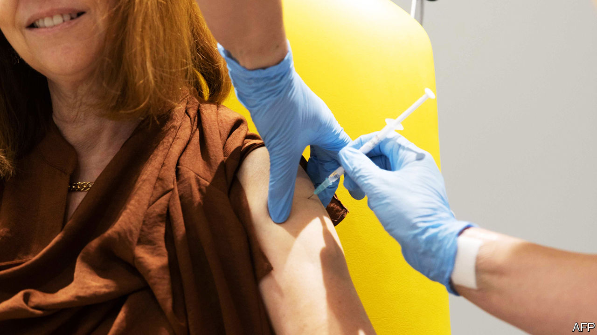

###### Emergency exit

# Britain’s vaccine roll-out takes shape 

##### There is reason to hope it will go better than the state’s pandemic management 

 

> Nov 28th 2020 

LOTS OF SPACE and vinyl flooring—that is what local directors of public health want. “The last time you went into an NHS appointment...the floor would have been a certain type of splash-proof vinyl in case you bled all over it or threw up,” says one. It is the sort of floor a mass vaccination centre requires.

The search for suitable venues has just become more urgent. On November 23rd the Oxford/AstraZeneca vaccine team announced positive results (though there are some concerns about the data—see ). A cheap, transportable vaccine would be good news for the world. It would also be good news for Britain, and not just because it would be the product of a British university and an Anglo-Swedish firm.


The government has ordered 40m doses of vaccine from Pfizer and 5m from Moderna, the two other firms to have announced phase-three-trial results. Both require two doses per person. It has ordered 100m from AstraZeneca, which may need just one-and-a-half. If all are approved, the AstraZeneca vaccine would thus accelerate the country’s journey to herd immunity.

That approval is in the hands of Britain’s medicines regulator, the MHRA, which is reviewing data from all three firms. AstraZeneca had planned to have 30m doses ready by September; it missed that target, but is expected to have tens of millions ready when approval is granted. One insider says the hope is to deliver 5m jabs a week by mid-January.

The Joint Committee on Vaccination and Immunisation, which advises the government, has drawn up a prioritisation list, with care-home residents and workers at the top, followed by the over-80s and health-care workers. The MHRA will probably at first offer an emergency-use authorisation, which may restrict vaccination to the most at-risk until more evidence is in.

The British state’s lacklustre response to the covid-19 pandemic provides plenty of reason for trepidation about the roll-out. But unlike the testing programme or track-and-trace, the National Health Service will be running things, removing the need to set up a leadership structure and local organisation from scratch.

It is not an entirely new exercise for the health service. Britain dishes out nearly 15m flu jabs a year. The need to store the Pfizer vaccine at -70°C limits the role of general practitioners (GPs) who deliver much of the flu campaign, since few surgeries have sufficiently icy freezers. But the AstraZeneca vaccine can be kept at 8°C.

Around half of the vaccines will be delivered in the community, the other half in mass vaccination centres. They will spring up in places like hospitals, sports halls and universities. Paramedics, physiotherapists and student medics will be called upon to staff them. So, too, may vets, dentists and trained volunteers, for whom the government has tweaked human medicines regulation to allow them to administer jabs.

All of this is a big ask for the NHS at a time of year when it is normally most stretched. This year’s expanded flu vaccine campaign suffered from distribution problems. GPs are in discussions with NHS leadership about what parts of their job can be put on hold to allow them to focus on vaccination. “We would want to protect patient-facing services,” says Steve Mowle of the Royal College of General Practitioners.

Perhaps the biggest challenge will be the IT system. It will need to contact people at the right time for their first and second jabs, and to integrate information with medical records. This is important, says Penny Ward of the Faculty of Pharmaceutical Medicine, a professional body, so that analysts can trawl the records for unidentified side effects. Not all are optimistic. A scientist advising the government says he cannot think of anything since the start of the pandemic “where we relied on digital support and it happened in a timely way”.

In a programme of this scale, things will almost certainly go wrong. But if enough goes right, there is a glittering prize on offer. By spring, vaccination and increased testing “should reduce the need for economic and social restrictions”, in the words of Boris Johnson. “We should be able to render obsolete the very notion of a covid-19 lockdown.” ■

Editor’s note: Some of our covid-19 coverage is free for readers of The Economist Today, our daily . For more stories and our pandemic tracker, see our 

