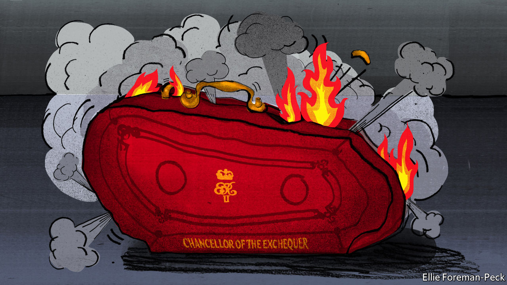
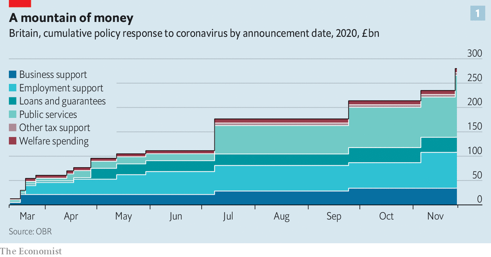
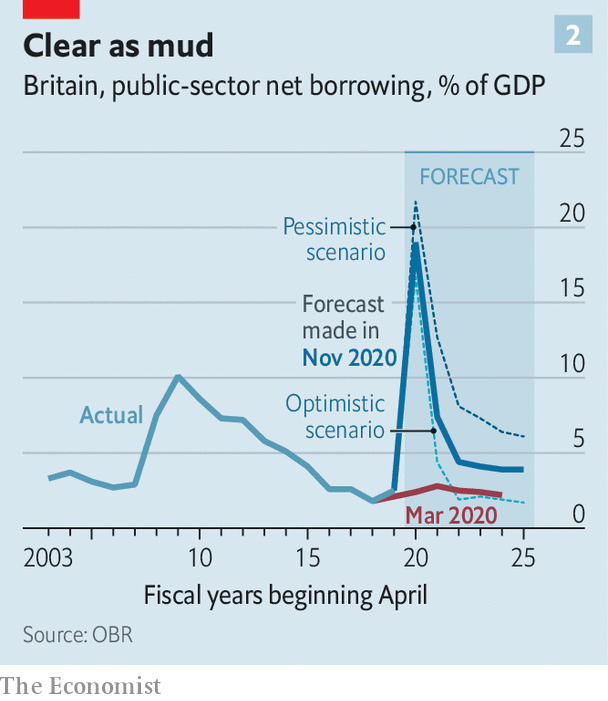

###### Public spending

# The spending review reveals the strains on the Tory party 

##### What covid-19 and Boris Johnson’s promises are doing to the public finances 

 

> Nov 28th 2020 

RICHARD HOLDEN is proving expensive. In the election last December, he became the first Conservative to represent the seat of North West Durham, a sprawling constituency of farms and former mining towns, since it was created in 1950. Since then he has been promised a new hospital, and in March won a tax-cut for motorhomes which will benefit the local camper-van factory and cost the exchequer £25m a year over five years. In the spending review on November 25th, the government said it would conduct a study into replacing a railway which was shut in 1963. Mr Holden is also eyeing government funds for a new bus network, some new footpaths and cycle ways, better broadband and a new leisure centre.

Boris Johnson is keen to please Mr Holden, for his seat is one of the so-called “red wall” formerly Labour constituencies in northern England, the Midlands and Wales that flipped blue in the general election. If people there are to stick with the Tories they will need to see their area changing, says Mr Holden. “I want to be able to go to the next election and say we’ve delivered this, we’ve had progress on this, and this is in the pipeline. It’s the fling versus the marriage question—we have to show real commitment to our towns and villages.”


The manifesto on which Mr Johnson won was written in sunnier times. It bound together a wide Conservative coalition with the glue of low borrowing costs and benign economic conditions. It promised to “level up” the gap between southern England and seats such as Mr Holden’s with a flood of spending on roads and railways, hospitals and green energy. Yet this would be done without hiking payroll taxes and VAT—a red line for Mr Johnson’s existing stock of southern Tories—and while cutting the national debt. Britain’s commitment to spend 0.7% of GDP on foreign aid would stay, despite its unpopularity with Tory activists, to keep the party’s dwindling liberal wing happy.

Covid-19 will force Mr Johnson to break some of those promises, and strain his coalition. That became clear in the spending review Rishi Sunak, the chancellor of the exchequer, announced on November 25th. The economy, he said, would shrink by 11.3%—the biggest contraction in 300 years. The spending plans reflect both the demands that the emergency has placed on the public sector (see chart 1) and the government’s political priorities.

 


A lot of money is being spent on keeping MPs such as Mr Holden happy. The government knows that the Labour Party cannot return to power without winning back their seats. Those MPs are relentless lobbyists, organised around a caucus known as the Northern Research Group. Partly in order to pay for their shopping lists, public sector net investment will hover just below 3% of GDP in the years after the crisis, higher than in all but two years since the 1970s.

The bit of the coalition that was thrown overboard this week was the shrinking band of liberals. They were outraged when Mr Sunak said he would, after all, abandon Britain’s foreign-aid commitment. David Cameron, the former prime minister who enshrined that commitment in law, had embraced development as part of a “compassionate conservatism” agenda. Liz Sugg, a development minister and former aide to Mr Cameron, quit.

How much further the coalition is strained depends largely on the prospects for recovery. They are highly uncertain. In its forecasts accompanying the review the Office for Budget Responsibility, a fiscal watchdog, set out three scenarios in which the economy regains its pre-pandemic size at the end of 2021, 2022 and 2024 respectively, depending on the path of the virus and the success of the vaccine. So severe and strange has the shock to the economy been that “there is no reasonable basis for forming a view on the likelihood of any particular outcome,” it warned.

The public finances are equally hard to predict, with projected budget deficits in 2025-26 ranging from 1.7% to 6.1% of GDP (see chart 2). And that is without taking into account the possible effect of completing the transition out of the European Union in January. A “no deal” exit would worsen those forecasts. The range of possible paths for the economy next year is simply enormous.

 


Mr Sunak warned that fiscal consolidation may eventually be necessary. He tightened the spigots only slightly, but those measures hint at rows to come. Public-sector workers, other than those in the National Health Service and the lowest paid, will see their pay frozen for a year—meaning a real-terms cut once inflation is taken into account. Local authorities will get less from the government in grants, making them more reliant on council-tax revenue, which will be toughest for poor areas. That risks leaving Mr Johnson vulnerable to the charge of a return to austerity in his new, working-class seats. A £20-a-week increase in unemployment benefits put in place during the pandemic will be reviewed in the new year.

Beyond that lie harder choices, which will upset other bits of the coalition. Its southern MPs in particular are allergic to tax rises, and are mobilising to warn Mr Sunak against touching taxes on profits, capital gains or pensions. David Davis, a former Brexit secretary, has urged him to fuse the doctrines of Reagan and Roosevelt: steep tax cuts and big spending on infrastructure, funded by cheap borrowing.

The government can take confidence from the fact that, despite massive borrowing, which will reach a peacetime record of 19% of GDP this year, low interest rates mean that the cost of servicing its debt will fall this year. Yet despite the appetite for spending in its new seats, the Conservative Party does not like borrowing. The party’s foot-soldiers view the public purse like a household’s finances, while MPs worry that the public finances are vulnerable if interest rates do rise.

There are sound tactical reasons for taking this view, too. The Tories have kept the Labour Party out of office for a decade by maintaining that only they can control public spending. If voters come to believe that governments can borrow without limits, Mr Sunak warns MPs, there is no reason for them not to vote Labour. Even red-wallers like Mr Holden see the case for prudence. “The worst thing we could possibly do is make irresponsible promises to people, which we can never deliver on,” he says. Uniting a disparate coalition of old and new Tories was possible in good times. After covid-19, a government forced to choose between spending, taxes and debt will find it much harder. ■

