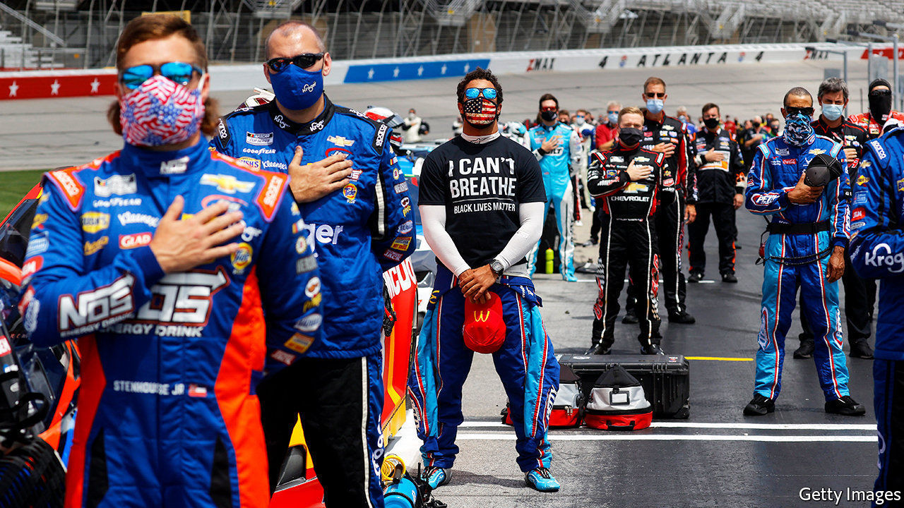

###### All inclusive

# Social unrest has fuelled a boom for the diversity industry 

##### An army of consultants and recruiters is helping firms become more inclusive 

 

> Nov 28th 2020 

AS PROTESTS AGAINST police violence and racism convulsed America’s streets this summer after the killing by a policeman of George Floyd, a black man, the heat could be felt in the air-conditioned corner offices above. America Inc rushed to announce plans to tackle racial inequality. Walmart said it would set up a $100m initiative to fight racism. Pepsi vowed to double spending with black-owned suppliers. Facebook and Estée Lauder pledged to hire more non-white candidates. JPMorgan Chase promised to extend $30bn in loans over five years to minority households and businesses. Even NASCAR, which runs a motor-racing series for a mostly rural and white fan base, prohibited the display of confederate flags at its events. Diversity, many said, is not just the right thing to do. It is good for business.

For one breed of firms it has been very good indeed. Consultancies and recruiters are enjoying a mini-boom as companies look for advice on how to become more inclusive. The newly created diversity, equity and inclusion (DEI) practice at Bain, a consultancy, now has two dozen staff, and another two dozen want to be part of it at least some of the time, says Julie Coffman, who heads it. She calls diversity “the next digital”. A partner at another consultancy says DEI is the “fastest growing business line we have right now”. Lyndon Taylor, who leads DEI at Heidrick and Struggles, an executive-search firm, discerns a “quantum” jump in demand for such services.


Lots of companies promised to do things during the protests. Now, Mr Taylor says, they must work out what those are and how they are going to do them. The priority is hiring black senior executives or board members. Before 2020 diversity meant women, Latino, Asian and LGBTQ, says Dale Jones, boss of the Diversified Search Group, a 46-year-old recruitment firm originally set up to promote women. Now Mr Jones sees “a hyper focus around black leadership”, with board placements up by half and C-suite recruiting by around a third over the past year. 

Julie Hembrock Daum, who recruits board members at Spencer Stuart, another search firm, says she has to temper clients’ expectations about what is possible. She tells them to think long and hard about what qualities they need on their board rather than “a knee-jerk reaction like ‘we need a CEO who is black’”.

Recruiters remind clients that boardrooms and C-suites are not overly blessed with other ethnic minorities, LGBTQ people or women. They also highlight other underrepresented groups, such as veterans, migrants and refugees, the “differently abled” and the all-encompassing “cognitively diverse” (consultant-speak for people who think differently).

The diversity industry has expanded beyond finding new hires. Consultancies’ and recruiters’ services include training staff on bias, advice for diversifying supply chains and coaching senior executives on how to run more inclusive firms. Some offer broad-ranging strategies for organisational and managerial changes. As one recruiter puts it, “hiring can be a quick fix, but you can’t just add a couple of diverse fish. You actually need to change the water in the pond.”

Demand for such services is unlikely to abate any time soon. A survey by Edelman, a public-relations firm, conducted soon after news of Floyd’s death, found that 60% of respondents said a brand’s reaction to the protests “will influence whether I buy or boycott them in the future”. Younger customers and employees are likelier to hold strong views: 53% of those aged 18-34 said they would not work for a firm that failed to speak out during the protests, compared with 42% for all ages.

The change is driven by the drive and passion of younger employees, says Pamela Warren, who in July was appointed co-leader of the DEI council at Egon Zehnder, a big executive-search firm. As more of them enter the workforce, pressure on employers to be more representative of the population will grow—and with it demand for the diversity industry’s services. ■

