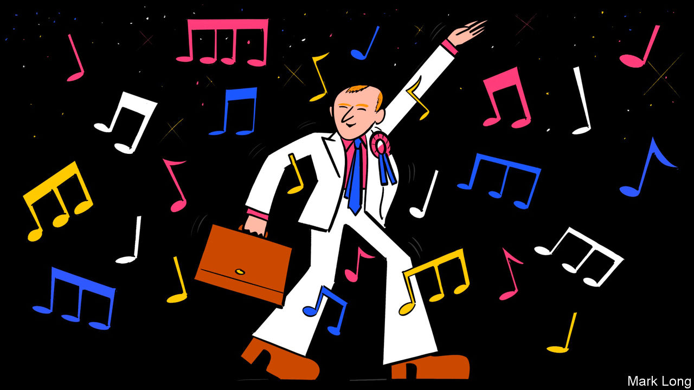

###### Populist Polish pop

# Why Polish politicians fear to sneer at rural music 

##### The ruling party’s supporters adore disco polo 

 

> Nov 28th 2020 

“LOVE, LOVE in Zakopane. We’re showering ourselves in champagne. I am the knight, and you, queen of the night.” The balding singer with a stubby moustache and sequined blazer slid across the stage. It was a chilly New Year’s Eve in 2018, but the crowd of 60,000 sang along in the resort town of Zakopane in the foothills of the Tatra mountains. Another 8m Poles watched the public broadcaster’s flagship concert from home, triple the peak viewing figures of its rival television stations.

Disco polo, a musical genre once relegated to country wedding bandstands, has strutted onto the main stage. Created in rural Poland in the late 1980s, it blends folk tunes with drum machines and synthesisers, often with saucy lyrics. “Polka Dot Knickers”, a hit song in 1995, offended many sensibilities. But the genre has bounced back. Almost two-thirds of Poles—and 80% of them in rural areas—say they enjoy it. “Love in Zakopane” has had 226m views on YouTube.


Disco polo bands now perform at venues such as Warsaw’s Palace of Culture and Science and London’s O2 Arena. In September a school in Michalowo, in eastern Poland, launched the country’s first class aimed at making a career in disco polo. This year’s inaugural class of 27 highschoolers is coached in singing and dancing, and learns the technicalities of sound systems. The minister of education at the time commended it: “Maybe it’ll catch on.” The town is building a disco-polo museum.

Polish politicians have long sucked up to disco-polo fans. Back in the presidential campaign of 1995, the two frontrunners were both backed by disco-polo artists. But the patronage afforded to musicians under the ruling Law and Justice party is quite new. Earlier this year TVP, Poland’s public broadcaster, released a hagiography of the disco-polo doyen, Zenek Martyniuk. After singing along at one of his concerts, the station’s boss, a Law and Justice politician, said it was time to end “the hypocrisy and pretence that this is an inferior genre”.

The ruling party has good reason to indulge disco polo’s enthusiasts—they are its core supporters. In last year’s parliamentary elections it got roughly twice the vote-share in rural regions, the heartland of the simple tunes, as it did in big cities. TVP has denounced any politicians or cultural gurus who sneer at disco polo as out of touch with “ordinary” Poles. After its record-breaking viewing figures for the New Year’s Eve concert in 2019 starring Mr Martyniuk, the station ran a gloating segment: “The pseudo-elites are jealous.”

