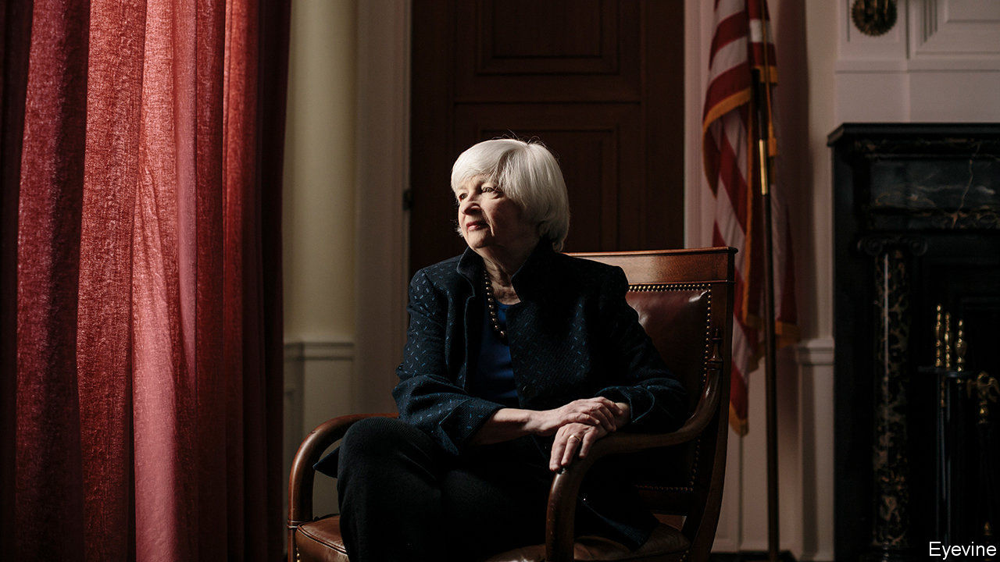

###### Something for everyone

# Janet Yellen will lead Joe Biden’s Treasury. What does she stand for? 

##### Progressives and conservatives both see something to like in the former Fed chair 

 

> Nov 24th 2020 

IN THE FIRST instalment of the “Harry Potter” series, the protagonist stumbles across the Mirror of Erised. Anyone who looks into the mirror sees the “deepest, most desperate desire” of their hearts reflected back at them. There is a touch of Erised about President-elect Joe Biden’s decision to nominate Janet Yellen as America’s next treasury secretary, first reported on November 23rd. No economist is more qualified than Ms Yellen, a former head of the Federal Reserve and a respected academic, for the job. Perhaps more important, however, for what is a political role as much as an economic one, people from the progressive left to the conservative right can see something to like in her.

In today’s political configuration, that matters. Mr Biden must tame a split in the Democratic Party between run-of-the-mill centrists and tear-it-down millennial socialists. And before she becomes treasury secretary, Ms Yellen must be confirmed by the Senate, which Republicans currently control. That hurdle ruled out candidates such as Elizabeth Warren, a senator from Massachusetts whom many Republicans would never confirm because she is seen as too hostile to free markets and the financial industry.


In the days before the announcement Washington insiders believed the race was between Ms Yellen and Lael Brainard, a governor of the Fed. Some favoured Ms Brainard on the grounds that she had more expertise in trade economics, others because she is younger than Ms Yellen, and would therefore do a better job of balancing an elderly president. Left-leaning Democrats were particularly taken with Ms Brainard’s monetary doveishness.

Yet Ms Yellen has many advantages of her own. She is an accomplished economist, originally specialising in labour economics, and is the president of the American Economic Association, the field’s pre-eminent learned society. (There are also few better-liked people in the profession; wonks turn up their collars in homage to one of Ms Yellen’s sartorial quirks.) She was a highly competent chairwoman of the Fed between 2014 and 2018, communicating the central bank’s intentions clearly in advance so as not to take investors by surprise. Her experience at the Fed may prove useful given that the central bank and the Treasury must continue to cooperate to help the economic recovery along. Under Ms Yellen there would be little chance of the sort of spat that has developed over the Fed’s lending schemes (see ).


The genius of choosing Ms Yellen lies in the fact that people of all political persuasions can find some reason to cheer her appointment. That means she will almost certainly be confirmed by the Senate. Take monetary policy. Hawks point out that during Ms Yellen’s tenure the Fed raised rates from near zero to 1.25-1.5%. Doves counter that hawks were over-represented on the rate-setting panel at the time, and that Ms Yellen in fact did a good job of keeping them in check.

It is a similar story on fiscal policy. Shortly before Donald Trump became president, Ms Yellen argued that “fiscal policy is not obviously needed to provide stimulus to help us get back to full employment”. She is on the board of the Committee for a Responsible Federal Budget, an organisation that spends a lot of time warning people about the dangers of high public debt. Yet in the pandemic Ms Yellen has urged “extraordinary fiscal support”. In June she co-signed a letter saying “Congress must pass another economic recovery package.”

Passing another stimulus bill may be her first big task. Republicans and Democrats have been unable to agree on a replacement to the bill passed in the spring, with particular disagreement on the size of the eventual package, even as it is now clear that America’s economic recovery is slowing. It is a lot to expect that the sheer force of one person could help break the deadlock, not least because Republicans are likely to retain control of the Senate for a while yet. But if anyone can do it, it may be Ms Yellen. ■

Dig deeper:Read our , and then sign up for Checks and Balance, our  and  on American politics.

