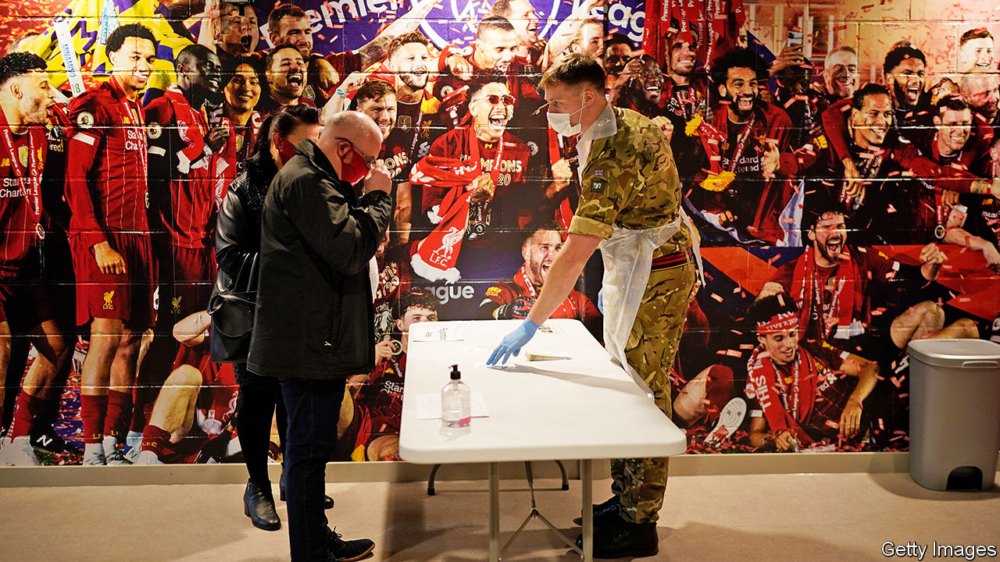
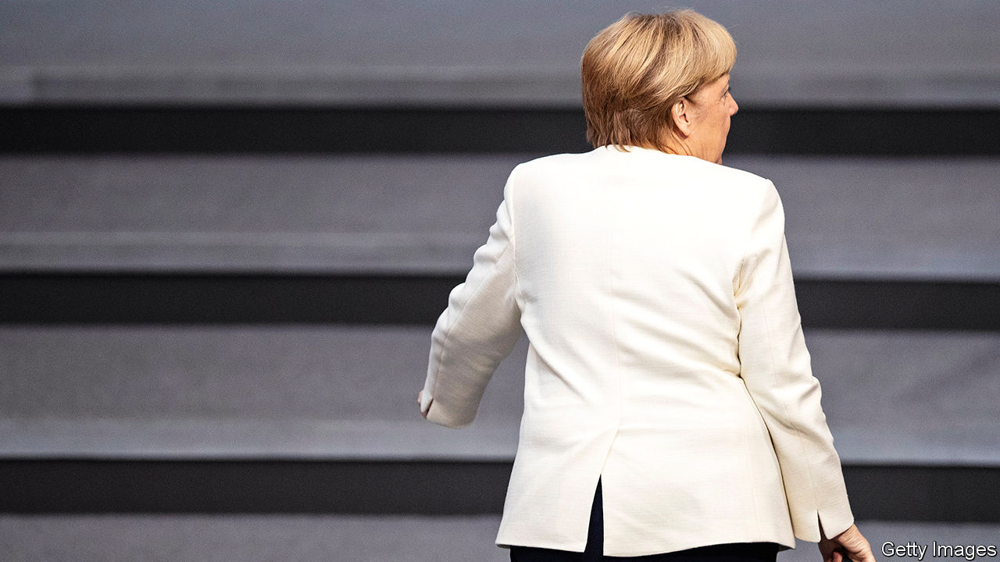
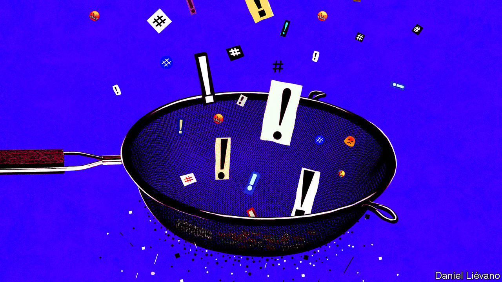
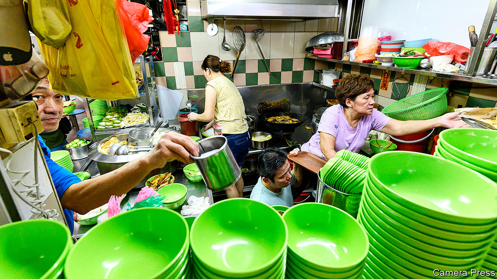
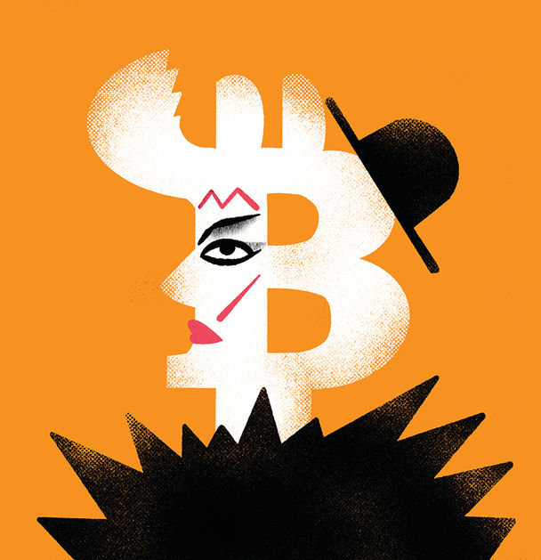

###### On covid testing, Germany, women's suffrage, free speech, rock stars, Singapore, trains, bitcoin

# Letters to the editor 

##### A selection of correspondence 

> Nov 28th 2020 


 


Work incentives

Although there was a carrot for people who got tested for covid-19 in Slovakia’s mass-testing programme, there was a strong stick, too (“”, November 21st). The carrot for those who got tested and proved negative was access to freedoms and exemptions from an otherwise strict curfew. But employees who did not take part in the nationwide test had to self-isolate, in effect, and could not go to work. If they weren’t able to provide any other certificate of a negative test to their employer they had to stay at home and take annual or unpaid leave. However, if they took part and tested positive they could claim sick leave, but still had to self-isolate with their whole household.


This carrot-and-stick approach led to a 95% turnout for the nationwide test, helping Slovakia halve its covid-19 prevalence in just a week.

KRISTINA LONDAKOVALondon

 


Veering to the left

I strongly disagree that Germany’s Christian Democratic Union is a “centre-right” party (“”, October 31st). This might have been true in the early years of the Merkel era. Nowadays, however, both the CDU and the Christian Social Union in Bavaria have lost any kind of sustainable trait of conservatism.

The euro has been turned into a political football, immigration laws and regulations are a mess, defence, national security and other areas that are of importance to conservatives are in disarray. NATO and the wider European alliance are in bits. Even worse, a radicalised party, which evolved from a liberal-minded down-to-earth opposition to Angela Merkel, has managed to establish itself permanently across the country.

The conservative parties have turned into rather leftish marketing professionals. Their primary goal is to conserve power and to celebrate “ethical” views, instead of bringing the country and Europe forward. Sadly, Richard von Weizsäcker’s assessment of Helmut Kohl’s turn to a self-centred policy focus was made substantial throughout the Merkel years.

It is time for Mrs Merkel to step down now. New and bold leadership is needed to provide answers and solutions to how Germany will earn its living in the near future and how it will play a geostrategic role. A lot is at stake.

JOHANNES WARBECKAugsburg, Germany

Women and the vote

gave New Zealand the honour of being the “the first place in the world to give women the vote” (November 7th). That was in 1893. In 1869 the American territory of Wyoming gave women the vote, as did the territory of Utah in 1870, if only for a few years.

In what is now Canada some women voted as early as 1793, not because British common law said they could, but because it didn’t say they could not. Canadian legislatures closed that loophole but in 1873 female property owners in British Columbia got the right to vote in municipal elections.

CEC JENNINGSToronto

 


Talk all you want

Much of the discussion regarding social media and free speech does not distinguish between the freedom of speech and the right to be heard (“”, October 24th). Freedom of speech is protected, but the right to be heard is not. Speakers were never guaranteed a platform for their views until social media came along. Now everyone has a chance to be heard.

But denying access to anti-vaxxers, say, would in no way limit their right to free speech. They would still have all the freedom of speech they enjoyed before Facebook was created. They can talk to their neighbours, write letters, call people on the telephone, publish pamphlets, organise petitions and even start their own social-media platforms.

TREVOR SCHINDELERNorth Bay, Canada

The distinction between free speech and free publication is that I am free to write offensive screeds. I am free to post them off to editors and publishers. They, however, are under no obligation to print my diatribes. Neither is Facebook or Twitter.

ADAM ISLERNew York

 


Handle with care

I was perplexed by your refusal to concede that the Travelling Wilburys featured more than just George Harrison and Bob Dylan (“”, October 31st). Were Jeff Lynne, Roy Orbison and Tom Petty not even worthy of an “among others” after mentioning a former Beatle and a Nobel laureate?

ANDREW GUSHChicago

 


Singapore’s food hawkers

Food-hawker centres are Singapore’s community dining rooms and offer affordable diverse food (“”, October 31st). Indeed, Singaporeans have such passion for the food that we have nominated hawker culture to be included as a UNESCO Intangible Cultural Heritage. UNESCO’s evaluation body has recently recommended the inscription.

Our hawker centres were first built in the 1970s, providing street hawkers with more hygienic settings. We ceased building new centres in 1985 and resumed in 2012. This partly explains the low rents of older-generation hawkers and the high median age of those working in the centres. The government began offering training programmes in 2013 to attract new hawkers to the trade, along with significantly subsidised fees and stall rentals. The operators of new hawker centres also run programmes to support new entrants. The results have been promising.

The median age of new hawkers since 2013 is 46, much lower than the national median. Many young enterprising hawkers have gone beyond selling traditional fare to offer Western and other fusion foods. We expect the median age to decrease further.

These efforts will sustain the trade, and keep Singapore’s hawker culture flourishing for future generations.

T.K. LIMHigh Commissioner of SingaporeLondon

 


Train of thought

It came as no surprise to learn in column on psychometric testing that introverts make the best train drivers (November 7th). I drive trains on urban passenger lines and cherish my autonomous mobile “office”, with no one to report to (unless something happens to passengers, the train or track infrastructure). My breaks between journeys are spent reading The Economist, in addition to other literary material carried in a tote bag. The best times to catch up with unread back issues are the unforeseen delays, which can last hours. I’d rather have The Economist keep me company on the train than a fellow human being.

EUGENE ANTHONYPerth, Australia

 


Bitcoin’s new romantics

At the risk of being as out of place as jeans and a T-shirt at the Blitz club in London on a Tuesday night I feel that Buttonwood left the main question unanswered: did Steve Strange have any bitcoin? (“”, October 31st.)

STUART SMITHMaastricht, Netherlands

