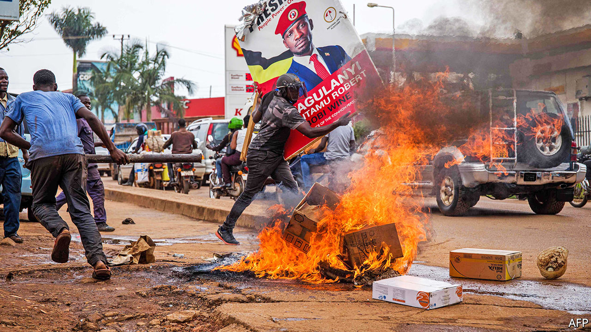

###### Bullets before the ballot

# The Ugandan state shoots scores of citizens dead 

##### Unrest erupted after the arrest of Bobi Wine, the leading opposition candidate for president 

 

> Nov 28th 2020 

AMOS SSEGAWA was a 15-year-old schoolboy walking past a shop with his mother. John Kittobe was a retired accountant on a trip downtown. Sophie Kusasira was selling food in a market. All were shot dead by Ugandan security forces on November 18th and 19th, along with scores of others, in the worst violence seen in Kampala, the country’s capital, for a decade.

Unrest broke out after the arrest of Bobi Wine, a popstar-turned-politician who is the opposition’s most popular candidate in presidential elections scheduled for January. He draws crowds far larger than the 200-person limit set to contain covid-19. The singer was in Luuka district on November 18th when police bundled him into a van. He was not seen again until a court released him on bail two days later, after he had been charged with “doing an act likely to spread infection of disease”.


In the meantime young men in Kampala and other cities blocked roads with rocks and burning tyres. Police, soldiers and plain-clothes gunmen swarmed onto the streets, firing tear-gas and bullets. The police say that 45 people died in two days of violence, but the number is probably higher. By comparison, the country has registered 191 covid-19 deaths in eight months.

Firing blind

Supporters of Yoweri Museveni, the president since 1986, were quick to condemn the “hooliganism” of protesters, some of whom smashed car windows, threatened passers-by and attacked police officers. Elly Tumwine, the security minister, declared that “police have a right to shoot you and kill you if you reach a certain level of violence.” But multiple accounts tell of reckless state force. Eyewitnesses say that Mwanje Sudi, a mechanic, was shot dead while sheltering in a yard; a bullet hole can be seen in the gate where he was hiding. Christine Zzawedde, a 58-year-old grandmother, was standing in her back garden when an errant bullet hit her out of the blue. “She was a very humble person, very loving, very accommodating,” says her daughter, in tears.

Ugandans have witnessed such episodes before. In 2009 security forces killed at least 40 people in riots sparked by a dispute over the traditional Buganda kingdom. In 2011 at least nine bystanders were shot dead during protests against inflation and bad governance. Even so, the scale of this month’s protests took the state by surprise. Mr Wine inherits a long tradition of discontent, yet he differs from other leaders: the young people in Kampala’s “ghettos” see him as one of their own.

The battle for the streets matters. Many in the opposition deem it their best hope of gaining power. The protesters have shown they can paralyse the capital for a day or two, but their strategy ultimately relies on the police and army deciding not to shoot.

For the moment, the security agencies are loyal to the president. Their chiefs are too busy bickering with each other to turn on him. The middle classes have not taken to the streets, as they did in Sudan against President Omar al-Bashir. “An officer would rather maim some errant wananchi (ordinary people) and get a slap on the wrist than refuse an order from above,” says Su Muhereza, a political analyst.

The watchful president has concentrated power among those closest to him. His brother, Salim Saleh, a general, acts as an all-purpose fixer. His wife, Janet Museveni, the education minister, has influential networks of her own. His son, Muhoozi Kainerugaba, led an elite army unit until 2017, when he was appointed a presidential adviser; many think he is being groomed for the top job.

Mr Museveni will almost certainly win the election, despite the bloodshed—or perhaps because of it. Maria, a chicken-seller in Kampala, worries that Mr Wine’s supporters are “bringing problems” with “their chaos”: her own cousin is in a cell after being caught with a tyre and a box of matches. Many others fear that Mr Museveni will only leave office violently, so will vote for him in order to have a quiet life. The old soldier promises order, as long as he is in charge. It is the logic of a protection racket. And one day it will break. ■

