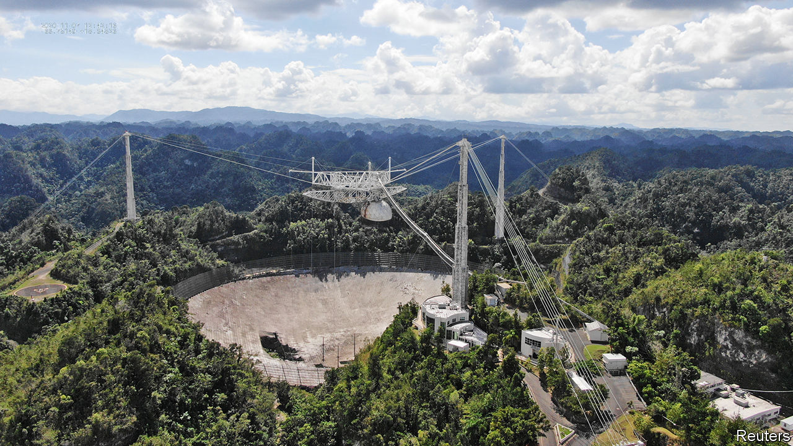

###### Scientific instruments

# With the death of Arecibo, an era ends for radio astronomy 

##### A snapped cable has irreparably damaged the dish 

 

> Nov 25th 2020 

ARECIBO OBSERVATORY was conceived in an era of space-age monumentalism, an imposition of geometry onto geology as striking in its simplicity and scale as the greatest brutalist architecture. When the James Bond franchise, in its pomp a showcase for iconic 1960s design, eventually got around to using the 306-metre dish as a location in the 1990s, the only surprise was that it had taken so long.

The observatory was not new to spycraft. It was created as a tool for using radar to study the ionosphere, an electrically charged upper layer of the atmosphere. America’s defence department had an interest in such work, which might lead to new ways of characterising incoming missiles or of snooping on enemy transmissions, so it stumped up some cash.


A free-standing dish big enough for the job would have been impractical. The designers therefore looked for a hole in the ground to repurpose. They found it in north-western Puerto Rico, a sinkhole where the limestone landscape had collapsed in just the right way. They built three towers on the sinkhole’s rim and hoisted the electronic heart of the instrument—the bit which emits and receives radio waves—into the empty space between them. Signals travelling to or from this equipment would bounce off eight hectares of wire mesh stretched out beneath it.

As a radar, Arecibo used the world’s biggest dish to study not just the ionosphere but also the surfaces of nearby planets and passing asteroids. But it was as a radio telescope that it truly excelled, making some crucial discoveries during the 1960s and 1970s, radio astronomy’s golden age. The most famous was a pair of pulsars—spinning neutron stars—orbiting each other in a way which was shown to prove Einstein’s general theory of relativity. Later data revealed planets around another pulsar. This was the first definitive detection of planets beyond the solar system.

Arecibo was also used for radio astronomy’s wayward offshoot, the search for extraterrestrial intelligence. Since 1960 radio astronomers have occasionally employed their instruments to look for artificial signals from the stars. In 1974, after an upgrade that saw the original mesh replaced by a dish made up of 38,778 aluminium panels, Arecibo was used to go a step further. It transmitted a 1,679-bit message towards a star cluster 25,000 light-years away. Encoded in this message were graphical representations of basic biochemistry and astronomy, and of the technology with which it had been sent.

Over time, technological advance eroded the advantages of Arecibo’s sheer size, and its funding dwindled. The engineering began to show its age. In August one of the cables supporting the instrument platform snapped, damaging the dish. The snapping of a second, in early November, seemed to presage imminent collapse. And so it is to be closed.

But as the vegetation beneath the dish rises through its remains, and the site falls into picturesque ruin, the sketch of its cross-section encoded in that message from the 1970s will continue on its way. It is already 46 light-years from Earth. Its pixels now constitute the farthest-flung memorial to a human achievement anywhere in the universe. And they always will.■

